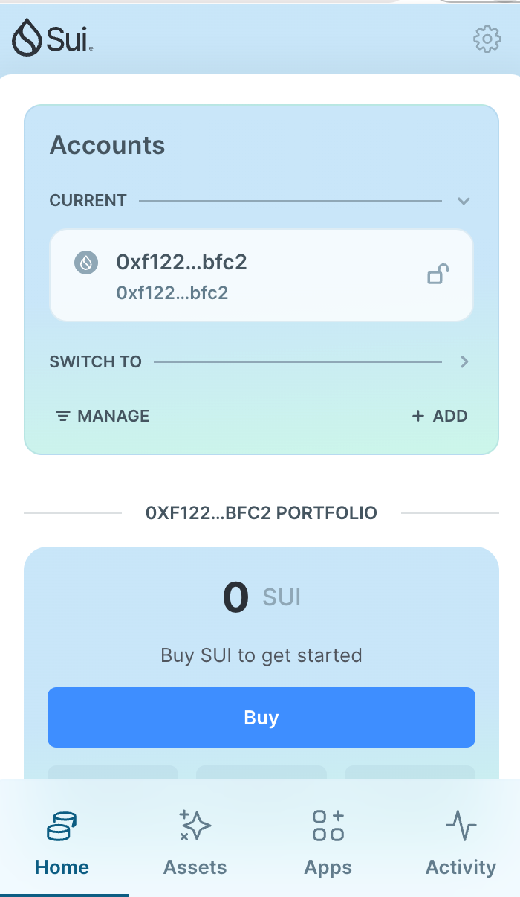
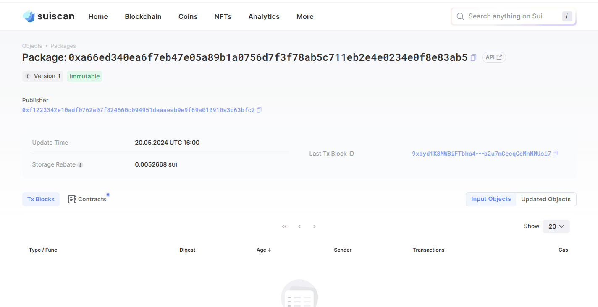

## 基本信息
- Sui钱包地址: `0xf1223342e10adf0762a07f824660c094951daaaeab9e9f69a010910a3c63bfc2`
> 首次参与需要完成第一个任务注册好钱包地址才被合并，并且后续学习奖励会打入这个地址
- github: `SuperSodaWater`

## 个人简介
- 工作经验: 2年
- 技术栈: `C++`
> 重要提示 请认真写自己的简介
- 多年CG/OS开发经验，对Sui感兴趣，想通过Sui入门区块链
- 联系方式: tg: `SuperSodaWater1` 

## 任务

##   01 hello move  
- [x] Sui cli version: sui-client 1.25.0-b10ea7331e1c
- [x] Sui钱包截图: 
- [x] package id:  0xa66ed340ea6f7eb47e05a89b1a0756d7f3f78ab5c711eb2e4e0234e0f8e83ab5   
- [x] package id 在 scan上的查看截图:

##   02 move coin
- [x] My Coin package id :  0x2eb7369f7d2c7e0da2e8a4352eb24196ad999dbc7ab2c417b0097b1a3a8deb87            
- [x] Faucet package id :  0x2eb7369f7d2c7e0da2e8a4352eb24196ad999dbc7ab2c417b0097b1a3a8deb87            
- [x] 转账 `My Coin` hash: HWRLhTNwm3HSRPtMxXKcmGh5jAKXxMgt4Nw7MrGwqEx6
- [x] `Faucet Coin` address1 mint hash: 4kBnDkb45kQFvWCmzxLVr8eookxs4rR5148d7LMTGsVn
- [x] `Faucet Coin` address2 mint hash: 29DqaDmi4WrxxwV9qhUr99bdVS97aBeFd5owvrGxfgAL

##   03 move NFT
- [x] nft package id : 0xb27dc64ab89843ba3180fe65f5c0ca652e81540967d7fe45bfc912246cf615fa 
- [x] nft object id :  0xc7b19f0f3610827db95e7c927d3eb7ddb1c807680b934ac06ebdec03024b78fe
- [x] 转账 nft  hash:  7casryDrsaviZH9CUFDymFUJ6duWRdctLgswc9zhmNRj
- [x] scan上的NFT截图:

##   04 Move Game
- [x] game package id : 0x0d33fcbc055f0ba93dff73c6ca25f5cff6173ef088def2a304701628b73e438d  
- [x] deposit Coin hash: 5Ntx6Miafvr5BvgGYoB5mrcGsiyXkUhg1iZvmUqP3hNn
- [x] withdraw `Coin` hash:  BTDf9yVpzWzN4Fuy12cgWnn4QGNoNSZHgro8D1hSocGY
- [x] play game hash: GY8Qrq1dmXxsWSQhT9aerZGnt19GVafDiSLKujstw24e

##   05 Move Swap
- [x] swap package id : 0xe49343d46b1a41c68b4cfe06a2c1b2ea704cba9bfdeab7ddbd61058bbe30c37c
- [x] call swap CoinA-> CoinB  hash : 5ci8ZS16zvD4UahhKvpQsizJb8QM8MBvBukHmAvCUhzr
- [x] call swap CoinB-> CoinA  hash : 3Hhb9JKx1KDsRkxp2XQdhUKfSRQtt8hKHwW7WdteUz51

##   06 Dapp-kit SDK PTB
- [x] save hash : [orqLVPxSmfHD64QsXGJfbTdnnxzrwnCARyRMJdZhVSS](https://suivision.xyz/txblock/orqLVPxSmfHD64QsXGJfbTdnnxzrwnCARyRMJdZhVSS)
