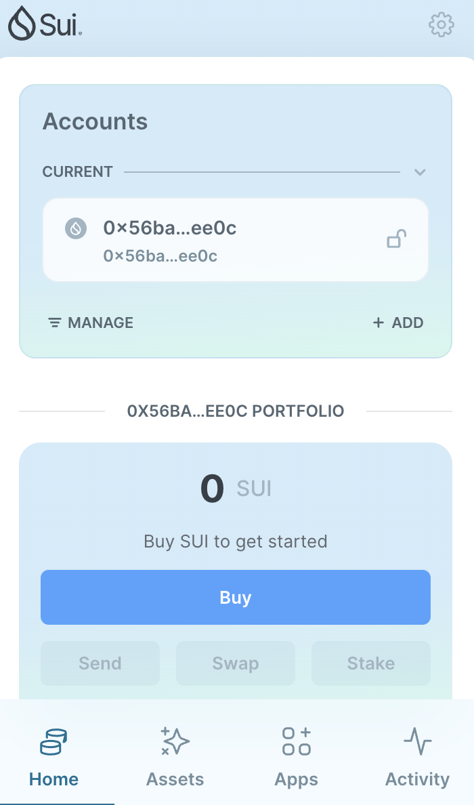
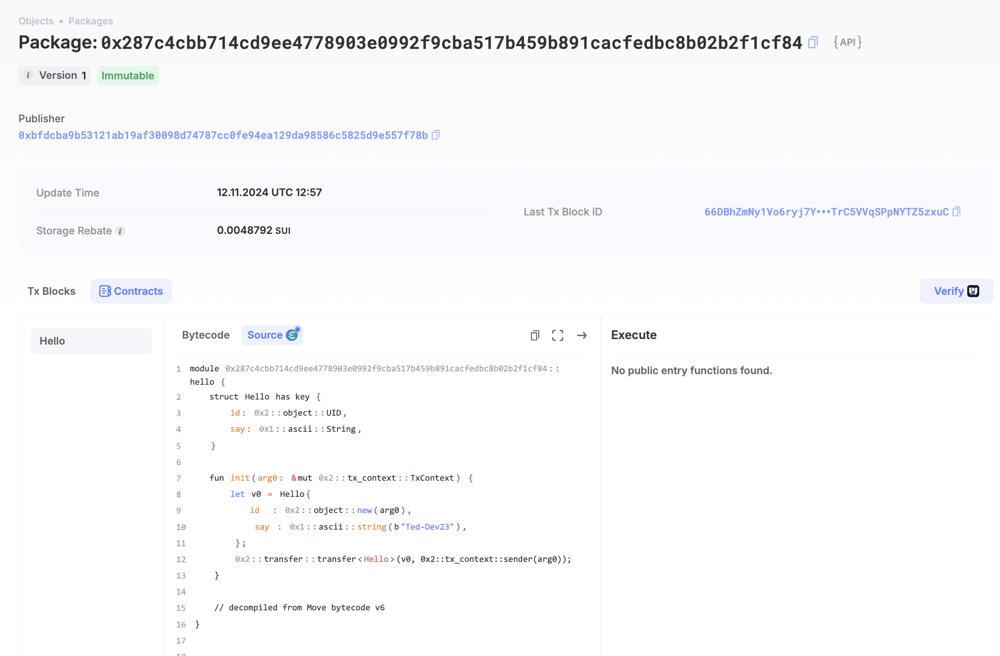

## 基本信息
- Sui钱包地址: `0x56ba55bd845e486e54c2d223b2e1df8934d9b8daeef07551ef7ad1ae8d6dee0c`
> 首次参与需要完成第一个任务注册好钱包地址才被合并，并且后续学习奖励会打入这个地址
- github: `Ted-Dev23`

## 个人简介
- 工作经验: 2年
- 技术栈: `c/c++` `python`
> 重要提示 请认真写自己的简介
- AI方向phd在读 Web3爱好者 币圈新人
- 联系方式: tg: `teddevv` 

## 任务

##   01 hello move  
- [] Sui cli version: sui 1.37.1-homebrew
- [] Sui钱包截图: 
- [] package id: 0x287c4cbb714cd9ee4778903e0992f9cba517b459b891cacfedbc8b02b2f1cf84
- [] package id 在 scan上的查看截图:

##   02 move coin
- [] My Coin package id : 
- [] Faucet package id : 
- [] 转账 `My Coin` hash:
- [] `Faucet Coin` address1 mint hash:
- [] `Faucet Coin` address2 mint hash:

##   03 move NFT
- [] nft package id :
- [] nft object id : 
- [] 转账 nft  hash:
- [] scan上的NFT截图:

##   04 Move Game
- [] game package id :
- [] deposit Coin hash:
- [] withdraw `Coin` hash:
- [] play game hash:

##   05 Move Swap
- [] swap package id :
- [] call swap CoinA-> CoinB  hash :
- [] call swap CoinB-> CoinA  hash :

##   06 Dapp-kit SDK PTB
- [] save hash :

##   07 Move CTF Check In
- [] CLI call 截图 : 
- [] flag hash :

##   08 Move CTF Lets Move
- [] proof : 
- [] flag hash :
