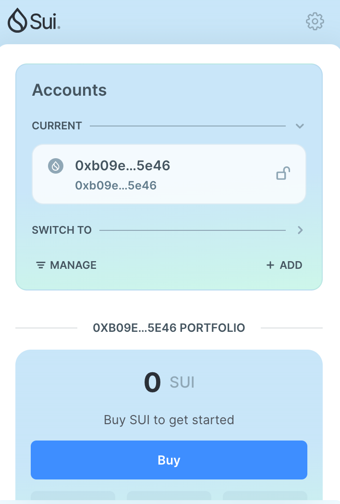
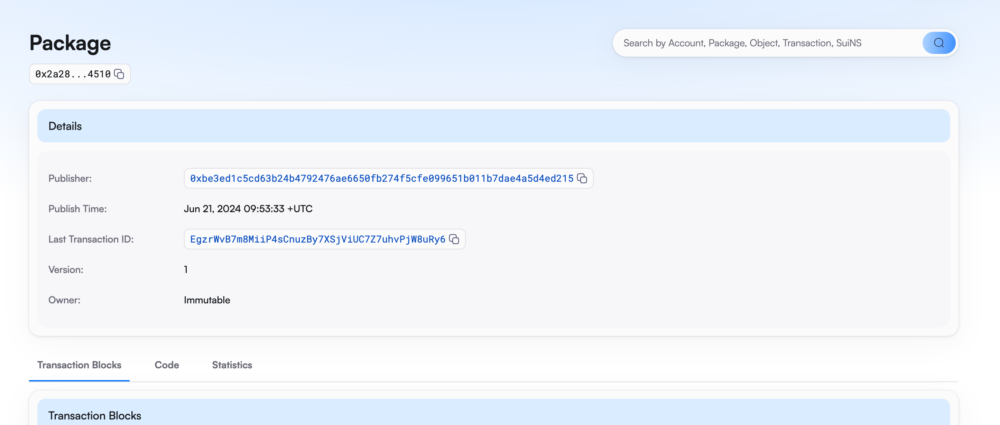
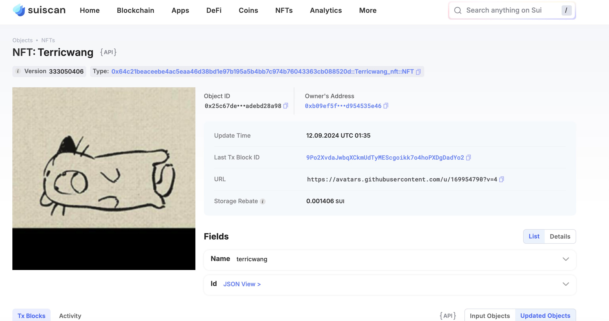

## 基本信息
- Sui钱包地址: `0xb09ef5f5769394a12e301bf94fd6dfece6062ad9cad55edecbbc64d954535e46`
> 首次参与需要完成第一个任务注册好钱包地址才被合并，并且后续学习奖励会打入这个地址
- github: `terricwang`

## 个人简介
- 工作经验: 5年
- 技术栈: `C++`
> 重要提示 请认真写自己的简介
- 多年web2开发经验，对Move特别感兴趣，想通过Move入门区块链
- 联系方式: tg: `terric` 

## 任务

##   01 hello move  
- [x] Sui cli version: sui-client 1.32.2-a5eab1a75fa8
- [x] Sui钱包截图: 
- [x] package id: 0xbd381d2f5d520515d327d333a68a70729ee3048de8b7dfc9b7bc45d8854e97b1
- [x] package id 在 scan上的查看截图:

##   02 move coin
- [x] My Coin package id :  0x88a65ed1d3bf4c0f640f67e3dbbab675acda88814c4f1bfe2dd4e388286f5181
- [x] Faucet package id :  0x88a65ed1d3bf4c0f640f67e3dbbab675acda88814c4f1bfe2dd4e388286f5181
- [x] 转账 `My Coin` hash: CK3vcT7CoBRMFoPUJUqs3PANaoAifF2hTFt4RvBpkxcD
- [x] `Faucet Coin` address1 mint hash:  3a5wi3a4ZE2CVDHC3FwKyLUertFeKCbMkDxtyYGNkCVe
- [x] `Faucet Coin` address2 mint hash: 6VfU8PM7JvC8d7QmFGds8T28VWgX4A6UXjJSZLi1Dq5t

##   03 move NFT
- [x] nft package id : 0x64c21beaceebe4ac5eaa46d38bd1e97b195a5b4bb7c974b76043363cb088520d
- [x] nft object id :  0x25c67deee3bd2137875ad1bdaeb35ffe7d5a65d83dcf405ae9fd8cadebd28a98
- [x] 转账 nft  hash:  3epMaTSbUE2Hic6xcqpVt5He93zp3AxiKuqfXdjtqyfx
- [x] scan上的NFT截图:

##   04 Move Game
- [x] game package id : 0x3a86ab156c19b1b36b6a1eaeb6c77553785b6aec3f9857d7098079dce6d75248
- [x] deposit Coin hash: Dkevn9X6hrBLhfsz4DKywpXuqK2N7sGGwng44piGaxav
- [x] withdraw `Coin` hash: DVTLxZoYZ5XfuTPuCfvJ41C1MZ7PrEtBd9EYPe5UZ8kD
- [x] play game hash: 4P7AdMixSRWtPogWeNsJ3QZ6tVQDD7przzjgKoJarxYW

##   05 Move Swap
- [] swap package id :
- [] call swap CoinA-> CoinB  hash :
- [] call swap CoinB-> CoinA  hash :

##   06 Dapp-kit SDK PTB
- [] save hash :

##   07 Move CTF Check In
- [] CLI call 截图 : 
- [] flag hash :

##   08 Move CTF Lets Move
- [] proof : 
- [] flag hash :
