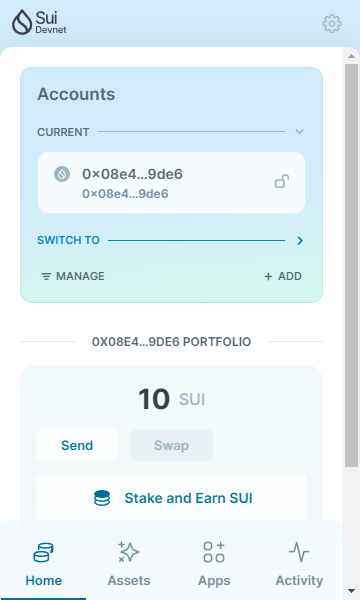
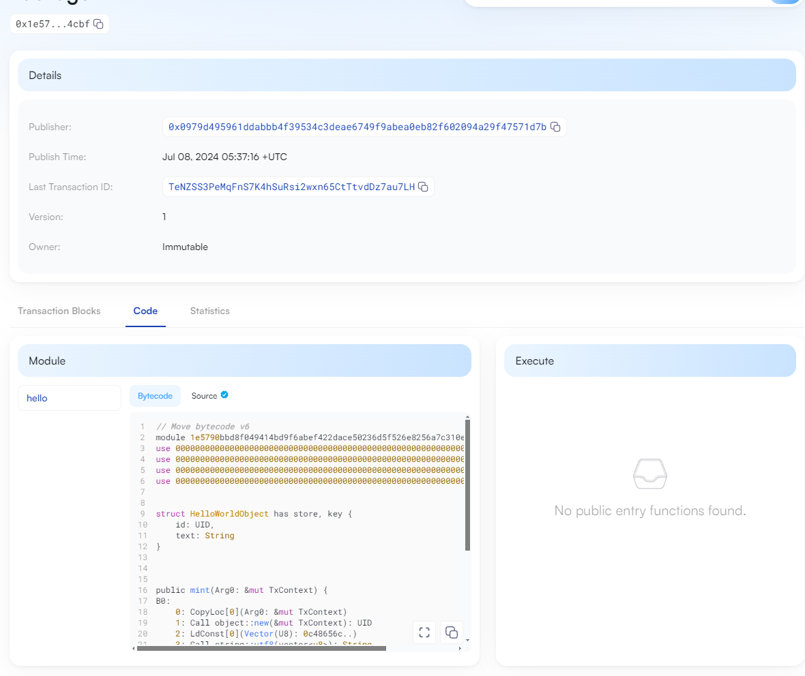

## 基本信息
- Sui钱包地址: `0x2eb70d0259f3e7590ff9188347837c9af8259d4575e6e54a0a7444be450d632d`
> 首次参与需要完成第一个任务注册好钱包地址才被合并，并且后续学习奖励会打入这个地址
- github: `TheHeBoy`

## 个人简介
- 工作经验: 2年
- 技术栈: `Golang` `Java` `Rust`
- 之前主要在ETH和BTC生态进行开发，现在对Move很感兴趣，想了解一下
- 联系方式: tg: `@anchor_xxxx` 

## 任务

##   01 hello move  
- [X] Sui cli version: sui 1.27.2-homebrew
- [X] Sui钱包截图: 
- [X] package id: 0xd81282396dda64132f8226c51662ebbe52ef3efaecdb88b06fc0ca2ef3c59734
- [X] package id 在 scan上的查看截图:

##   02 move coin
- [] My Coin package id : 
- [] Faucet package id : 
- [] 转账 `My Coin` hash:
- [] `Faucet Coin` address1 mint hash:
- [] `Faucet Coin` address2 mint hash:

##   03 move NFT
- [] nft package id :
- [] nft object id : 
- [] 转账 nft  hash:
- [] scan上的NFT截图:

##   04 Move Game
- [] game package id :
- [] deposit Coin hash:
- [] withdraw `Coin` hash:
- [] play game hash:

##   05 Move Swap
- [] swap package id :
- [] call swap CoinA-> CoinB  hash :
- [] call swap CoinB-> CoinA  hash :

##   06 Dapp-kit SDK PTB
- [] save hash :

##   07 Move CTF Check In
- [] CLI call 截图 : 
- [] flag hash :

##   08 Move CTF Lets Move
- [] proof : 
- [] flag hash :
