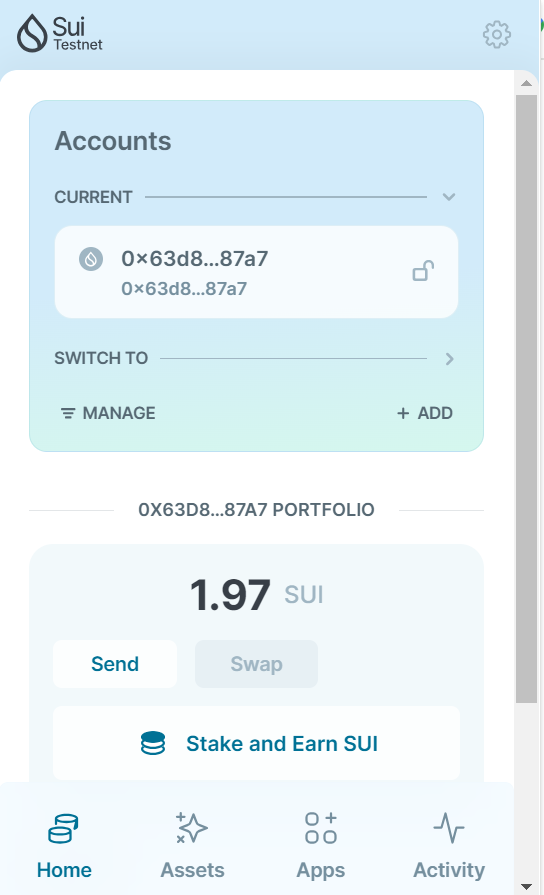

## 基本信息
- Sui钱包地址: `0x63d85f1dc46362d88ad248e52fadb0d6afb92787df9cfc7081b260bf878887a7`
> 首次参与需要完成第一个任务注册好钱包地址才被合并，并且后续学习奖励会打入这个地址
- github: `TheonInAu`

## 个人简介
- 工作经验: 0年
- 技术栈: `Javascript` `C++`
> 重要提示 请认真写自己的简介
- 对Move特别感兴趣，想通过Move入门区块链
- 联系方式: tg: `xxx` 

## 任务

##   01 hello move  
- [] Sui cli version: sui 1.24.1
- [] Sui钱包截图: 
- [] package id: 0x83b783b615d0b0717f71bd47854d1bf3a0bd357738c09fee78b6c800fb1d593f
- [] package id 在 scan上的查看截图:

##   02 move coin
- [] My Coin package id : 0x306910e9bd90b4df696a5b34018b7a8df83e08f932bb69f7a032f232394af1ba
- [] Faucet package id : 0x306910e9bd90b4df696a5b34018b7a8df83e08f932bb69f7a032f232394af1ba
- [] 转账 `My Coin` hash: G4XhkXiqsfzFK7tLhSFmhNFppPX7vmCHXqkrkFb6z8oZ
- [] `Faucet Coin` address1 mint hash: FwQo3NvtZtqvaBzosLEJtiHUwWgiF5m2KWBzFYYP443U
- [] `Faucet Coin` address2 mint hash: 97BCHkmqBP7s1irpqKpbsGrGWmWkFyiLeUxLhHQWUHnu

##   03 move NFT
- [] nft package id :0x368657d96f1e3935d4986ac0860805010aec6fc839d12a10a3e787132e3de4a2 
- [] nft object id : 0x6aaba9db74080c16eb07f6bd7110fa691134c3fcf323f0f88233c0b807cb1d98
- [] 转账 nft  hash: 8tR3yYDKTRJRgePZBvKNEiv3RtbkJF86ADnLPFENFFQS
- [] scan上的NFT截图:

##   04 Move Game
- [] game package id: 0x131c83f79b7acd7e57f5ec32e9d247a8d03e17f60783f7db1d1deff810301bb1
- [] deposit Coin hash: C5ZpfJDYqEJcBKiobpoekvwK76nvPKLQTVF8XU7tVdf
- [] withdraw `Coin` hash: F8Kuxqb4H7kaqzWVJ27tWLAVtMXRQsg6i1z3JBekYcJ5
- [] play game hash: CzL4Lg5zuPcw8srPHgdURaTL6uG7iVtg2AEPjZjYoJSV

##   05 Move Swap
- [] swap package id :0xe438fae1b5fa2142aededfc48449244f235f69f6dc28dcb53080e24809ea3faa
- [] call swap CoinA-> CoinB  hash :872B52VmYbNKiZfkKg7EnRvWmChBfWuvDv4nWshjvZdU
- [] call swap CoinB-> CoinA  hash :CvmtR7oHEvyM47N6a9oH48ZLbcyCctGwGw2eiakjGDUC

##   06 SDK PTB
- [] save hash :
