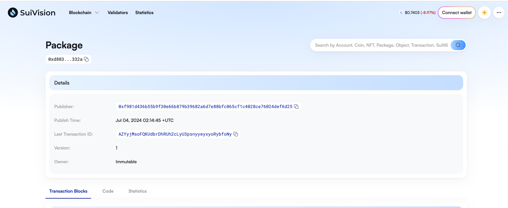
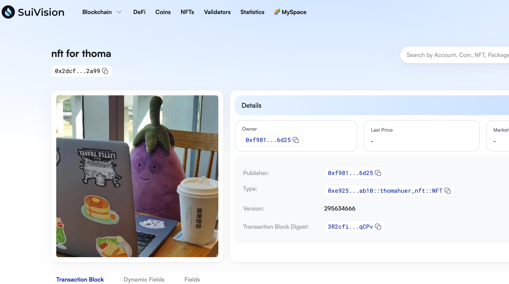
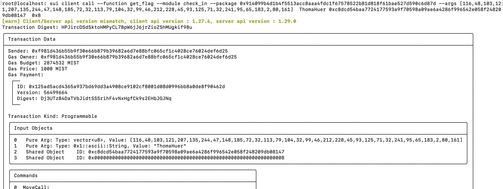

## 基本信息
- Sui钱包地址: `0xf981d436b55b9f30e66b879b39682a6d7e88bfc065cf1c4028ce76024def6d25`
> 首次参与需要完成第一个任务注册好钱包地址才被合并，并且后续学习奖励会打入这个地址
- github: `ThomaHuer`

## 个人简介
- 工作经验: 3年
- 技术栈: `C/CUDA`
> 重要提示 请认真写自己的简介
- 硬件加速开发经验，对Move特别感兴趣，想通过Move入门区块链

## 任务

##   01 hello move  
- [x] Sui cli version: 1.28.2
- [x] Sui钱包截图: 
- [x] package id: `0xd883d684f468562f88a8ce6cfc21fd22c54c55d9cd5bc050cd4e2dae3d77332a`
- [x] package id 在 scan上的查看截图:

##   02 move coin
- [x] My Coin package id :  `0x4ec11c0624cd41569b57b92f65e9e55513cac12bb341d8b698bbdd61ce0fb003`
- [x] Faucet package id : `0x4ec11c0624cd41569b57b92f65e9e55513cac12bb341d8b698bbdd61ce0fb003`
- [x] 转账 `My Coin` hash: `5cyeHFDBPajpzQSqAigzi3RCsgwxPxjPjsbkCMwEMt72`
- [x] `Faucet Coin` address1 mint hash: `5H7E78nf2iGtVwatTzKJN7nAkQyusZoPwi1vXgwuceHA`
- [x] `Faucet Coin` address2 mint hash: `3jJ2FCH9UjcdADz5w9HajRTix51Ah49KF1yZCwpnyyE4`

##   03 move NFT
- [x] nft package id : `0xe92524438738280f0145ec942255e759fe969e00b8ed9449e5d59f1367f1ab10`          
- [x] nft object id :  `0x2dcfa41933343219f40217efc11240d734c1aa09025e783d127c784e86342a99`
- [x] 转账 nft  hash: `6m1g8vxCjg8qz8pL5W6mmBDrZpibeTbnigSWxQhnrkPp`
- [x] scan上的NFT截图:

##   04 Move Game
- [x] game package id : `0x74743ec7e61f47a798270aa93058bec08e29d546556f79b7e35c2f533b77ea8f`
- [x] deposit Coin hash: `AXAgiBTDaepubx6GSHhmqtxdNDRtWj9pZFCbjr5avR1j`
- [x] withdraw `Coin` hash: `CQkbSc1GhHarQpWa4kxJd5BNKGGX1uhVLza9a6PUZmqN`
- [x] play game hash: `9nCky3UBDiynVx64cMij5YGj5zQRKCzvwXS2NQzzGDUu`

##   05 Move Swap
- [x] swap package id : `0x7c9ddf274fad286b0110722154712ec09b1bcde6778b9f55f98c0e2283488653`
- [x] call swap CoinA-> CoinB  hash : `AuE4wiaw6WpHqWk5PSLktDHTtBCieoe4XFhw7Rw5A6Z`
- [x] call swap CoinB-> CoinA  hash : `AYeTXbegkABm64yKhTNpdarJd2AEwdjjc4WySQW5uSnJ`

##   06 Dapp-kit SDK PTB
- [x] save hash : `Ep56dtymsWQa37AHi6Dj9zapGu6e696tShjL27X8Anre`

##   07 Move CTF Check In
- [x] CLI call 截图 : 
- [x] flag hash : `HPJircDSdSktoHMPyCL7BpW6jJ6jrZioZShMUgkif98u`

##   08 Move CTF Lets Move
- [x] proof :  `92ae831a88b0cd6fba32`
- [x] flag hash : `7ErKexcj3b2PGCukHv7GdNSLoThyfZGHM4YmXY4qvvHV`
