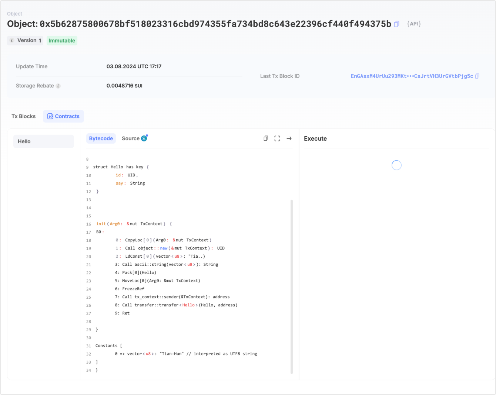
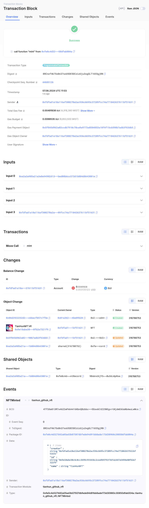
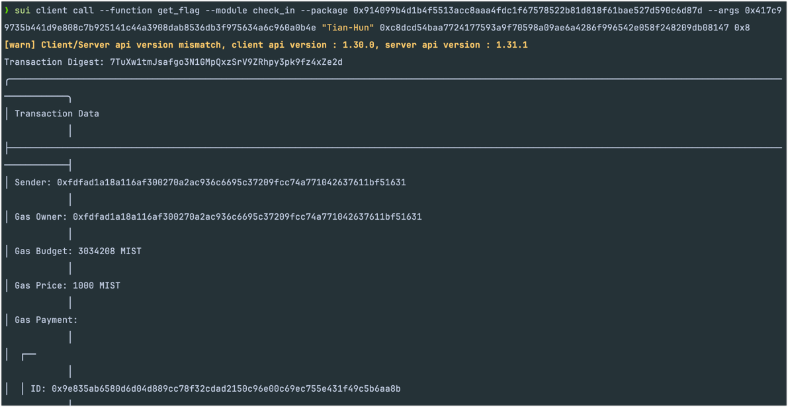

## 基本信息
- Sui钱包地址: `0x75f1593382299a7a383aaf02bd15483bd2224f29481873eb8b437872bf07961a`
> 首次参与需要完成第一个任务注册好钱包地址才被合并，并且后续学习奖励会打入这个地址
- github: `Tian-Hun`

## 个人简介
- 工作经验: 9 年
- 技术栈: `Javascript/Typescript` `Node.js` `Python` `Dart/Flutter`
> 重要提示 请认真写自己的简介
- 多年 web2 开发经验，对 Move 特别感兴趣，想通过 Move 入门区块链
- 联系方式: None

## 任务

##   01 hello move  
- [x] Sui cli version: sui 1.29.2-homebrew
- [x] Sui钱包截图: 
- [x] package id: 0x5b62875800678bf518023316cbd974355fa734bd8c643e22396cf440f494375b
- [x] package id 在 scan上的查看截图:

##   02 move coin
- [x] My Coin package id : 0x0fde7a34dc93f1401d93868361258a4b00ccf8aa0b58393eabeb5efb41ccfe66
- [x] Faucet package id : 0xccb69f4b847c308b24ae2bae1dac2454822a091bccb87fbf1f7e910cdde9405e
- [x] 转账 `My Coin` hash:3P9u4WkDnYfcb2rwWLhdTJ1PksLnDJp4pg3DoarJsUaV
- [x] `Faucet Coin` address1 mint hash:8kgtWSHWZUeQy7gSenTSdUA1TKcwr5JCfage5kJxrc8a
- [x] `Faucet Coin` address2 mint hash:7aBsjr36jV1Z27Wb9ecuPiNcBZgxwPT2QtyCCg9FYMzw

##   03 move NFT
- [x] nft package id :0xfe0c4d327b92a05ad3b07507dbfede94d91bb8ade173d30960c30850dfab004a
- [x] nft object id : 0x36771c32fdcce9e73d4b36c08c84559f4c14d67bfbcfa65105acd8959a0e9372
- [x] 转账 nft  hash:8RCnzf4k7SsBn37soU5DE5DCzizUju3xgGLT1655gjRN
- [x] scan上的NFT截图:

##   04 Move Game
- [x] game package id :0x4ef9cf6c97e16fc5e6bb2c6c3193dabd7633f91f89d6c5f82ec6b2b9575fb23e
- [x] deposit Coin hash:5EGQUcpxqT6518ZnDpjtNupqG9w9kSAthREooMXdNrkm
- [x] withdraw `Coin` hash:9sT3bVLJibKse8pZet7A8jrB3QG8MfevLVHWv9wDaP7x
- [x] play game hash:HzZVvTFMJ2YNjQ6iRxHVVfEFjhwivfzZig2gG9apczRd

##   05 Move Swap
- [x] swap package id :0xe13406c97851b94b9cc3121ff0b01719677dc6442009a95c062fbc5713de9f57
- [x] call swap CoinA-> CoinB  hash :3zijkpwNt1YC432ysFBWkiW8Lnm4t4njwNdXgoxe8qUS
- [x] call swap CoinB-> CoinA  hash :6cGE3ov486UHRp8auT3yK1gfVP9NTxnCru4KBJ6mKD4R

##   06 Dapp-kit SDK PTB
- [x] save hash :EzLWo2BY3yhLacrzaf8jK9S8WHdQQUkpKKLsjkmnhTgh

##   07 Move CTF Check In
- [x] CLI call 截图: 
- [x] flag hash: 7TuXw1tmJsafgo3N1GMpQxzSrV9ZRhpy3pk9fz4xZe2d

##   08 Move CTF Lets Move
- [x] proof:  32803021 ([205,136,244,1,0,0,0,0])
- [x] flag hash: HMuWrfwoBzMTDdDQQ1WTrjox3zwimTwSQufgvSuwvaBh
