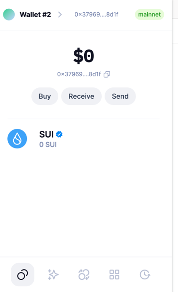
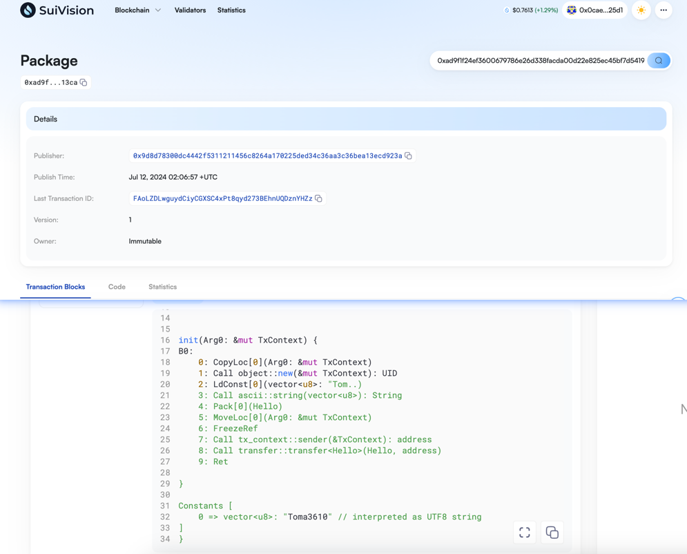
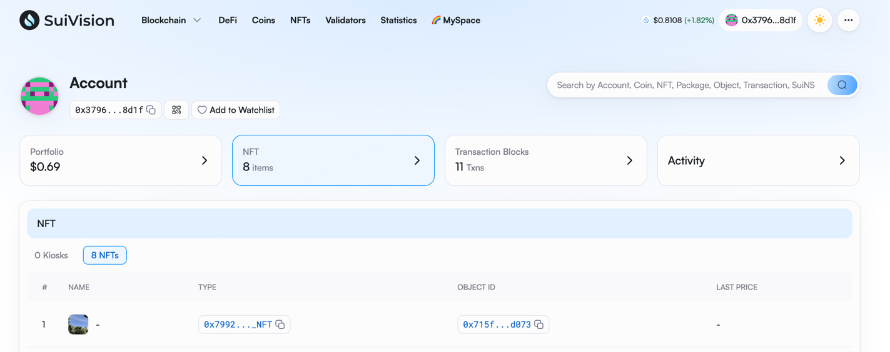

## 基本信息
- Sui钱包地址: `0x379691743aa92a4b0149bed9c76141630e9fc08773a75bf03090b02470038d1f`
> 首次参与需要完成第一个任务注册好钱包地址才被合并，并且后续学习奖励会打入这个地址
- github: `Toma3610`

## 个人简介
- 工作经验: 6年
- 技术栈: `Rust` `Java`
> 重要提示 请认真写自己的简介
- 多年web2开发经验，对Move特别感兴趣，想通过Move入门区块链
- 联系方式: tg: `https://t.me/toma3610` 

## 任务

##   01 hello move  
- [X] Sui cli version: sui 1.28.3-3781a7e6b56c
- [X] Sui钱包截图: 
- [X] package id: 0xad9f1f24ef3600679786e26d338facda00d22e825ec45bf7d541900b241513ca
- [X] package id 在 scan上的查看截图:

##   02 move coin
- [X] My Coin package id : 0x4937565c85650cdc064619333ccbf150ac3f5302d728948dba35f24014088491
- [X] Faucet package id : 0x0d759fda433607390946753c250ac07ba508aad83ca5c1041ab7a599a45d6f60
- [X] 转账 `My Coin` hash: 3fDFtaSj8uSpUj5Anu7ZS2ia3bQPpGWo38f8smUc81Kk
- [X] `Faucet Coin` address1 mint hash:9HDNpTewQPVVtXXk2aQJAH1K3YmBFN2krFcSJJryF4cq
- [X] `Faucet Coin` address2 mint hash:D5s8XG4jZmqPeeSS3Nxi2fyC9iuk4ucrmKMHXmHPwzLy

##   03 move NFT
- [X] nft package id : 0x7992ec142f96abb7c8a30169a8a6472af75a4d672bce4e1fc60d220100613ecf
- [X] nft object id : 0x715fa803c984d4422d6c41438db987149c7322a83cda892a39646bc769fdd073
- [X] 转账 nft  hash: 34XyUjoyoi3Mww9zaX5hmC62B1LeZspFMa91ydg5kFdt
- [X] scan上的NFT截图:

##   04 Move Game
- [] game package id :
- [] deposit Coin hash:
- [] withdraw `Coin` hash:
- [] play game hash:

##   05 Move Swap
- [] swap package id :
- [] call swap CoinA-> CoinB  hash :
- [] call swap CoinB-> CoinA  hash :

##   06 Dapp-kit SDK PTB
- [] save hash :

##   07 Move CTF Check In
- [] CLI call 截图 : 
- [] flag hash :

##   08 Move CTF Lets Move
- [] proof : 
- [] flag hash :
