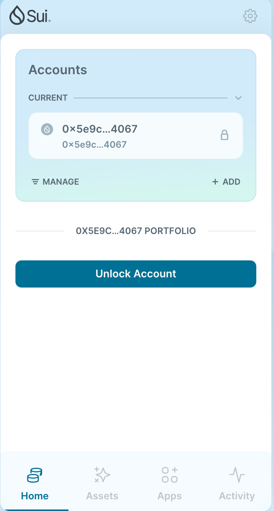
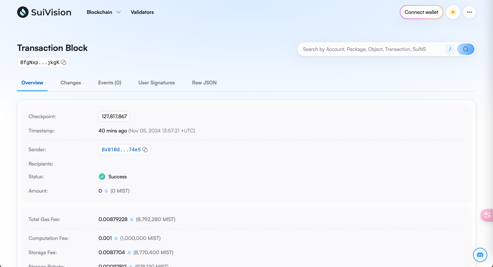

## 基本信息

- Sui 钱包地址: `0x5e9cc4d19dce85a30cd5b192588233b0f602802600052dce49fee0ef57564067`
  > 首次参与需要完成第一个任务注册好钱包地址才被合并，并且后续学习奖励会打入这个地址
- github: `Tornoto`

## 个人简介

- 工作经验: 5 年
- 技术栈: `Java` `Rust`
  > 重要提示 请认真写自己的简介
- 多年 java 开发经验，对 Move 特别感兴趣，想通过 Move 入门区块链
- 联系方式: tg: `Tornoto`

## 任务

## 01 hello move

- [x] Sui cli version: sui 1.37.1-7839b9501066
- [x] Sui 钱包截图: 
- [x] package id: BfgNxpRpJXEayZ61qVNGRNvViamxjE5nnh8A2yP6jkgK
- [x] package id 在 scan 上的查看截图:

## 02 move coin

- [] My Coin package id :
- [] Faucet package id :
- [] 转账 `My Coin` hash:
- [] `Faucet Coin` address1 mint hash:
- [] `Faucet Coin` address2 mint hash:

## 03 move NFT

- [] nft package id :
- [] nft object id :
- [] 转账 nft hash:
- [] scan 上的 NFT 截图:

## 04 Move Game

- [] game package id :
- [] deposit Coin hash:
- [] withdraw `Coin` hash:
- [] play game hash:

## 05 Move Swap

- [] swap package id :
- [] call swap CoinA-> CoinB hash :
- [] call swap CoinB-> CoinA hash :

## 06 Dapp-kit SDK PTB

- [] save hash :

## 07 Move CTF Check In

- [] CLI call 截图 : 
- [] flag hash :

## 08 Move CTF Lets Move

- [] proof :
- [] flag hash :
