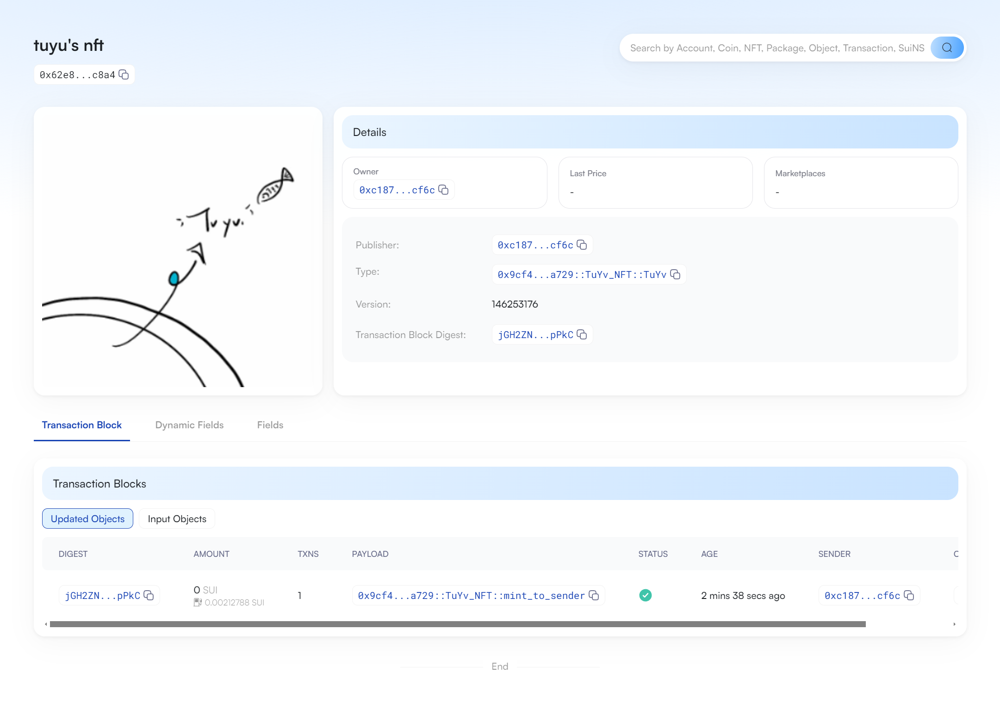

## 基本信息
- Sui钱包地址: `0xc187cfe01fdb2c8d3a81d12f54183e0d7e7d735da3cf0995be72102164f1cf6c`
> 首次参与需要完成第一个任务注册好钱包地址才被合并，并且后续学习奖励会打入这个地址
- github: `TuYv`

## 个人简介
- 工作经验: 7年
- 技术栈: `JAVA` `vue`
> 重要提示 请认真写自己的简介
- 多年web2开发经验，资深JAVA开发,对Move特别感兴趣，想通过Move入门区块链
- 联系方式: tg: `@Rick_Tu` 

## 任务

##   01 hello move  
- [x] Sui cli version: 1.25.0
- [] Sui钱包截图: 
- [x] package id: 0x14e1037482b2a8f0bc040002454af035428198b76ee00b6fabf71848367485c7
- [] package id 在 scan上的查看截图:

##   02 move coin
- [x] My Coin package id : 0x96f96b3029af57bfd44b0f1b0b76af23dd8475ea26026e26ca8096fdc6e5bd77
- [x] Faucet package id : 0xc9e44b1f7af4dff2d61b720ee6e780922f96fbc8a1022dc93d46ef78b1481777
- [x] 转账 `My Coin` hash: 4XZjbN5Qo4AvqB85sBhK6vAJPrF5DxxgmFi423BQTUom
- [x] `Faucet Coin` address1 mint hash: 8uKUceGQ6K7mLm58qSGe95NJaScF69Z8ZRLQ3WmWuMch
- [x] `Faucet Coin` address2 mint hash: AFt27RHTc4QSraZWkByCvxB3h6iTGxHMwWUsMLwMuRZp

##   03 move NFT
- [x] nft package id : 0x9cf4dd321a1db40886be126c0201b28598b0a5182ef79f84e10daafdc5e4a729
- [x] nft object id : 0x62e8dc93eaaa01a490adcee693cf1fa69dca774332aaa14eac67f214f466c8a4
- [] 转账 nft  hash:BogGY49Q56wKyUX53htfWgpchANyVzR6teBfh8BVsbrs
- [] scan上的NFT截图:

##   04 Move Game
- [] game package id :
- [] deposit Coin hash:
- [] withdraw `Coin` hash:
- [] play game hash:

##   05 Move Swap
- [] swap package id :
- [] call swap CoinA-> CoinB  hash :
- [] call swap CoinB-> CoinA  hash :

##   06 Dapp-kit SDK PTB
- [] save hash :
