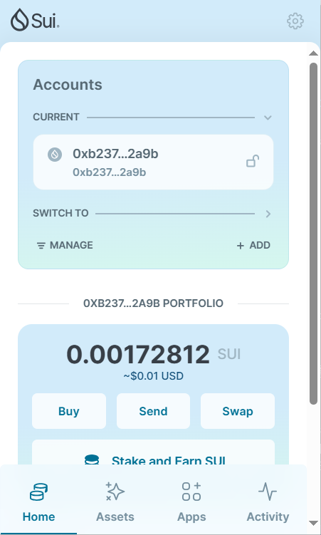
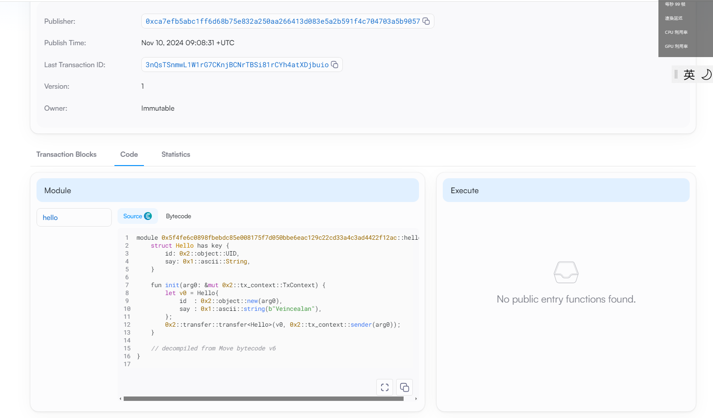
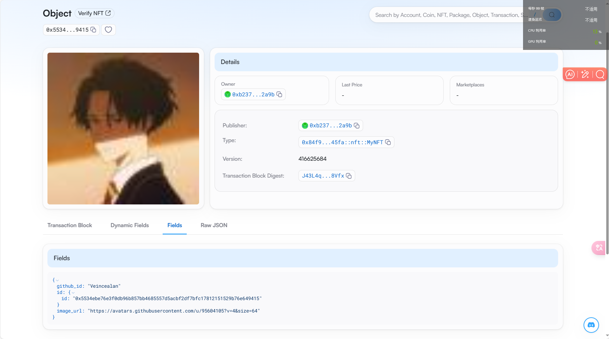

## 基本信息
- Sui钱包地址: `0xb2375d2d73ba4ed40129da74d5c29a91841170a682f9e84b6037c1c7d1f42a9b`
> 首次参与需要完成第一个任务注册好钱包地址才被合并，并且后续学习奖励会打入这个地址
- github: `Veincealan`

## 个人简介
- 工作经验: 0年
- 技术栈: `Python`
> 重要提示 请认真写自己的简介
- 对Move特别感兴趣，想通过Move入门区块链
- 联系方式: tg: `@AlanVicent` 

## 任务

##   01 hello move  
- [✓] Sui cli version:1.37.1-7839b9501066
- [✓] Sui钱包截图: 
- [✓] package id: 3nQsTSnmwL1W1rG7CKnjBCNrTBSi81rCYh4atXDjbuio
- [✓] package id 在 scan上的查看截图:

##   02 move coin
- [✓] My Coin package id :0xc3209494d8c52b2c44444fc34d47bbcc9156bc539eab602993f187bcad4dfe36 
- [✓] Faucet package id :0xc3209494d8c52b2c44444fc34d47bbcc9156bc539eab602993f187bcad4dfe36 
- [✓] 转账 `My Coin` hash:DzmHaaSFe67C6wEt6KAMhDYyAJFav64sr7CwnJs6GYZ9
- [✓] `Faucet Coin` address1 mint hash:GV4nyVyz6y5njr2BSHhSVL31TwGmErbs2jTwgrSCA8zX
- [✓] `Faucet Coin` address2 mint hash:76jrA7fN7ke5VhDqaTbSp9999aMU1CKFWnk5seVuyu6J

##   03 move NFT
- [✓] nft package id :0x84f9f40f9b4da0c8f44fc069a4bc6372965a6bbcb65491af9034f82023f345fa
- [✓] nft object id :0x5534ebe76e3f0db96b857bb4685557d5acbf2df7bfc17812151529b76e649415 
- [✓] 转账 nft  hash:6Xf9tFQSkPyZhD86dXKqjU6EMVTNpXMsyFVubZe8LS3c
- [✓] scan上的NFT截图:

##   04 Move Game
- [✓] game package id :0xc1e5ad7464b4816ce73ffec8752eeaa068306836909081736ce5d6dff0b98748
- [✓] deposit Coin hash:Cf3MGCd2axSZUESAkgDRscdRPuF8tkGWviyEaQTqCgMJ
- [✓] withdraw `Coin` hash:3aYguahzcvczNnmn5zrFyfwh8gfcwxTwWRTmqAu1j3Zh
- [✓] play game hash:CwhZqFCnnxqyu8i7y77V97DmrRoZVxHSx4a8ct3BmUrL

##   05 Move Swap
- [] swap package id :
- [] call swap CoinA-> CoinB  hash :
- [] call swap CoinB-> CoinA  hash :

##   06 Dapp-kit SDK PTB
- [] save hash :

##   07 Move CTF Check In
- [] CLI call 截图 : 
- [] flag hash :

##   08 Move CTF Lets Move
- [] proof : 
- [] flag hash :
