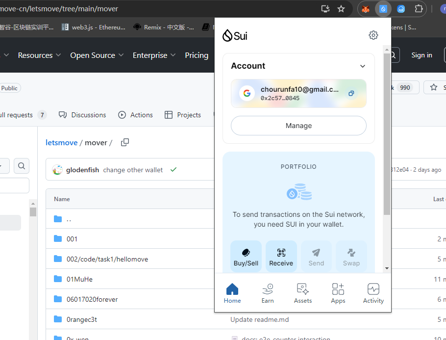
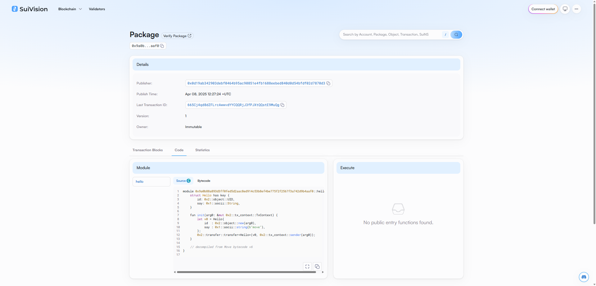
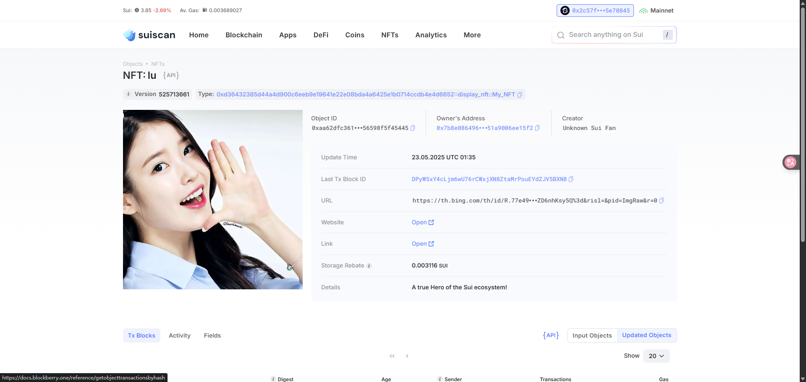

## 基本信息
- Sui钱包地址: `0x2c57f62931437ca57565642a01b291e73cf87306480c3ea73fed2e8995e70845`
> 首次参与需要完成第一个任务注册好钱包地址才被合并，并且后续学习奖励会打入这个地址
- github: `VipMason`

## 个人简介
- 工作经验: 1年
- 技术栈: `java` `C++`
> 重要提示 请认真写自己的简介
- 1年java开发经验，对Move特别感兴趣，想通过Move入门区块链
- 联系方式: tg: `xxx` 

## 任务

##   01 hello move  
- [] Sui cli version:sui 1.46.0-e011e770764f
- [] Sui钱包截图: 
- [] package id: 0x9a0b88a893d3ff0fed5d2aac8ed914c53b8ef4be775f2f2567f3a742d9b4aaf0
- [] package id 在 scan上的查看截图:

##   02 move coin
- [] My Coin package id : 0x83e8577d9ccfd315453f0c618a56f51080825679e47b676a9fa812aa2630b6f6
- [] Faucet package id : 0x83e8577d9ccfd315453f0c618a56f51080825679e47b676a9fa812aa2630b6f6
- [] 转账 `My Coin` hash: 4ZugZ9BABQ4LcddVVV7fEJmrXw5NJnGPuNzarV9pAut4
- [] `Faucet Coin` address1 mint hash: 4aALKP3PXy69nHZW2nXvA82RvTX17QaTUAU61dHrJRWV
- [] `Faucet Coin` address2 mint hash: HJCuxeAkiLAYmtitBDwE4GdsuPvqooYV6KSz8mEKKoJy

##   03 move NFT
- [] nft package id : 0xd36432385d44a4d900c6eeb9e19641e22e08bda4a6425e1b0714ccdb4e4d6652
- [] nft object id : 0xc22a3432de4692d99f929e287e23d57884927f44f5aa23f394f79531a3036cca
- [] 转账 nft  hash: 2kXyiZ3LaP14MRW6SCjgn2uG8MriS5wxuuc8Bai5zA8s
- [] scan上的NFT截图:

##   04 Move Game
- [] game package id :0xe284f47d8cf3180a1449d9dc3a38acdbffba174774a3cc4635241b6d027833d2
- [] deposit Coin hash:B8JWrC1uwRMfUb2gZ4mRGHACizdSRvThSJFsXktVgLnt
- [] withdraw `Coin` hash:HVTfpTW6mF5fwdrzGqhvMhfpHmAbXUDr7GJp7FkmPexC
- [] play game hash:QtSSRYSEzvHJHTKcDHyL3iUKdwRyhfj4BwAgAper2VS

##   05 Move Swap
- [] swap package id :
- [] call swap CoinA-> CoinB  hash :
- [] call swap CoinB-> CoinA  hash :

##   06 Dapp-kit SDK PTB
- [] save hash :

##   07 Move CTF Check In
- [] CLI call 截图 : 
- [] flag hash :

##   08 Move CTF Lets Move
- [] proof : 
- [] flag hash :

