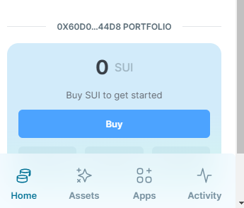
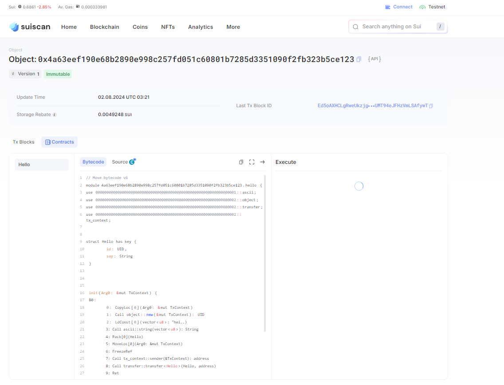

## 基本信息

- Sui钱包地址: 0x60d08ad7840fd99ca434ba05aaf1b2d737fee0f319e97c54067d6561639644d8
  
  > 首次参与需要完成第一个任务注册好钱包地址才被合并，并且后续学习奖励会打入这个地址

- github: VirFriend

## 个人简介

- 工作经验: 6年
- 技术栈: Golang

## 任务

## 01 hello move

- [x] Sui cli version: 1.30.1-a4185da5659d
- [x] package id: 0x4a63eef190e68b2890e998c257fd051c60801b7285d3351090f2fb323b5ce123
- [x] Sui钱包截图: 
- [x] package id 在 scan上的查看截图:

##   02 move coin
- [] My Coin package id :
- [] Faucet package id :
- [] 转账 `My Coin` hash:
- [] `Faucet Coin` address1 mint hash:
- [] `Faucet Coin` address2 mint hash:

##   03 move NFT
- [] nft package id :
- [] nft object id :
- [] 转账 nft  hash:
- [] scan上的NFT截图:

##   04 Move Game
- [] game package id :
- [] deposit Coin hash:
- [] withdraw `Coin` hash:
- [] play game hash:

##   05 Move Swap
- [] swap package id :
- [] call swap CoinA-> CoinB  hash :
- [] call swap CoinB-> CoinA  hash :

##   06 Dapp-kit SDK PTB
- [] save hash :

##   07 Move CTF Check In
- [] CLI call 截图 : 
- [] flag hash :

##   08 Move CTF Lets Move
- [] proof :
- [] flag hash :
