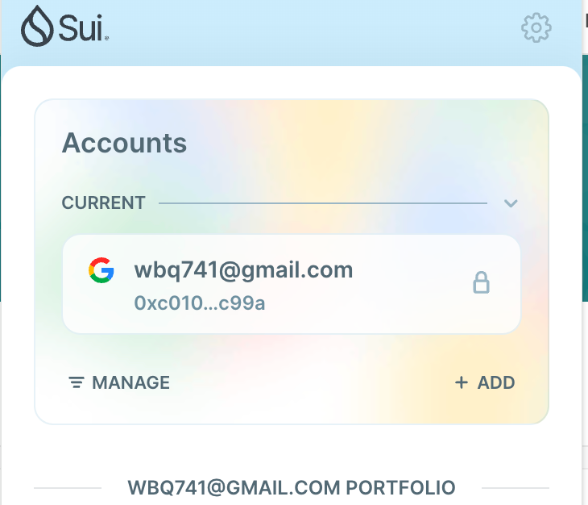
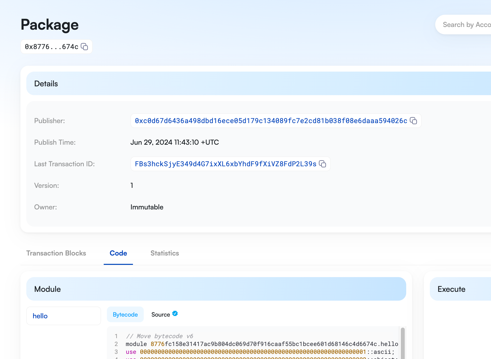
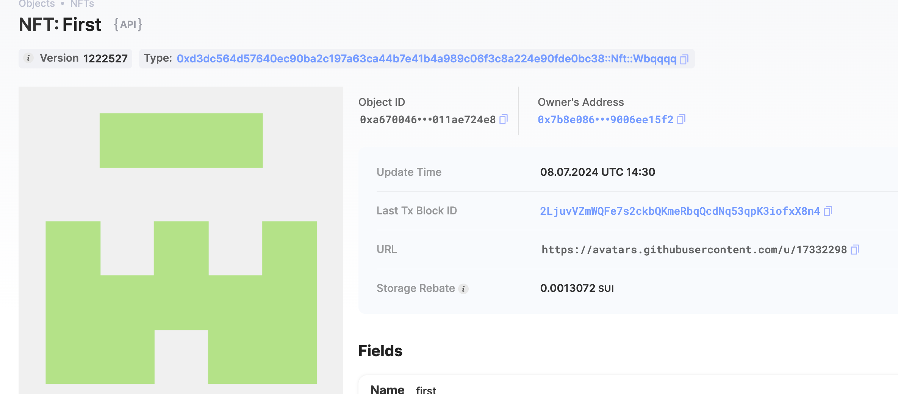

## 基本信息
- Sui钱包地址: `0xc0100e2aeabf566856da019847049d51dab17314ef7fa1ab30d142cbd864c99a`
> 首次参与需要完成第一个任务注册好钱包地址才被合并，并且后续学习奖励会打入这个地址
- github: `Wbqqqq`

## 个人简介
- 工作经验: x年
- 技术栈: `Rust` `C++`
> 重要提示 请认真写自己的简介
- 多年web2开发经验，对Move特别感兴趣，想通过Move入门区块链
- 联系方式: tg: `xxx` 

## 任务

##   01 hello move  
- [x] Sui cli version: sui 1.27.2-homebrew
- [x] Sui钱包截图: 
- [x] package id: 0x8776fc158e31417ac9b804dc069d70f916caaf55bc1bcee601d68146c4d6674c
- [x] package id 在 scan上的查看截图:

##   02 move coin
- [] My Coin package id : 0x711c39ac903e296e5496c291c147221301771b763d48259ca0dba325ca5000aa
- [] Faucet package id :  0x77fc4975f41d294cdaa6ba1e6dafb1d3389bce6a00acc0fafc04a6504dfca07d
- [] 转账 `My Coin` hash: 3nnPp9iqtzDGgThP5z7V3czih2sxjKEcRya3mGNZLvRU
- [] `Faucet Coin` address1 mint hash: 7xKKXdZB96ThLpr36SQvGewBbdwrP6TB81WNMooz9dJJ
- [] `Faucet Coin` address2 mint hash: EpGvQEe764mpHdaBmusZkgk5CrBc8BXSVcwxrJHgdB15

##   03 move NFT
- [] nft package id : 0xd3dc564d57640ec90ba2c197a63ca44b7e41b4a989c06f3c8a224e90fde0bc38
- [] nft object id : 0xa6700469274e79a6a67979e106190fd13676cedc925966a2d73941011ae724e8
- [] 转账 nft  hash: 2LjuvVZmWQFe7s2ckbQKmeRbqQcdNq53qpK3iofxX8n4
- [] scan上的NFT截图:

##   04 Move Game
- [] game package id : 0x32dc2903a9f210df96d819e57f7b1a57793ad35276fc07b11be1028075482728
- [] deposit Coin hash: 9k7QvdPqgkk9PykDwbF4LygYHqBGHumoHJm7mxSUdmcu
- [] withdraw `Coin` hash: F9UChKqdA1FtFL6FEEBCcJrFBytDqhXcjQ1MhKVrytU1
- [] play game hash: 5isEytPfzCn9hXKRuSNj95z3XmYjg1k4RER789CUKzHX

##   05 Move Swap
- [] swap package id : 0x6a08caf25d583e00384519090f441a9c922ac235d7d5899894b07a92f13b5d77
- [] call swap CoinA-> CoinB  hash : F81mYMDdjSWbRsjRC3cCCqJH2QrHLLDPKKPu4te2xFAi
- [] call swap CoinB-> CoinA  hash : 54NPiPbVNyiszCusVLKWdGgx2AjDbsZEXqJuw2tWUygc

##   06 Dapp-kit SDK PTB
- [] save hash :

##   07 Move CTF Check In
- [] CLI call 截图 : 
- [] flag hash :

##   08 Move CTF Lets Move
- [] proof : 
- [] flag hash :
