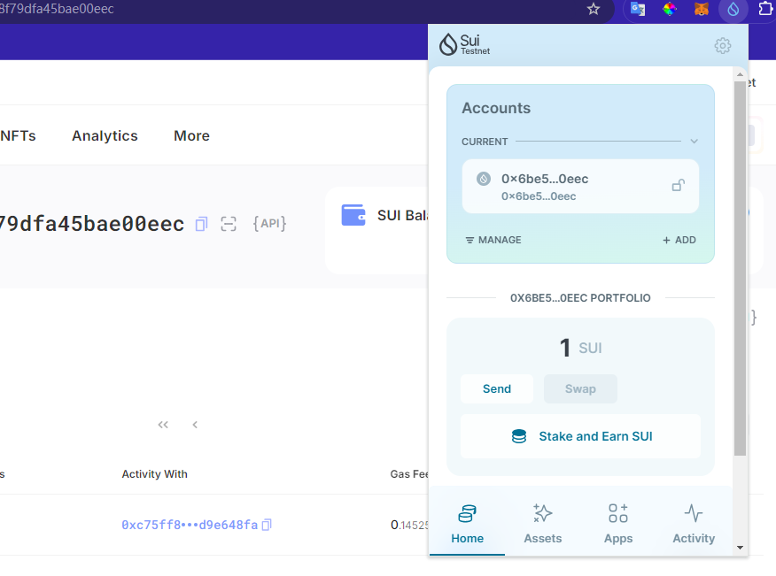
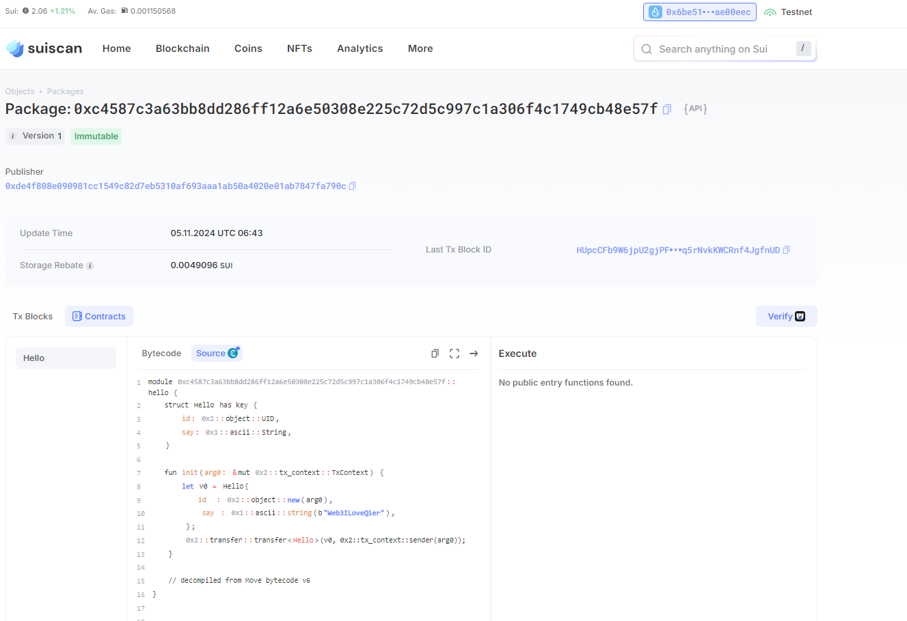

## 基本信息

- Sui 钱包地址: `0x6be510d9f1e79d33534d3e085d6dce332ebb2133b7f2d358f79dfa45bae00eec`
  > 首次参与需要完成第一个任务注册好钱包地址才被合并，并且后续学习奖励会打入这个地址
- github: `Web3ILoveQier`

## 个人简介

- 工作经验: 6 年
- 技术栈: `Javascript` `solidity`
  > 重要提示 请认真写自己的简介
- 6 年前端开发经验，正在学习 solidity 和 move，希望未来能找到远程 fullstack 开发工作
- 联系方式: tg: `xxx`

## 任务

## 01 hello move

- [√] Sui cli version:sui 1.37.1-7839b9501066
- [√] Sui 钱包截图: 
- [√] package id:0xc4587c3a63bb8dd286ff12a6e50308e225c72d5c997c1a306f4c1749cb48e57f
- [√] package id 在 scan 上的查看截图:

## 02 move coin

- [] My Coin package id :
- [] Faucet package id :
- [] 转账 `My Coin` hash:
- [] `Faucet Coin` address1 mint hash:
- [] `Faucet Coin` address2 mint hash:

## 03 move NFT

- [] nft package id :
- [] nft object id :
- [] 转账 nft hash:
- [] scan 上的 NFT 截图:

## 04 Move Game

- [] game package id :
- [] deposit Coin hash:
- [] withdraw `Coin` hash:
- [] play game hash:

## 05 Move Swap

- [] swap package id :
- [] call swap CoinA-> CoinB hash :
- [] call swap CoinB-> CoinA hash :

## 06 Dapp-kit SDK PTB

- [] save hash :

## 07 Move CTF Check In

- [] CLI call 截图 : 
- [] flag hash :

## 08 Move CTF Lets Move

- [] proof :
- [] flag hash :
