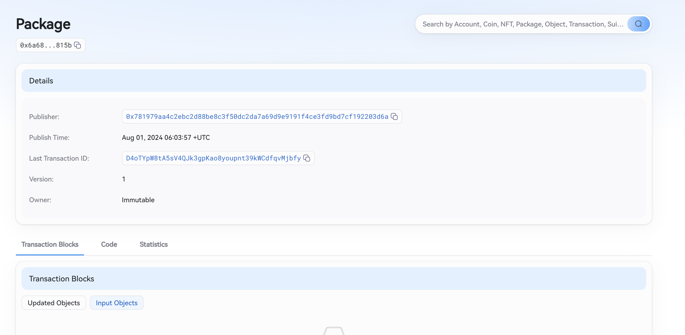
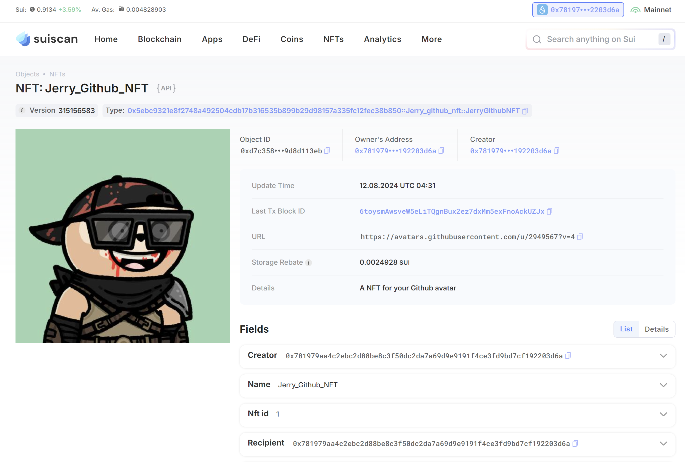
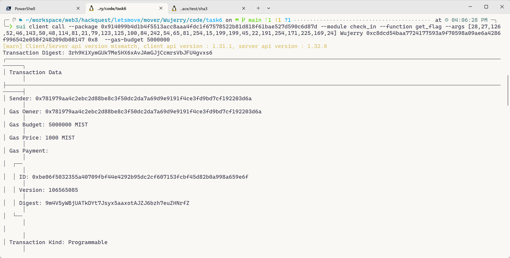

## 基本信息
- Sui钱包地址: `0xe3d5ad0071da63db13000b3e07812a6b16f1f42db1517da912ce60897dc97c60`
> 首次参与需要完成第一个任务注册好钱包地址才被合并，并且后续学习奖励会打入这个地址
- github: `Wujerry`

## 个人简介
- 工作经验: 8年
- 技术栈: `Javascript` `Flutter` `Java` `C#` 
> 重要提示 请认真写自己的简介
- 多年web2全栈(偏前端)开发经验，对Move和Movement特别感兴趣，已经完成基础的Solidity教程，想通过Move进入区块链行业
- 联系方式: tg: `JerryImba` 

## 任务

##   01 hello move  
- [x] Sui cli version: `sui 1.30.1-a4185da5659d`
- [x] Sui钱包截图: 
- [x] package id: 0x6a689266b8d4675916cadf634c036fc671ceb2a86e433abd72206222f8a6815b
- [x] package id 在 scan上的查看截图:

##   02 move coin
- [x] My Coin package id : 0x29dc673186351105c22905403d596fd93177cfe0ac250cfbf1090eaefd1113f2
- [x] Faucet package id : 0x29dc673186351105c22905403d596fd93177cfe0ac250cfbf1090eaefd1113f2
- [x] 转账 `My Coin` hash: GNW7fcwLDbzsqsuXMAYtnXTawgsq7eN5eoigXxSoWSh5
- [x] `Faucet Coin` address1 mint hash: 8VUGfFegktgqcBZ73vvL7TRfyfRSjz9Lu8Bqq5BDFfTY
- [x] `Faucet Coin` address2 mint hash: 4jZkdSf7QaKLsHVsGmyRptdc7cux1DxBbkgbt81jGNf9

##   03 move NFT
- [x] nft package id : 0x5ebc9321e8f2748a492504cdb17b316535b899b29d98157a335fc12fec38b850
- [x] nft object id : 0x99d4e63b90fa1ba8cae2a9660106768521c33dcb869241810569f205aaeba2ec
- [x] 转账 nft  hash: 66T5oQLJNc81zDcirK98mJYt9MiwgNXRVn147mYZ1BRg
- [x] scan上的NFT截图:

##   04 Move Game
- [x] game package id : 0x80ef91e852cd82453fd465d59a7025230215d1e6a54909440a2b5be594fba85b
- [x] deposit Coin hash: FeCQNzofbyzm6E534n3Bk4zLm6r813MBcnD2ndeoddDq
- [x] withdraw `Coin` hash: FWvsxRaA78S8edunmrJfkgH4hMW2kSxsWQzqYWaAR8mo
- [x] play game hash: FWvsxRaA78S8edunmrJfkgH4hMW2kSxsWQzqYWaAR8mo

##   05 Move Swap
- [x] swap package id : 0x7e71bb622e1683fdec8369624db34d6ee5c8e7d681a14c4e5e7923d77aeae2f5
- [x] call swap CoinA-> CoinB  hash : GKdduUuwLPr518DwCajZcojokzbKbuB3MbsgwxpGL98X
- [x] call swap CoinB-> CoinA  hash : 4DSKtTy2aFqprb1ZJd5FLj8X3XRsvtuquyVKmSeenetG

##   06 Dapp-kit SDK PTB
- [x] save hash : 9JhgQrQoTwHhQfHSbj5tWZmzRzSF5LBTgNDqviG8iojz

##   07 Move CTF Check In
- [x] CLI call 截图 : 
- [x] flag hash : 3rh9KiXymGUk7MeSHX6xAvJAwGJjCcmrsVbJFU4gvxs6

##   08 Move CTF Lets Move
- [x] proof : [72,146,83]
- [x] flag hash : 3tSxjbWkgWGYWc6jYW4hc7RcT9EXL2mPYgfSLtezy7jM
