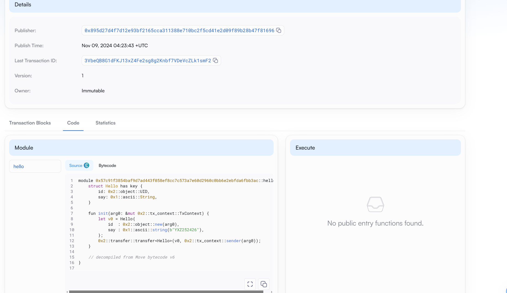

## 基本信息
- Sui钱包地址: `0x36267b37782396812512e83c32ee51b84eeaae0d7b92f3ddaf9c6c81e88dd620`
> 首次参与需要完成第一个任务注册好钱包地址才被合并，并且后续学习奖励会打入这个地址
- github: `YXZ252426`

## 个人简介
- 工作经验: 半年
- 技术栈: `GO` `JAVA` `React` `Python`
> 重要提示 请认真写自己的简介
- 计算机科学与技术大二在读，希望通过这次学习机会真正融入WEB3生态，融入SUI生态
- 联系方式: tg: `YXZ252426` gmail: `yexiongzhi5@gmail.com` QQ: `3069946891@qq.com`  

## 任务

##   01 hello move  
- [x] Sui cli version: sui 1.37.1-7839b9501066

- [x] Sui钱包截图: 
- [x] package id: 0x57c91f3854baf9d7ad443f058ef8cc7c573a7e60d2960c0bb6e2ebfda6fbb3ac
- [x] package id 在 scan上的查看截图:

##   02 move coin
- [x] My Coin package id : 0x4a84cee52be28b15ccaf679692aa8324dbc057e626843f18ea5533fa9efad9a6
- [x] Faucet package id : 0xca91323681336a5b81bd8405ae740ebf25109d664ffdd1b5a25368e4ce53ce17
- [x] 转账 `My Coin` hash:3jZ43YJi2HJ4SZdeVjoJXp2UAuCXhpS43Kh8tnkszj7R
- [x] `Faucet Coin` address1 mint hash:4Rgjn5nZoj4Ra3x48GMQnZnJxf5HhcFhWk8u96FsUGg4
- [x] `Faucet Coin` address2 mint hash:3tMK1VuaUdT2X5KUxLnpVqsFLio419qQkyk9LkT4Q1T6

##   03 move NFT
- [] nft package id :
- [] nft object id : 
- [] 转账 nft  hash:
- [] scan上的NFT截图:
- 

##   04 Move Game
- [] game package id :
- [] deposit Coin hash:
- [] withdraw `Coin` hash:
- [] play game hash:

##   05 Move Swap
- [] swap package id :
- [] call swap CoinA-> CoinB  hash :
- [] call swap CoinB-> CoinA  hash :

##   06 Dapp-kit SDK PTB
- [] save hash :

##   07 Move CTF Check In
- [] CLI call 截图 : 
- [] flag hash :

##   08 Move CTF Lets Move
- [] proof : 
- [] flag hash :
