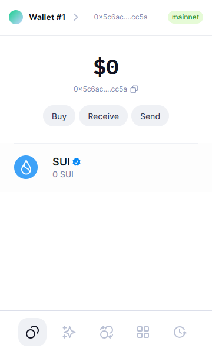
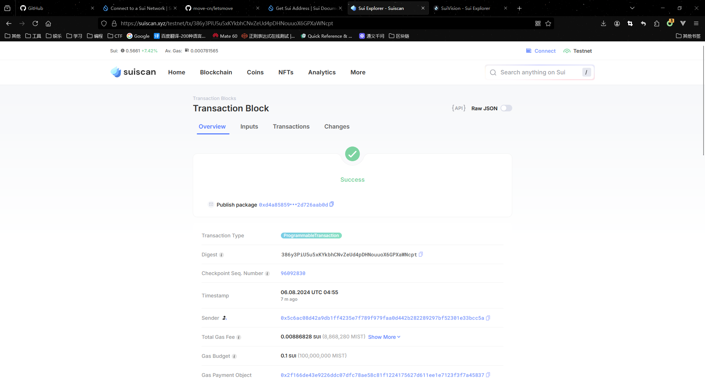

## 基本信息

- Sui 钱包地址: `0x5c6ac08d42a9db1ff4235e7f789f979faa0d442b282289297bf52301e33bcc5a`
  > 首次参与需要完成第一个任务注册好钱包地址才被合并，并且后续学习奖励会打入这个地址
- github: `YiGuMoYan`

## 个人简介

- 工作经验: 2 年
- 技术栈: `Java` `Python`
  > 重要提示 请认真写自己的简介
- 具有 web2 开发经验，当前正在学习区块链，对 Move 特别感兴趣。
- 联系方式: qq: `3194775246`

## 任务

## 01 hello move

- [] Sui cli version: sui 1.30.1-a4185da5659d
- [] Sui 钱包截图: 
- [] package id: 386y3PiU5u5xKYkbhCNvZeUd4pDHNouuoX6GPXaWNcpt
- [] package id 在 scan 上的查看截图:

## 02 move coin

- [] My Coin package id :
- [] Faucet package id :
- [] 转账 `My Coin` hash:
- [] `Faucet Coin` address1 mint hash:
- [] `Faucet Coin` address2 mint hash:

## 03 move NFT

- [] nft package id :
- [] nft object id :
- [] 转账 nft hash:
- [] scan 上的 NFT 截图:

## 04 Move Game

- [] game package id :
- [] deposit Coin hash:
- [] withdraw `Coin` hash:
- [] play game hash:

## 05 Move Swap

- [] swap package id :
- [] call swap CoinA-> CoinB hash :
- [] call swap CoinB-> CoinA hash :

## 06 Dapp-kit SDK PTB

- [] save hash :

## 07 Move CTF Check In

- [] CLI call 截图 : 
- [] flag hash :

## 08 Move CTF Lets Move

- [] proof :
- [] flag hash :
