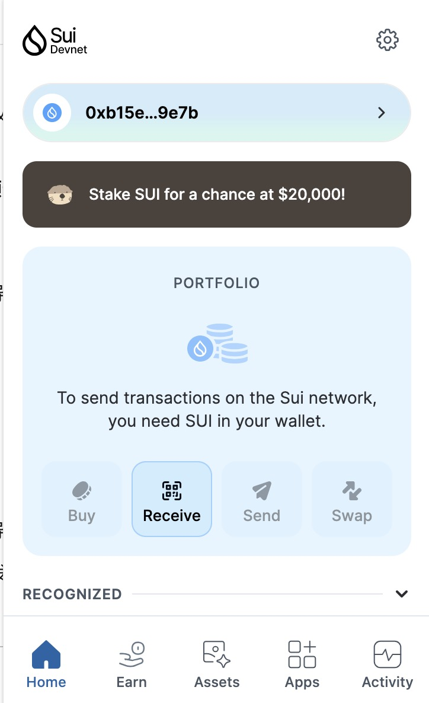
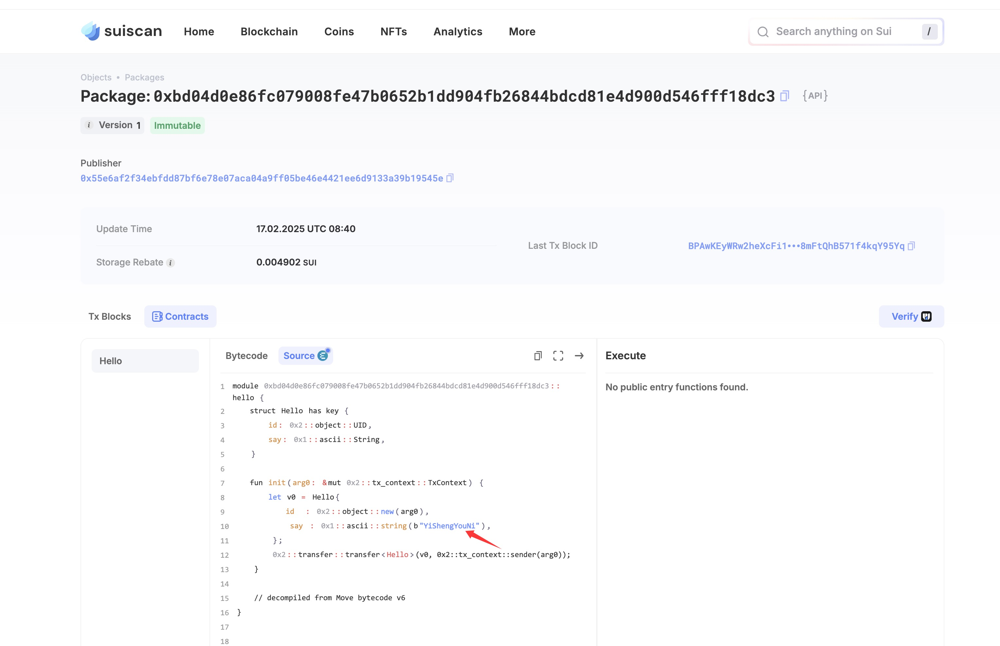
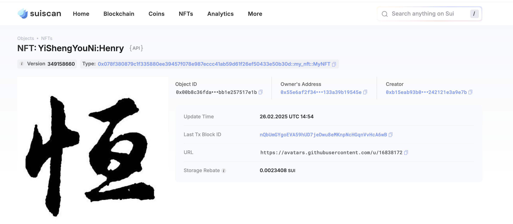

# Sui 共学营

## 基本信息

- Sui钱包地址: `0xb15eab93b07c186c4ec4312faa4a6a1cb284258200c8f7df21f242121e3a9e7b`

> 首次参与需要完成第一个任务注册好钱包地址才被合并，并且后续学习奖励会打入这个地址

- github: `YiShengYouNi`

## 个人简介

- 工作经验: 10年
- 技术栈: `JavaScript/Typescript`(`React`/`Vue`)、`Node`

> 重要提示 请认真写自己的简介

- 我是一名拥有 10 年 Web 开发经验的技术经理和架构师，在多家公司中带领过团队，也主导过多个中大型项目的技术设计。写代码、解决问题、优化用户体验这些事，一直让我感到兴奋，因为我热爱创造并看到它产生实际影响。
- 最近，我对 Web3 领域产生了浓厚的兴趣。这个充满未知和可能性的领域让我很兴奋，也让我重新找回了刚开始学习编程时的那种好奇心。我希望未来能在这方面做一些尝试，深入探索区块链和去中心化的世界。
- 联系方式: tg: `Henry Wei`

## 任务

## 01 hello move  

- [✔️] Sui cli version: sui 1.42.2-homebrew
- [✔️] Sui钱包截图: 
- [✔️] package id: 0xbd04d0e86fc079008fe47b0652b1dd904fb26844bdcd81e4d900d546fff18dc3
- [✔️] package id 在 scan上的查看截图:

## 02 move coin

- [] My Coin package id :
- [] Faucet package id :
- [] 转账 `My Coin` hash:
- [] `Faucet Coin` address1 mint hash:
- [] `Faucet Coin` address2 mint hash:

## 03 move NFT

- [✔️] nft package id : 0x078f380879c1f335880ee39457f078e987eccc41ab59d61f26ef50433e50b30d
- [✔️] nft object id : 0x00b8c36fda9d2cdd0ca0cbe615f72e0326c9fa746b12015d261bb1e257517e1b
- [✔️] 转账 nft  hash: FLXix3JhPHtPXHJBRcL6t5x8CqTHf8mqdSuhZRpvh8tC
- [✔️] scan上的NFT截图:

## 04 Move Game

- [] game package id :
- [] deposit Coin hash:
- [] withdraw `Coin` hash:
- [] play game hash:

## 05 Move Swap

- [] swap package id :
- [] call swap CoinA-> CoinB  hash :
- [] call swap CoinB-> CoinA  hash :

## 06 Dapp-kit SDK PTB

- [] save hash :

## 07 Move CTF Check In

- [] CLI call 截图 : 
- [] flag hash :

## 08 Move CTF Lets Move

- [] proof :
- [] flag hash :
