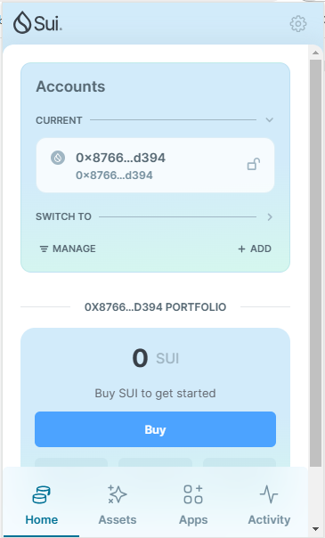
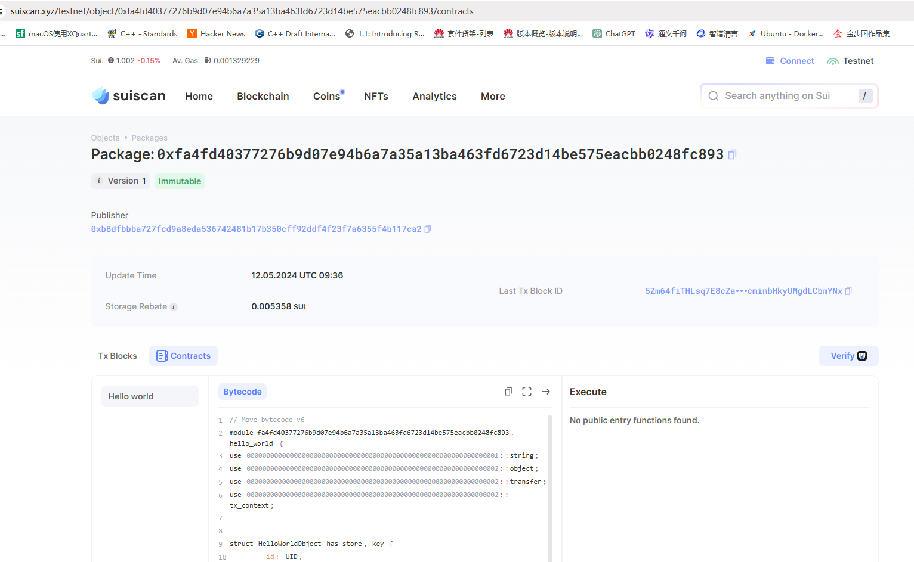
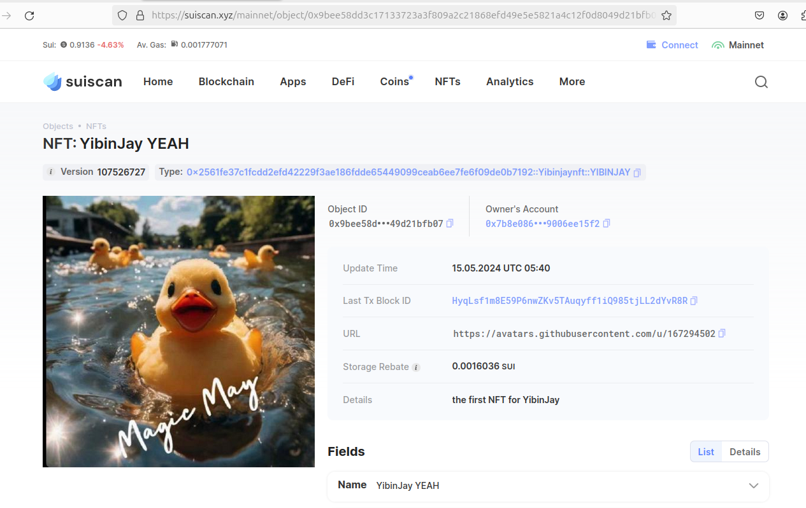

## 基本信息
- Sui钱包地址: `0x8766fc99c2c3f9099d52d03126b5d04695bd9e1febcbdb9859fe56aedd00d394`
> 首次参与需要完成第一个任务注册好钱包地址才被合并，并且后续学习奖励会打入这个地址
- github: `YibinJay`

## 个人简介
- 工作经验: 1年
- 技术栈:  `C++`
> 重要提示 请认真写自己的简介
- 对sui和move生态感兴趣
- 联系方式: qq: `3862848960` 

## 任务

##   01 hello move  
- [x] Sui cli version: sui 1.24.1-d63ccc6
- [x] Sui钱包截图: 
- [x] package id:  0xfa4fd40377276b9d07e94b6a7a35a13ba463fd6723d14be575eacbb0248fc893 
- [x] package id 在 scan上的查看截图:

##   02 move coin
- [x] My Coin package id : 0xe55f387b15347ce3200e408c1213ee2a6f5951875d8239124c7555e7bc4d029c
- [x] Faucet package id : 0xe55f387b15347ce3200e408c1213ee2a6f5951875d8239124c7555e7bc4d029c
- [x] 转账 `My Coin` hash: FEW7azuuAH7TNVr4MHuvAoxwzUSNfjaUec9m6i2L34Bc
- [x] `Faucet Coin` address1 mint hash: FLQBYUvoESubvsogLmiLYBQ5LrLDsYRTcBQwAcwBRb4i
- [x] `Faucet Coin` address2 mint hash: 7sWRBMf5T3hH4C5crXakUWKtXgRJs2LbztMi4GsCsqeE

##   03 move NFT
- [x] nft package id : 0x2561fe37c1fcdd2efd42229f3ae186fdde65449099ceab6ee7fe6f09de0b7192
- [x] nft object id :  0x9bee58dd3c17133723a3f809a2c21868efd49e5e5821a4c12f0d8049d21bfb07
- [x] 转账 nft  hash:  HyqLsf1m8E59P6nwZKv5TAuqyff1iQ985tjLL2dYvR8R
- [x] scan上的NFT截图:

##   04 Move Game
- [x] game package id : 0x9e0afa8af3b477f64a847cd9789b6e36b110dc69945ff09fe7dc45ddbb670d06
- [x] deposit Coin hash: 75VRQBU2rG2q1tihNQvL9pzwwMjWwdDS6Fj5PqT6JRXb
- [x] withdraw `Coin` hash: 5tDLMSNkGkGB5B1B4T8XGzBYgDFk8w5UUCwRMr7hZgHb
- [x] play game hash: CiToCsPnbfP2mkWrwERmUr8x1f7LeJr24yy2561jZFrD

##   05 Move Swap
- [x] swap package id : 0x0cd49e2217686cae5de14459a5a9f7721b7561362c6b181563033c77fb5acc65
- [x] call swap CoinA-> CoinB  hash : GwrVA7QfD8rPYtui4V4XCGkLLXFKNFEWWNXMrSAqgrHx
- [x] call swap CoinB-> CoinA  hash : E4yHc2jQkpkDf3mAVgqbpeAq8RhEGmV4MnqDzD5fHSSS

##   06 SDK PTB
- [x] save hash : 5s7F2Jib6xGnownyAsRUVjUXW7iAEc23zYdxRKo4DFHf
