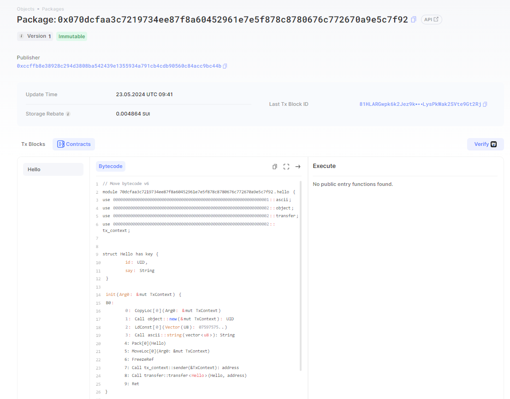
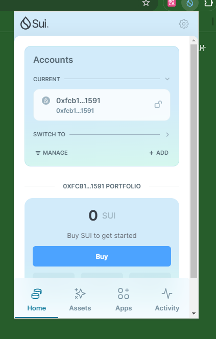

## 基本信息

- Sui钱包地址: 0xfcb1bfb86bb70fcaf997bd4593ddfbab20c6107fded0db4b28a61910dec91591
  
  > 首次参与需要完成第一个任务注册好钱包地址才被合并，并且后续学习奖励会打入这个地址

- github: YuuCccc

## 个人简介

- 工作经验: 4年
- 技术栈: Nodejs\Java
- 刚接触sui链，希望通过move学习能进入sui链生态
- 联系方式: YuuCccc@Gmail.com

## 任务

## 01 hello move

- [x] Sui cli version: 1.25.1
- [x] package id: 0x070dcfaa3c7219734ee87f8a60452961e7e5f878c8780676c772670a9e5c7f92
- [x] Sui钱包截图: 
- [x] package id 在 scan上的查看截图:

