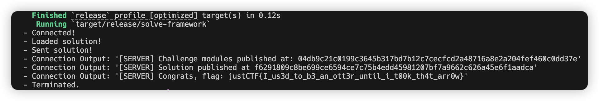

# justCTF2024-Dark BrOTTERhood

> Description: In the shadowed corners of the Dark Brotterhood's secrets, lies a tavern where valiant Otters barter for swords and shields. Here, amidst whispers of hidden bounties, adventurers find the means to battle fearsome monsters for rich rewards. Join this clandestine fellowship, where the blockchain holds mysteries to uncover. Otters of Valor, your destiny calls; may your path be lined with both honor and gold.

solve.move:
```move
module solve::solve {

    // [*] Import dependencies
    use challenge::Otter::{Self, OTTER};
    use sui::random::Random;

    #[allow(lint(public_random))]
    public fun solve(
        _vault: &mut Otter::Vault<OTTER>,
        _questboard: &mut Otter::QuestBoard,
        _player: &mut Otter::Player,
        _r: &Random,
        _ctx: &mut TxContext,
    ) {
        challenge::Otter::buy_sword(_vault, _player, _ctx);
        challenge::Otter::find_a_monster(_questboard, _r, _ctx);
        challenge::Otter::fight_monster(_questboard, _player, 0);
        challenge::Otter::return_home(_questboard, 0);
        let mut i = 0;
        while (i < 100) {
            challenge::Otter::find_a_monster(_questboard, _r, _ctx);
            challenge::Otter::get_the_reward(_vault, _questboard, _player, 0, _ctx);
            i = i+1;
        };

        let flag = challenge::Otter::buy_flag(_vault, _player, _ctx);
        challenge::Otter::prove(_questboard, flag);
    }

}
```

