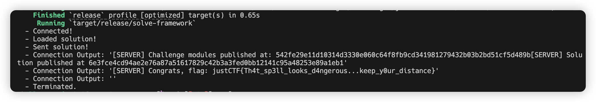

# justCTF2024-The Otter Scrolls

> Description: Behold the ancient Spellbook, a tome of arcane wisdom where spells cast by mystical Otters weave the threads of fate. Embark on this enchanted journey where the secrets of the blockchain will be revealed. Brave adventurers, your quest awaits; may your courage be as boundless as the magic that guides you.

solve.move:
```move
module solve::solve {

    // [*] Import dependencies
    use challenge::theotterscrolls;

    public fun solve(
        _spellbook: &mut theotterscrolls::Spellbook,
        _ctx: &mut TxContext
    ) {
        let seq = &mut vector::empty<u64>();
        vector::push_back(seq, 1);
        vector::push_back(seq, 0);
        vector::push_back(seq, 3);
        vector::push_back(seq, 3);
        vector::push_back(seq, 3);
        challenge::theotterscrolls::cast_spell(*seq, _spellbook);
    }

}
```

