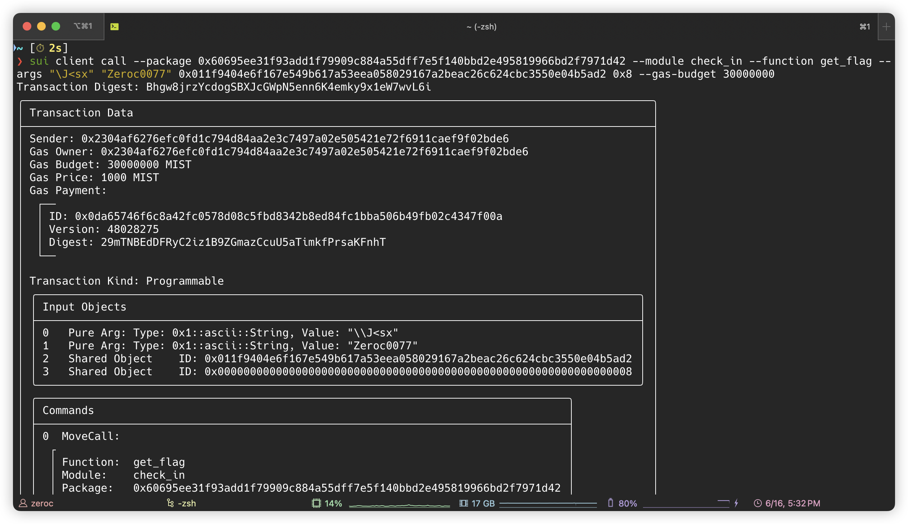

## 基本信息
- Sui钱包地址: `0x2304af6276efc0fd1c794d84aa2e3c7497a02e505421e72f6911caef9f02bde6`
> 首次参与需要完成第一个任务注册好钱包地址才被合并，并且后续学习奖励会打入这个地址
- github: `Zeroc0077`

## 个人简介
- 技术栈：`C++`, `java`, `solidity`
- 联系方式: tg: `zeroc0077` 

## 任务

##   01 hello move  
- [x] package id: [0x672625114d409ac01273c1aff18d23c6f62a712df6a30dc01425b37cdb0aec5a](https://testnet.suivision.xyz/package/0x672625114d409ac01273c1aff18d23c6f62a712df6a30dc01425b37cdb0aec5a?tab=Code)

##   02 move coin
- [x] My Coin package id : [0x5077c96a8187676f13050075e54ece545bc540a73734dc028650ca753f444d35](https://suivision.xyz/package/0x5077c96a8187676f13050075e54ece545bc540a73734dc028650ca753f444d35)
- [x] Faucet package id : [0x746a00502d8e4dd0d9500fb029febab2419f91cf776e25e4442d488ae513d244](https://suivision.xyz/package/0x746a00502d8e4dd0d9500fb029febab2419f91cf776e25e4442d488ae513d244)
- [x] 转账 `My Coin` hash: [SNbo25kjXmmpoLm1PtHLiXmwiEmS6RvBUFj3nPGPfyr](https://suivision.xyz/txblock/SNbo25kjXmmpoLm1PtHLiXmwiEmS6RvBUFj3nPGPfyr)

##   03 move NFT
- [x] nft package id : [0x476f64d10937fa395cb9e1d2985ae1cafaed35fcf1d4195d613bbee9208c464e](https://suivision.xyz/package/0x476f64d10937fa395cb9e1d2985ae1cafaed35fcf1d4195d613bbee9208c464e)
- [x] nft object id : [0x224b9de17af57c4258867219b7da4463cacb57f99f17ab43e613bdc44e71065f](https://suivision.xyz/object/0x224b9de17af57c4258867219b7da4463cacb57f99f17ab43e613bdc44e71065f)
- [x] 转账 nft hash : [5Ygh15qx5vn4FSPAU75z27oWaZUrxAZMQay8JwufmPxL](https://suivision.xyz/txblock/5Ygh15qx5vn4FSPAU75z27oWaZUrxAZMQay8JwufmPxL)

##   04 Move Game
- [x] game package id : [0xc649c7e67d2d8aa8781f1f418123ed9aed2853360e7cc16e54b206746e6e23df](https://suivision.xyz/package/0xc649c7e67d2d8aa8781f1f418123ed9aed2853360e7cc16e54b206746e6e23df)
- [x] call game hash : [Gopknqueoiq8eRvGKwz5Lf2B2odeVhpcSUyRjJ5GiGtK](https://suivision.xyz/txblock/Gopknqueoiq8eRvGKwz5Lf2B2odeVhpcSUyRjJ5GiGtK), [6UJtBF5qSDQDD9vRnTxkRB9gKW6QfjphiWqMDcVURXY2](https://suivision.xyz/txblock/6UJtBF5qSDQDD9vRnTxkRB9gKW6QfjphiWqMDcVURXY2)

##   05 Move Swap
- [x] swap package id : [0x2b230c388e8edef414cfff2bb49dac5b83bef0ef72d4f7051717c26827cc2490](https://suivision.xyz/package/0x2b230c388e8edef414cfff2bb49dac5b83bef0ef72d4f7051717c26827cc2490)
- [x] call swap hash: [9GwvQUfKpbNeygVJTH1jk4Seq2sqv5AJJUS4CwcmrH5d](https://suivision.xyz/txblock/9GwvQUfKpbNeygVJTH1jk4Seq2sqv5AJJUS4CwcmrH5d)

##   06 SDK PTB
- [x] save hash : [B7jQFSYnRkKoEWPTNDfupjiFVJPzfqC5W33Y6BqFTtqi](https://suivision.xyz/txblock/B7jQFSYnRkKoEWPTNDfupjiFVJPzfqC5W33Y6BqFTtqi)

##   07 Move CTF Check In
- [x] CLI call 截图 : 
- [x] flag hash : [Bhgw8jrzYcdogSBXJcGWpN5enn6K4emky9x1eW7wvL6i](https://testnet.suivision.xyz/txblock/Bhgw8jrzYcdogSBXJcGWpN5enn6K4emky9x1eW7wvL6i)

##   08 Move CTF Lets Move
- [] proof : 
- [] flag hash :