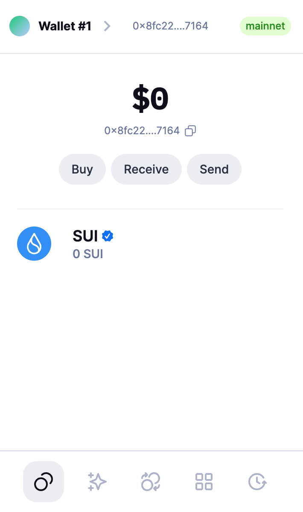
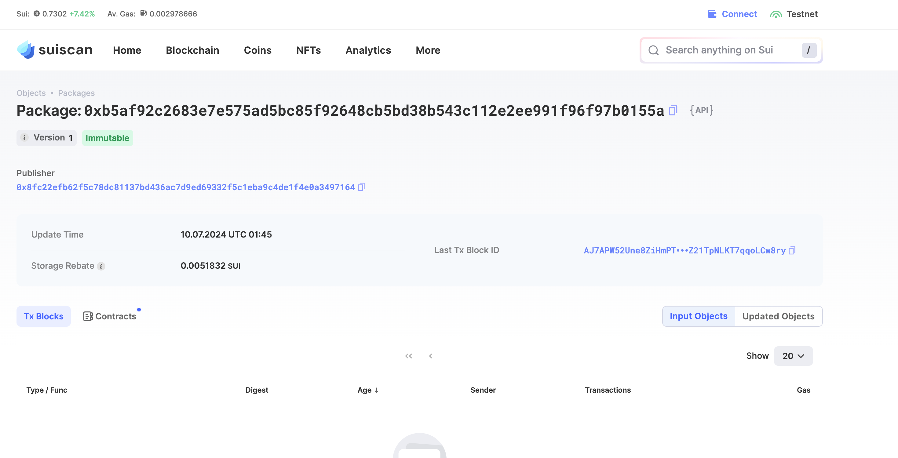
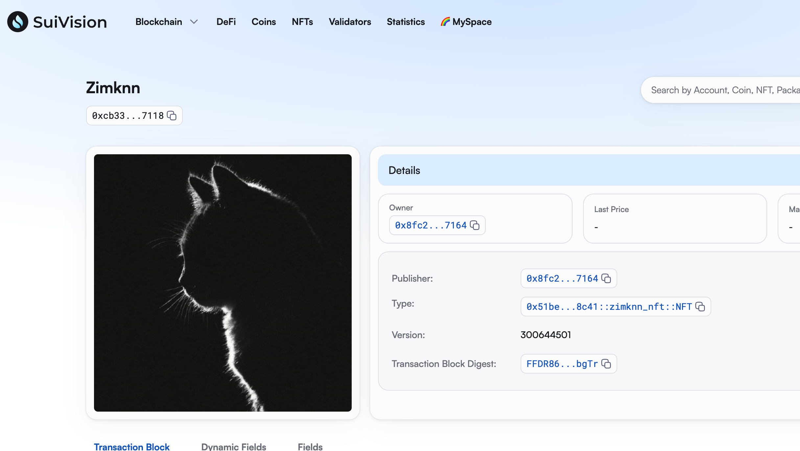
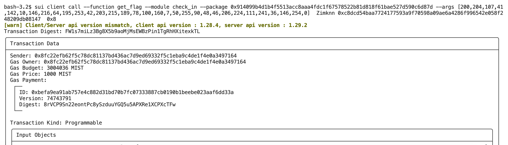

## 基本信息
- Sui钱包地址: `0x8fc22efb62f5c78dc81137bd436ac7d9ed69332f5c1eba9c4de1f4e0a3497164`
> 首次参与需要完成第一个任务注册好钱包地址才被合并，并且后续学习奖励会打入这个地址
- github: `Zimknn`

## 个人简介
- 工作经验: 1年
- 技术栈: `Python`
> 重要提示 请认真写自己的简介
- 机器学习从业经验，对Move特别感兴趣，想通过Move入门区块链
- 联系方式: tg: `zmk005` 

## 任务

##   01 hello move  
- [x] Sui cli version: 1.28.3
- [x] Sui钱包截图: 
- [x] package id: [0xb5af92c2683e7e575ad5bc85f92648cb5bd38b543c112e2ee991f96f97b0155a](https://suiscan.xyz/testnet/object/0xb5af92c2683e7e575ad5bc85f92648cb5bd38b543c112e2ee991f96f97b0155a)   
- [x] package id 在 scan上的查看截图:

##   02 move coin
- [x] My Coin package id : 0xba5d4f63fb896cb96668ba14849f1ee4a02c9e5666128cccef254a4a40827ada
- [x] Faucet package id : 0xba5d4f63fb896cb96668ba14849f1ee4a02c9e5666128cccef254a4a40827ada
- [x] 转账 `My Coin` hash : AhPYTbVED6ESJmpHsPbLePtLbEosg1FwC2mw96fq45ew
- [x] `Faucet Coin` address1 mint hash : CcRQL3hnkPQSBLkjPJ6NGmG9LcVggHk96qjF7j9qE1sh
- [x] `Faucet Coin` address2 mint hash : 3ro5QZ3iuGTvMxWQGyASUiJcKYTmrP8mawKa556TLPS3

##   03 move NFT
- [x] nft package id : 0x51bec691c37be7828398c972f6b630a6e250a7f21ff5295099d322cd56198c41
- [x] nft object id : 0xcb33b8fb75f525a05d33d9638641a1ce19764943377a5ccc230a57fbb0a27118
- [x] 转账 nft  hash: BQ9vSbZxhkaK5CaNnwfCidqnbq5yxnrfknvMZbGSR2pt
- [x] scan上的NFT截图:

##   04 Move Game
- [x] game package id: 0x3f1f464e51c7f96bc4f707d74d0ec132dbf4a2bc097828001724e4c4a0151baf
- [x] deposit Coin hash: 5cfWVGueaiprYudEoHAHj8R9HcTR24hZeeWUE1UiwL2U
- [x] withdraw `Coin` hash: GFsm1UD4pLstbpMdEaZkFLEZ7ZdX4D8UfGcrbdeqjWh6
- [x] play game hash:  6SoDei5yuSD5vjrsemtVtCtjJvcs4474f6k5zKJwoTDG

##   05 Move Swap
- [x] swap package id : 0x60f45a1dcbb8fee154af0f8c0e0dc41a171f3050ead824aad23037b9c8448c07
- [x] call swap CoinA-> CoinB  hash : AwAvob7gkvjUL7DatNCgWu2dbSLzeAAr8j6X78Tq45ox
- [x] call swap CoinB-> CoinA  hash : DAcPFxNXcvNVQKvfjPqySJqrRXPeSkVcnk8h8K8MScS

##   06 Dapp-kit SDK PTB
- [x] save hash : ACF95mGZPubeRdXDA3cftSiJV2rua5cWfiT2Vn2iE3Q8

##   07 Move CTF Check In
- [x] CLI call 截图 : 
- [x] flag hash : FW1s7miLz3Bg8X5b9aoMjMsEWBzPin1TgRhHXitexkTL

##   08 Move CTF Lets Move
- [x] proof : f6b4d7278ff03e53bcc6
- [x] flag hash : 5JVawCtxvqnust8M9mvoMgA7QUVgn1NchGdy4m12uAs8
