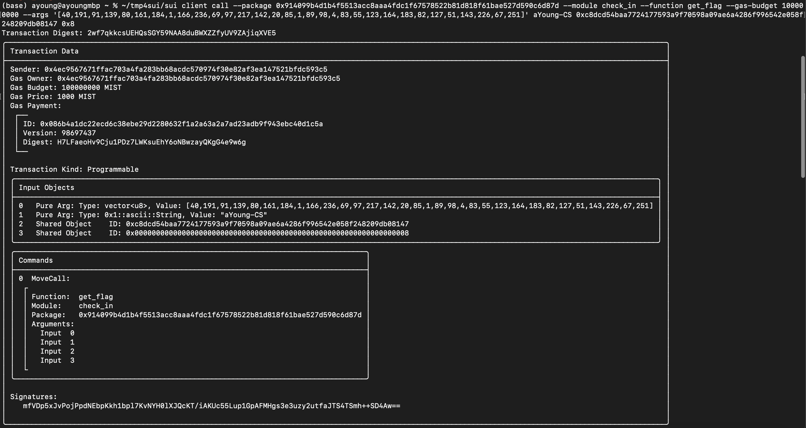

## 基本信息
- Sui钱包地址: `0x4ec9567671ffac703a4fa283bb68acdc570974f30e82af3ea147521bfdc593c5`
> 首次参与需要完成第一个任务注册好钱包地址才被合并，并且后续学习奖励会打入这个地址
- github: `aYoung-CS`

## 个人简介
- 工作经验: 0年
- 技术栈: `C` `python`
- 网安小白，对Move感兴趣，想通过Move入门区块链
- 联系方式:`qq:814738588`

## 任务

##   01 hello move  
- [x] package id: `0xf6ed7149a9c0c7569b94d5e6e3ab8eab90d2e7731a16c74ff007a5035d1e8590`

##   02 move coin
- [x] My Coin package id : `0xf3dd827ad2e10db5865d3ab1f0e04dfabd957184959abfdf2dc26d80ccb26306`
- [x] Faucet package id : `0x4aff5560adba35a7a92864a8f2dfc5e8344f6284fa745861d2c55cbfc60d5340`
- [x] 转账 `My Coin` hash: `EwepbHz679mVb8ezgXP5SVkFjYTFwpdRHbQUXtthq2u8`

##   03 move NFT
- [x] nft package id : `0xb4a6093a24352cec0ba294edd670a67f72150b776449aff23ab3a0e1d919b3a2`
- [x] nft object id : `0x5b66e90e56cec7eb8c3cae96fc5e8a832b9586dd8d9eacfef325c2bf967769e5`
- [x] 转账 nft  hash: `A2rAAvossWkFuLvBmTfTLa18CrP5fwdU1cC6Kka3nWAg`

##   04 Move Game
- [x] game package id : `0x455aba9281a360c459ac1c4b16bfc8155ce0785f7e14cb06df1147a50eb7f7f8`
- [x] call game hash: `4QQV3V29KRkUfuq8YZ6nQ7wCskkNUU3XonaRjBbsotzg`(start_game) `58iRUQB9hkE4kcNJmKCbuHQik1RYTXfyTvcRCH9Gbo1F`(finish_game)

##   05 Move Swap
- [x] swap package id : `0xf43d9ca9b12ab76b36654afdb62304e02ebd2bba48621128a72f3ec2cfb85d41`
- [x] call swap hash: `FkzafJHHLPDMNMYr4NpQLZ6SbLAVykxkVGgLom5HqDxW`(start_swap) `5GiLXRfZ65cPk2sjQbybSsZcy5owgKTg53JRgG7MWAso`(create_escrow) `D72XMhQgS9zkbe2dtGNy86vqkQmir5rCHGBbugperWWo`（end_swap）(填完才看到新版要求 有点懒了 就只跑了一遍orz)

##   06 Dapp-kit SDK PTB
- [] save hash :

##   07 Move CTF Check In
- [x] CLI call 截图 : 
- [x] flag hash :2wf7qkkcsUEHQsSGY59NAA8duBWXZZfyUV9ZAjiqXVE5

##   08 Move CTF Lets Move
- [x] proof : [163, 3, 136]
- [x] flag hash :2k8jWPTYinWWGvJpKerWR1zPyDxVA61SSiH92EyVbCkg