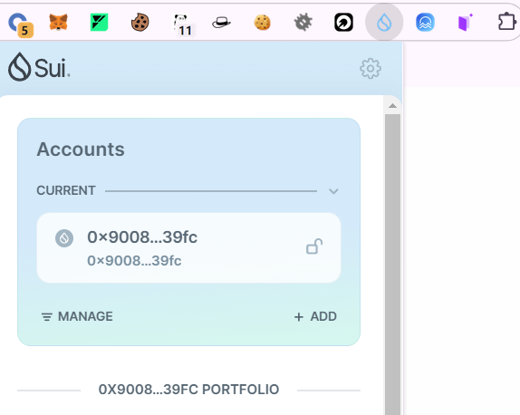
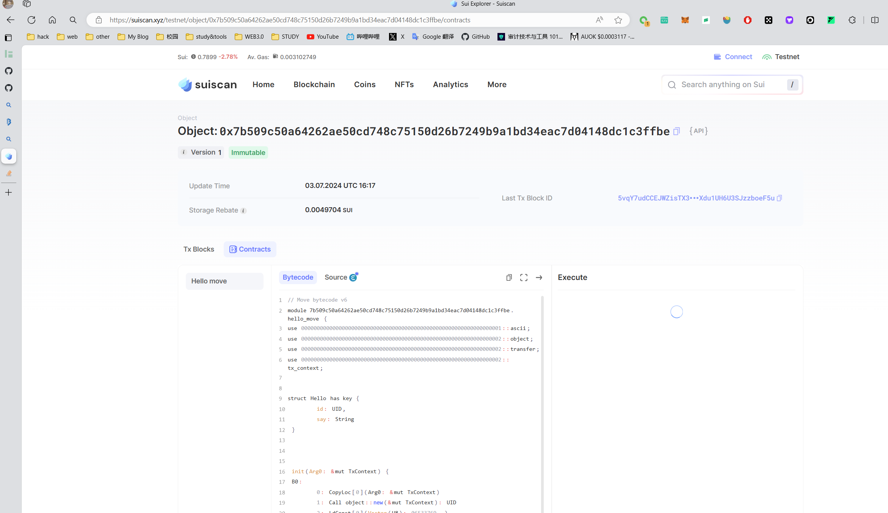

## 基本信息
- Sui钱包地址: `0x45dc113dd85e77addcfaf2788df0e1d0ce7b49cb622b5189650a8a137b2267c2`
> 首次参与需要完成第一个任务注册好钱包地址才被合并，并且后续学习奖励会打入这个地址
- github: `S7iter`

## 个人简介
- 工作经验: 1年
- 技术栈: python,php,solidity
- 本科在读，参与过多场CTF和web2安全项目，web2漏洞研究，web2安全转web3安全ing。
- 参与过几次web3黑客松。
- Blog：`oosec.cn` 
- 联系方式: ：`S7iter@gmail.com`

## 任务

##   01 hello move  
- [x] Sui cli version:

- [x] Sui钱包截图:

- [x] package id: 0x7b509c50a64262ae50cd748c75150d26b7249b9a1bd34eac7d04148dc1c3ffbe

- [x] package id 在 scan上的查看截图:

  

##   02 move coin

- [x] My Coin package id :   0x9c83bf7e29c32e9f1ab9605e14576a853d369fa7f28a83ed45c668a9bcc2ec89
- [x] Faucet package id :   0x9c83bf7e29c32e9f1ab9605e14576a853d369fa7f28a83ed45c668a9bcc2ec89
- [x] 转账 `My Coin` hash:  CYmTsGoAD2x4iW9A1XGvkDZzWEf141Nx6MYnRmVqBvHR
- [x] `Faucet Coin` address1 mint hash:  FET1skAGTHdZdauKJcXZKxc3KX2FB8kCQXve7YqH1ks 
- [x] `Faucet Coin` address2 mint hash:  FbxBECy4FHSSQZwwrtxryJixeKqN3MUqjW2PCC9LpMEB

##   03 move NFT
- [] nft package id :
- [] nft object id : 
- [] 转账 nft  hash:
- [] scan上的NFT截图:

##   04 Move Game
- [] game package id :
- [] deposit Coin hash:
- [] withdraw `Coin` hash:
- [] play game hash:

##   05 Move Swap
- [] swap package id :
- [] call swap CoinA-> CoinB  hash :
- [] call swap CoinB-> CoinA  hash :

##   06 Dapp-kit SDK PTB
- [] save hash :

##   07 Move CTF Check In
- [] CLI call 截图 : 
- [] flag hash :

##   08 Move CTF Lets Move
- [] proof : 
- [] flag hash :

