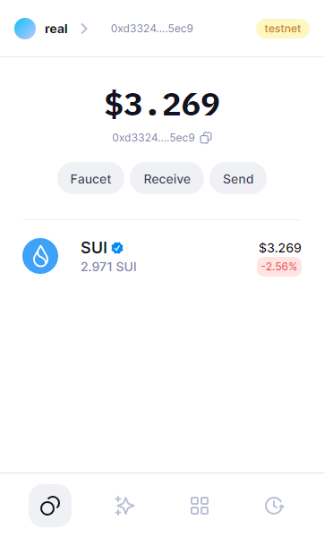
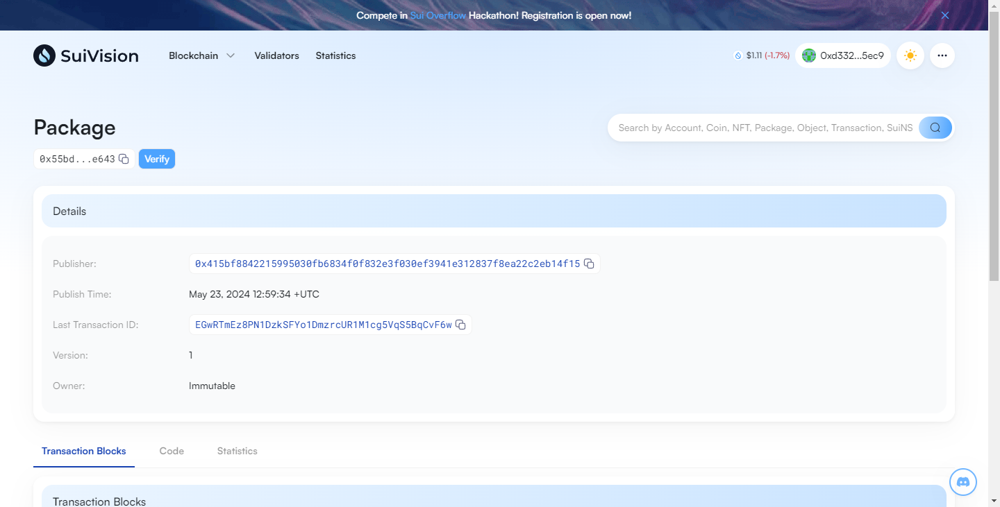

## 基本信息
- Sui钱包地址: `0xd3324287c3b2fd24b0c52a512e20f7aab280396df5169267f323047b50e95ec9`
> 首次参与需要完成第一个任务注册好钱包地址才被合并，并且后续学习奖励会打入这个地址
- github: `aiqubits`

## 个人简介
- 工作经验: 10年
- 技术栈: `Rust` `C` `Go` `KVM` `Rust-VMM` `Substrate`
> 重要提示 请认真写自己的简介
- 多年Web2开发经验，对Move特别感兴趣，想通过Move入门区块链
- 联系方式: tg: `aiqubits` 

## 任务

##   01 hello move  
- [x] Sui cli version: 1.25.1-6579e0ed9e43
- [x] Sui钱包截图: 
- [x] package id: 0x55bd4763083e125c4c653b0eb7d8a91906d89cbe852d2710eb3b01f94e97e643
- [x] package id 在 scan上的查看截图:

##   02 move coin
- [x] My Coin package id : 0xb4b03a2729a2dac3053c86a422aab9a1f5c9a8aec4e20c6f1d004e40a779d153
- [x] Faucet package id : 0x1bb4375bc50d5ff8a2aa01c105fcd643146d29366f7c5cdf9bf019f1e2b44c21
- [x] 转账 `My Coin` hash: 43wayC1kvToT2uSMRGA2mFdSMezwSpmW5jqw57k16ZYW

##   03 move NFT
- [x] nft package id : 0x3e388ec2e18459c40e6efb2633b992575dc2b40181df5b9feafb66175f9ff733
- [x] nft object id : 0xa33e88f6c7b24c9d538539c4fd0c6624c997c0b8a797c1f4c525ace2e3cd6036
- [x] 转账 nft  hash: Cr1EyYmLG7FfUbW1Ks5DV3hK5zTudKpjiMpw5qPMjWjU
- [x] scan上的NFT截图:

##   04 Move Game
- [] game package id :
- [] deposit Coin hash:
- [] withdraw `Coin` hash:
- [] play game hash:

##   05 Move Swap
- [] swap package id :
- [] call swap CoinA-> CoinB  hash :
- [] call swap CoinB-> CoinA  hash :

##   06 Dapp-kit SDK PTB
- [] save hash :
