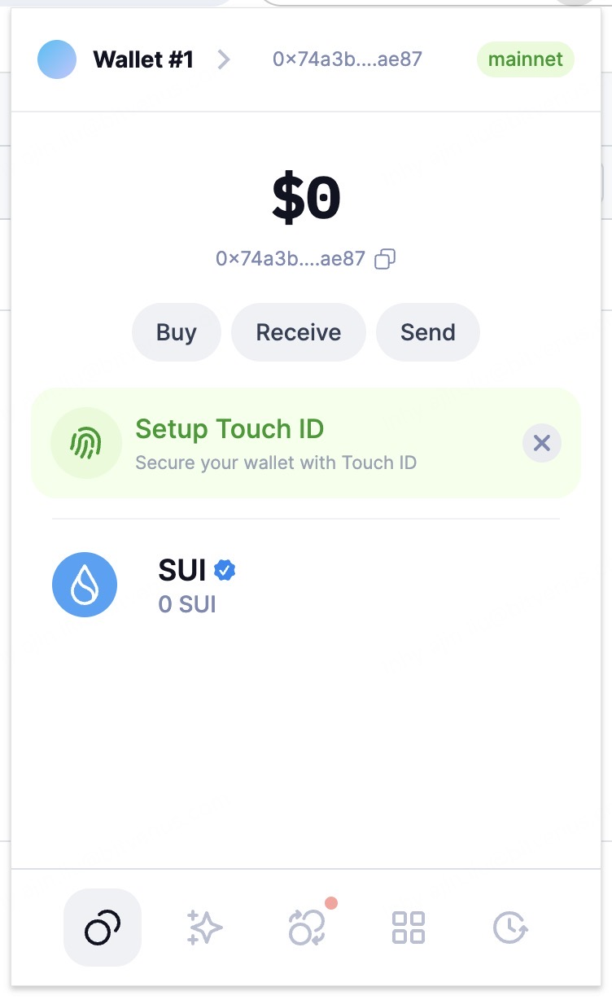

## 基本信息
- Sui钱包地址: `0x74a3ba8cd6f6331093c7bbc36d4bb805ff90b9eb3fe128d402fc03e13cc9ae87`
> 首次参与需要完成第一个任务注册好钱包地址才被合并，并且后续学习奖励会打入这个地址
- github: `ajin8898`

## 个人简介
- 工作经验: 8年
- 技术栈: `Rust` `java`
> 重要提示 请认真写自己的简介
- 多年java开发经验，目前在交易所工作，对Move特别感兴趣，想通过Move入门区块链
- 联系方式: tg: `https://t.me/joey889889` 

## 任务

##   01 hello move  
- [] Sui cli version: 1.29.0
- [] Sui钱包截图: 
- [] package id: 0x6844b77646c359b59c9bc08127b6fc7ff952c0127ef7e92c3b99f06ae61ddd80
- [] package id 在 scan上的查看截图:

##   02 move coin
- [] My Coin package id : 0x045eff3eaf7a574b1607fb8fd930adfa634e06c2e9cffe28b8963ddb499dedde
- [] Faucet package id : 0x35492b3e019b3f5cec1e00190de1e751013114214b4e94dce2e4193215ef2d82
- [] 转账 `My Coin` hash: H5kJaD5DAHfN4Txp18jNvqAxgAJb8zPcC14L5qg4HvF1
- [] `Faucet Coin` address1 mint hash: BiaM42QDMx9EY9cSEFfVy9is3ZDQUWtqvYdJkNyvWYt9
- [] `Faucet Coin` address2 mint hash: 3omRmf1nsoDqRuwKyLXpo2sP9hoyPNoiSSXnwt1HpSDG

##   03 move NFT
- [] nft package id : 0x93ff41e4086c4d855c2ee4ad3390049ea9b5cefa74d432d2d97043d34613329d
- [] nft object id : 0x93ff41e4086c4d855c2ee4ad3390049ea9b5cefa74d432d2d97043d34613329d
- [] 转账 nft  hash: BPPzmjDYBtnoPEHRzMALmhMUuhtCjzRbfASBrUEyRoBv
- [] scan上的NFT截图:

##   04 Move Game
- [] game package id :
- [] deposit Coin hash:
- [] withdraw `Coin` hash:
- [] play game hash:

##   05 Move Swap
- [] swap package id :
- [] call swap CoinA-> CoinB  hash :
- [] call swap CoinB-> CoinA  hash :

##   06 Dapp-kit SDK PTB
- [] save hash :

##   07 Move CTF Check In
- [] CLI call 截图 : 
- [] flag hash :

##   08 Move CTF Lets Move
- [] proof : 
- [] flag hash :
