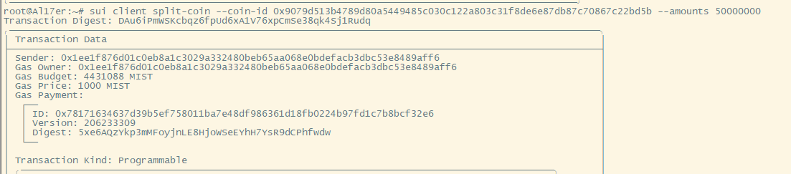
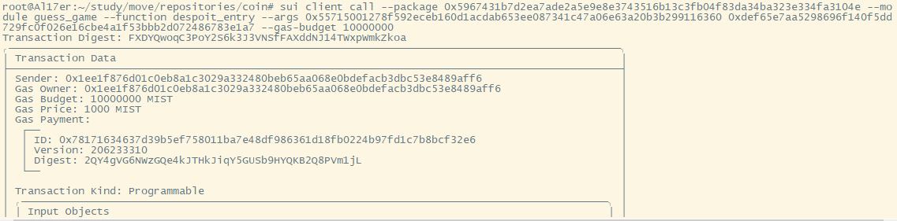
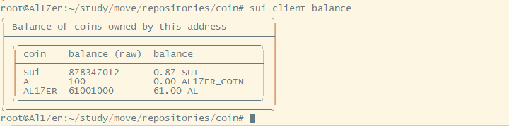
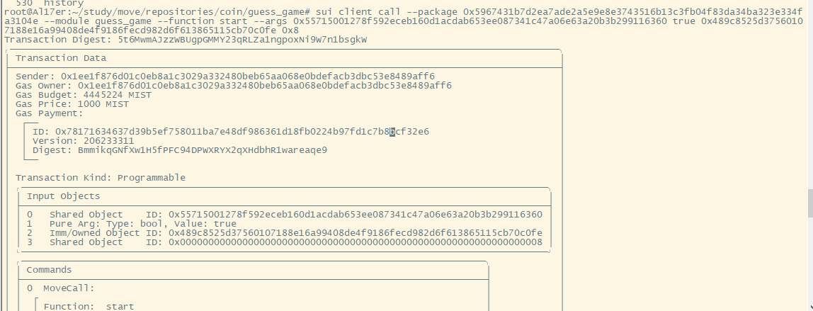

## 合约说明
```
public struct BankAccount has key{
    id:UID,
    balance: Balance<AL17ER_COIN>,
}
```

定义一个银行账户结构，用于生成银行账户负责游戏中游戏币的存取

```
fun init(ctx: &mut TxContext){
    let bankaccoount =  BankAccount{
        id: object::new(ctx),
        balance:zero(),
    };

    share_object(bankaccoount);
}
```
合约发布时用于初始化，生成银行账户，并共享，保证所有玩家都可交互

```
fun despoit(account: &mut BankAccount,dcoins: coin::Coin<AL17ER_COIN>,ctx: &mut TxContext){
    let into_balance = into_balance(dcoins);
    balance::join(&mut account.balance,into_balance);
}

fun withdraw(account:&mut BankAccount,amount:u64,to:address,ctx:&mut TxContext){
    let coin_balance=balance::split(&mut account.balance,amount);
    let coin = from_balance(coin_balance,ctx);
    public_transfer(coin,to);
}

public entry fun despoit_entry(account: &mut BankAccount,dcoins: coin::Coin<AL17ER_COIN>,ctx: &mut TxContext){
    let into_balance = into_balance(dcoins);
    balance::join(&mut account.balance,into_balance);
}
```

质押函数和退币函数，用于向银行中存入游戏币，退币函数没有添加退币入口，仅合约能退币，保证玩家赢的时候可以获得奖励。

```
public entry fun start(bankaccount: &mut BankAccount,guess:bool,guess_coin: coin::Coin<AL17ER_COIN>,rand: &Random,ctx:&mut TxContext){
    let coin_balance=coin::value(&guess_coin);
    let bank_balance=balance::value(&bankaccount.balance);

    if (bank_balance < coin_balance){
        abort 0;
    };

    let mut gen = random::new_generator(rand,ctx);
    let flag = random::generate_bool(&mut gen);

    let player_address = sender(ctx);
    if (guess == flag){
        withdraw(bankaccount,coin_balance,player_address,ctx);
        public_transfer(guess_coin,player_address);
    }else{
        despoit(bankaccount,guess_coin,ctx);
    }
}
```
开始游戏，生成随机的True与False跟用户传入做比较，预测正确则返还用户质押，并转入同等数量奖励，预测失败将用户质押转入银行账户。

## 拆分代币用于质押银行账户



## 将拆分的代币质押至银行合约账户

```
sui client call --package 0x5967431b7d2ea7ade2a5e9e8e3743516b13c3fb04f83da34ba323e334fa3104e --module guess_game --function despoit_entry --args 0x55715001278f592eceb160d1acdab653ee087341c47a06e63a20b3b299116360 0xdef65e7aa5298696f140f5dd729fc0f026e16cbe4a1f53bbb2d072486783e1a7 --gas-budget 10000000
```



## 查看当前余额



## 调用start方法开始游戏

```
sui client call --package 0x5967431b7d2ea7ade2a5e9e8e3743516b13c3fb04f83da34ba323e334fa3104e --module guess_game --function start --args 0x55715001278f592eceb160d1acdab653ee087341c47a06e63a20b3b299116360 true 0x489c8525d37560107188e16a99408de4f9186fecd982d6f613865115cb70c0fe 0x8
```

Digest: 5t6MwmAJzzWBUgpGMMY23qRLZa1ngpoxNi9W7n1bsgkW



