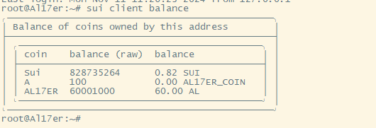
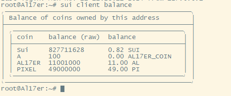

## 代码说明
思路：通过银行账户，用户置换代币是，先质押用户代币，然后退还另一种代币，实现交换。

```
public struct BankAccount has key{
    id:UID,
    al17er_coin_balance: Balance<AL17ER_COIN>,
    pixel_coin_balance: Balance<PIXEL_COIN>,
}

public struct AdminCap has key{
    id:UID,
}
```
银行结构用于生成银行账户，AdminCap用于后续可能的函数权限校验。

```
fun init(ctx: &mut TxContext){
    let admin_cap=AdminCap{
        id: object::new(ctx),
    };

    let bankaccount = BankAccount{
        id:object::new(ctx),
        al17er_coin_balance:zero<AL17ER_COIN>(),
        pixel_coin_balance:zero<PIXEL_COIN>(),
    };
    transfer(admin_cap,sender(ctx));
    share_object(bankaccount);
}
```
初始化，生成银行对象和管理权限对象，银行对象共享，管理员权限发送至个人。

```
fun despoit_al17er_contact(bankaccount:&mut BankAccount,dcoins:coin::Coin<AL17ER_COIN>,ctx:&mut TxContext){
    let into_balance = into_balance(dcoins);
    balance::join(&mut bankaccount.al17er_coin_balance,into_balance);
}

fun despoit_pixel_contact(bankaccount:&mut BankAccount,dcoins:coin::Coin<PIXEL_COIN>,ctx:&mut TxContext){
    let into_balance = into_balance(dcoins);
    balance::join(&mut bankaccount.pixel_coin_balance,into_balance);
}

public entry fun despoit_al17er(bankaccount:&mut BankAccount,dcoins:coin::Coin<AL17ER_COIN>,ctx:&mut TxContext){
    let into_balance = into_balance(dcoins);
    balance::join(&mut bankaccount.al17er_coin_balance,into_balance);
}

public entry fun despoit_pixel(bankaccount:&mut BankAccount,dcoins:coin::Coin<PIXEL_COIN>,ctx:&mut TxContext){
    let into_balance = into_balance(dcoins);
    balance::join(&mut bankaccount.pixel_coin_balance,into_balance);
}
```
质押代币，任何人均可捐赠代币至银行账户

```
fun withdraw_al17er_contact(bankaccount: &mut BankAccount,amount:u64,to:address,ctx:&mut TxContext){
    let coin_balance=split(&mut bankaccount.al17er_coin_balance,amount);
    let coin=from_balance(coin_balance,ctx);
    public_transfer(coin,to);
}

fun withdraw_pixel_contact(bankaccount:&mut BankAccount,amount:u64,to:address,ctx:&mut TxContext){
    let coin_balance=split(&mut bankaccount.pixel_coin_balance,amount);
    let coin=from_balance(coin_balance,ctx);
    public_transfer(coin,to);
}
```
退币函数，不允许外部调用

```
public entry fun swap_pixel(bankaccount:&mut BankAccount,swap_coin:coin::Coin<AL17ER_COIN>,ctx:&mut TxContext){
    let swapper_address = ctx.sender();
    let swap_value = swap_coin.value();
    despoit_al17er_contact(bankaccount,swap_coin,ctx);
    withdraw_pixel_contact(bankaccount,swap_value,swapper_address,ctx);
}

public entry fun swap_al17er(bankaccount:&mut BankAccount,swap_coin:coin::Coin<PIXEL_COIN>,ctx:&mut TxContext){
    let swapper_address = ctx.sender();
    let swap_value= swap_coin.value();
    despoit_pixel_contact(bankaccount,swap_coin,ctx);
    withdraw_al17er_contact(bankaccount,swap_value,swapper_address,ctx);
}
```
交换代币，先压后换


## 向银行账户添加AL17ER代币

```
sui client call --package 0x9fbf0c3f70e6589f0b0454ae1640a2ad294bd208a583245ea5aa9d392da5c5df --module swap_coin --function despoit_al17er --args 0x9f533487d54808913d461baadb6313ddae6eca58ebe46f2fc2746c3e5b523f1c 0x53b6f18aee2f173473f0b630ed31c98768b5270009b79bde78df8b21994d5015
```
digest: D2LMruiVdPyKhak3VrrkMvdn4nBRUL4mEvcxUWR9sry5
## 向银行账户添加PIXEL代币
```
sui client call --package 0x9fbf0c3f70e6589f0b0454ae1640a2ad294bd208a583245ea5aa9d392da5c5df --module swap_coin --function despoit_pixel --args 0x9f533487d54808913d461baadb6313ddae6eca58ebe46f2fc2746c3e5b523f1c 0x398fbb143b681001f9716b121ff9ade9cf7b42d85e4f520b4baa811e717a1e21
```

digest: 4duU1GqkxcQME3jBftyEgNmZDS3WXqPQTPwXcUcuBzYc

## 查看当前余额



## 执行swap交换代币

```
sui client call --package 0x9fbf0c3f70e6589f0b0454ae1640a2ad294bd208a583245ea5aa9d392da5c5df --module swap_coin --function swap_pixel --args 0x9f533487d54808913d461baadb6313ddae6eca58ebe46f2fc2746c3e5b523f1c  0x9079d513b4789d80a5449485c030c122a803c31f8de6e87db87c70867c22bd5b
```

digest: GPz4v3Hi6PUdWoXsV2eLJVdZ7TtqXw1YXtw8rwMrzbUd

## 查看交换后代币余额：



