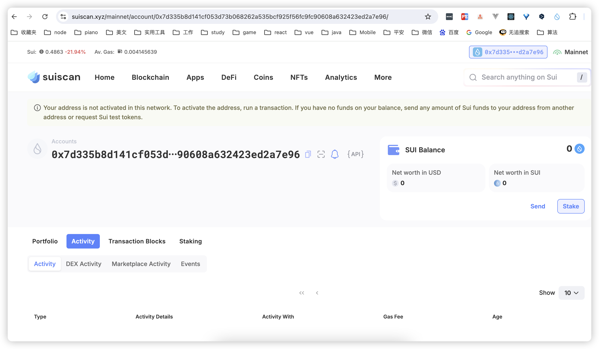
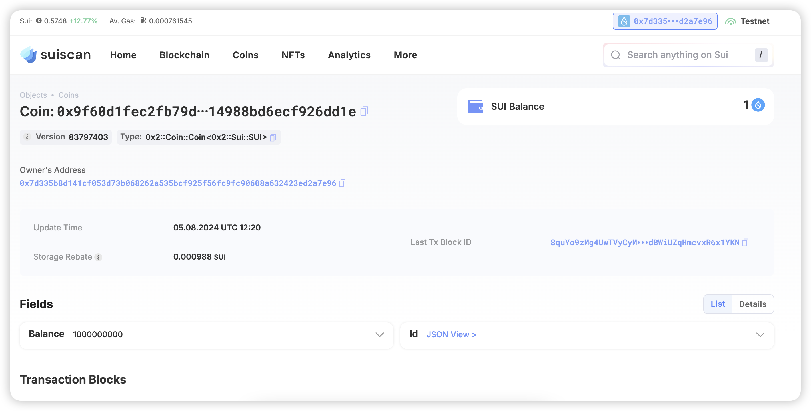

## 基本信息
- Sui钱包地址: `0x7d335b8d141cf053d73b068262a535bcf925f56fc9fc90608a632423ed2a7e96`
> 首次参与需要完成第一个任务注册好钱包地址才被合并，并且后续学习奖励会打入这个地址
- github: `jiashuai1002`

## 个人简介
- 工作经验: 7年
- 技术栈: `React` `ReactNative` `nodejs`
> 重要提示 请认真写自己的简介
- 互联网web2前端开发 喜欢研究新技术 对web3有强烈兴趣 希望通过sui（move）入门 
- 联系方式: wx群昵称: `Alex小张早睡早起` 

## 任务

##   01 hello move  
- [] Sui cli version: sui 1.29.2-homebrew
- [] Sui钱包截图: 
- [] package id: 0x9f60d1fec2fb79d08680492cf550c13a5239ae2f96383714988bd6ecf926dd1e
- [] package id 在 scan上的查看截图:

##   02 move coin
- [] My Coin package id : 
- [] Faucet package id : 
- [] 转账 `My Coin` hash:
- [] `Faucet Coin` address1 mint hash:
- [] `Faucet Coin` address2 mint hash:

##   03 move NFT
- [] nft package id :
- [] nft object id : 
- [] 转账 nft  hash:
- [] scan上的NFT截图:

##   04 Move Game
- [] game package id :
- [] deposit Coin hash:
- [] withdraw `Coin` hash:
- [] play game hash:

##   05 Move Swap
- [] swap package id :
- [] call swap CoinA-> CoinB  hash :
- [] call swap CoinB-> CoinA  hash :

##   06 Dapp-kit SDK PTB
- [] save hash :

##   07 Move CTF Check In
- [] CLI call 截图 : 
- [] flag hash :

##   08 Move CTF Lets Move
- [] proof : 
- [] flag hash :
