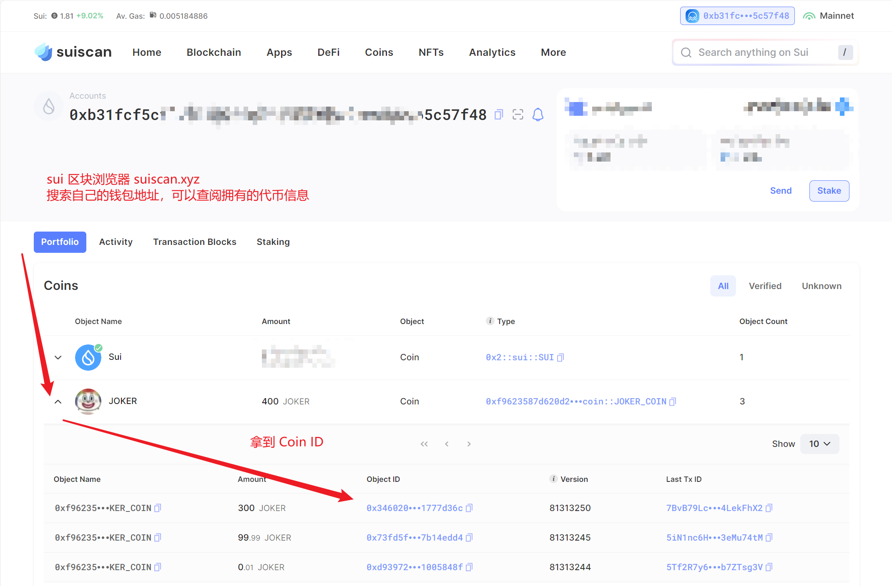

> [letsmove](https://github.com/move-cn/letsmove)
>
> Let's Move 一项学Move获得SUI的激励计划，鼓励更多的人学习Move语言
>
> 学习日志 ([alva-lin](https://github.com/alva-lin/letsmove))

# Task 2 - 完成两个 Coin 合约的上链部署(mainnet)

> 任务
>
> - 完成 Coin相关知识的学习
>
> - 完成 `My Coin` 的学习并部署主网
>
> - 完成 `Faucet Coin` 的学习并部署主网
>
> - 提交 `My Coin` 和 `Faucet Coin` 合约发布`package id`
>
> - 发送 `My Coin`  给地址 `0x7b8e0864967427679b4e129f79dc332a885c6087ec9e187b53451a9006ee15f2`

主要参照 [Managed Coin 案例 - Sui Move 导论](https://intro-zh.sui-book.com/unit-three/lessons/5_managed_coin.html) 一文


## sui::coin 库

### Coin

Coin 合约的编写，主要使用了 `sui::coin` 库中提供的结构体和方法。

```move
struct Coin<phantom T> has key, store {
    id: UID,
    balance: Balance<T>
}

struct Balance<phantom T> has store {
    value: u64
}
```

Coin 拥有 key 和 store 能力，被视为资产，可以在不同地址间转移，后续在区块浏览器中可以查阅到自己拥有的所有 Coin。

### create_currency

```move
public fun create_currency<T: drop>(
    witness: T,
    decimals: u8,
    symbol: vector<u8>,
    name: vector<u8>,
    description: vector<u8>,
    icon_url: Option<Url>,
    ctx: &mut TxContext
): (TreasuryCap<T>, CoinMetadata<T>) {
    // Make sure there's only one instance of the type T
    assert!(sui::types::is_one_time_witness(&witness), EBadWitness);

    // Emit Currency metadata as an event.
    event::emit(CurrencyCreated<T> {
        decimals
    });

    (
        TreasuryCap {
            id: object::new(ctx),
            total_supply: balance::create_supply(witness)
        },
        CoinMetadata {
            id: object::new(ctx),
            decimals,
            name: string::utf8(name),
            symbol: ascii::string(symbol),
            description: string::utf8(description),
            icon_url
        }
    )
}
```

`create_currency` 方法参数中

| 参数 | 描述 |
| :-- |  :-- |
| decimals | 精度，被分割的最小单位。 10^(-1*n) |
| symbol | 符号 |
| name | 名称 |
| description | 描述 |
| icon_url | 图片 |

方法的返回值是一个元组，包含两个值，`TreasuryCap` 和 `CoinMetadata`，

其中 `TreasuryCap` 是一种资产，通过[一次性见证模式](https://intro-zh.sui-book.com/unit-three/lessons/3_witness_design_pattern.html#one-time-witness)保证是一个单体对象，其类型声明如下

```move
/// Capability allowing the bearer to mint and burn
/// coins of type `T`. Transferable
struct TreasuryCap<phantom T> has key, store {
        id: UID,
        total_supply: Supply<T>
}
/// A Supply of T. Used for minting and burning.
/// Wrapped into a `TreasuryCap` in the `Coin` module.
struct Supply<phantom T> has store {
    value: u64
}
```

这个 `total_supply` 值跟踪了当前货币 `T` 的发行总量，所以 TreasuryCap 只需要一个即可。而 `CoinMetadata` 可以简单看出，其保存了当前货币的元数据。

## coin 合约代码

得益于 sui 框架库的完善，想要创建一个拥有 `mint` (铸造) 和 `burn` (销毁) 功能的代币合约，所需代码很少。

```move
// file: my_coin.move
module new_coin::my_coin {
    use std::option;
    use sui::coin::{Self, Coin, TreasuryCap};
    use sui::transfer;
    use sui::tx_context::{Self, TxContext};

    struct MY_COIN has drop {}

    fun init(witness: MY_COIN, ctx: &mut TxContext) {
        let (treasury_cap, metadata) = coin::create_currency<MY_COIN>(
            witness,
            2,
            b"MY_COIN",
            b"MC",
            b"learning for letsmove, power by alva-lin",
            option::none(),
            ctx
        );

        transfer::public_freeze_object(metadata);
        transfer::public_transfer(treasury_cap, tx_context::sender(ctx));
    }

    public fun mint(
        treasury_cap: &mut TreasuryCap<MY_COIN>,
        amount: u64,
        recipient: address,
        ctx: &mut TxContext
    ) {
        coin::mint_and_transfer(treasury_cap, amount, recipient, ctx);
    }

    public fun burn(treasury_cap: &mut TreasuryCap<MY_COIN>, coin: Coin<MY_COIN>) {
        coin::burn(treasury_cap, coin);
    }

    #[test_only]
    public fun test_init(ctx: &mut TxContext) {
        init(MY_COIN {}, ctx);
    }
}
```

`my_coin` 模块先根据 [`Witness 模式`](https://intro-zh.sui-book.com/unit-three/lessons/3_witness_design_pattern.html#the-witness-design-pattern) 定义了名为 `MY_COIN` 的结构体。随后在 `init` 方法参数中，添加一个 `MY_COIN` 类型的 witness 资源，由模块推送后自动创建。

在 `init` 方法中，调用了 `coin::create_currency` 方法，获取 `TreasuryCap` 和 `CoinMetadata` 资源，并立即将 `CoinMetadata` 冻结。

而 `TreasuryCap` 作为控制调用 `mint` 方法和 `burn` 方法的凭证，被发送到了发布者的地址上。

### 测试

测试代码如下，模拟了一个多重交易时间，来进行 `mint` 操作和 `burn` 操作

```move
#[test_only]
module new_coin::my_coin_tests {
    use new_coin::my_coin::{Self, MY_COIN};
    use sui::coin::{Coin, TreasuryCap};
    use sui::test_scenario::{Self, next_tx, ctx};

    #[test]
    fun mint_burn() {
        // Initialize a mock sender address
        let addr1 = @0xA;

        // Begins a multi transaction scenario with addr1 as the sender
        let scenario = test_scenario::begin(addr1);

        // Run the coin module init function
        {
            my_coin::test_init(ctx(&mut scenario))
        };

        // Mint a `Coin<MY_COIN>` object
        next_tx(&mut scenario, addr1);
        {
            let treasurycap = test_scenario::take_from_sender<TreasuryCap<MY_COIN>>(&scenario);
            my_coin::mint(&mut treasurycap, 100, addr1, test_scenario::ctx(&mut scenario));
            test_scenario::return_to_address<TreasuryCap<MY_COIN>>(addr1, treasurycap);
        };

        // Burn a `Coin<MY_COIN>` object
        next_tx(&mut scenario, addr1);
        {
            let coin = test_scenario::take_from_sender<Coin<MY_COIN>>(&scenario);
            let treasurycap = test_scenario::take_from_sender<TreasuryCap<MY_COIN>>(&scenario);
            my_coin::burn(&mut treasurycap, coin);
            test_scenario::return_to_address<TreasuryCap<MY_COIN>>(addr1, treasurycap);
        };

        // Cleans up the scenario object
        test_scenario::end(scenario);
    }
}
```

## 发布

先切换网络到所需的环境

```bash
sui client switch --env mainnet
```

在项目文件夹下，执行以下命令，来发布包或单独发布模块

```bash
# publish package
sui client publish --gas-budget 30000

# 或者按需发布模块
# publish module
# sui client publish sources/my_coin.move --gas-budget 30000
```

发布后的输出结果中，包含了

- Package: 位于 `Object Changes > Published Objects` 块中

- CoinMetadata: 位于 `Object Changes > Created Objects` 块中

    其 ObjectType 为 `0x2::coin::CoinMetadata<<Package ID>::<Module>::<Witness Type>>`

- TreasuryCap: 位于 `Object Changes > Created Objects`

    其 ObjectType 为 `0x2::coin::TreasuryCap<<Package ID>::<Module>::<Witness Type>>`


将 `Package ID` 和 `TreasuryCap ID` 记录：

```bash
export PACKAGE_ID=0xf9623587d620d26024868578a3539642993e2da44598c3fcaa1f384f5327f6a5
export TREASURYCAP_ID=0x97233be4acd1688c93f2c60ce81350b993a810c6b4851e8cdf214402759fad88
```

## 铸造和销毁

使用 sui cli 来调用模块相应的模块函数即可。

需要注意，`想要的代币数量 = 传入值 * 10^(-1*n)`，其中 n 为前面发布的合约代码中，`decimals` 的值

在本文中，decimals 的值为 2。如果想要铸造 100 枚代币，则需要传值 10000

```bash
# 转入的钱包地址
export RECIPIENT_ADDRESS=<YOUR_WALLET_ADDRESS>
# mint
sui client call --gas-budget 3000 --package $PACKAGE_ID --module my_coin --function mint --args $TREASURYCAP_ID \"10000\" $RECIPIENT_ADDRESS
```

在输出内容中，可以看到交易详情。

又或者是拿到交易 hash，可以去 [SuiScan](https://suiscan.xyz/) 或其他 sui 区块浏览器上查看交易详情。

```bash
# 交易 hash 的字样类似以下形式，一般在输出内容的最前面
Transaction Digest: <hash>
```

---

在铸造时的输出内容中，找到 `Object Changes > Created Objects` 块中，ObjectType 类型为 `0x2::coin::Coin<<package>, <module>, <type>>` 的对象，获取 ObjectID

这个 ObjectID 即为 `CoinID`，将其存为变量

如果找不到命令行输出的 coin id，也可以从区块浏览器中找到。



```bash
export COIN_ID=0x3460204ae7f9385df79dc963a17d8b11eb0fa7a699f7196fac80405e1777d36c
```

调用 burn 方法，销毁货币

```bash
# 注意 gas 预算需要提高
# burn
sui client call --gas-budget 7500000 --package $PACKAGE_ID --module joker --function burn --args $TREASURYCAP_ID $COIN_ID
```

命令执行成功后，可以从钱包中看到，之前铸造的这笔金额被删除了

> 代币销毁后，不能使用 COIN ID 直接在区块浏览器中搜索到，只能从历史交易中间接找到其记录
