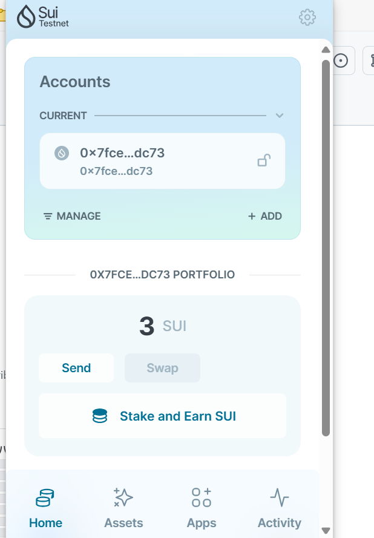

## 基本信息
- Sui钱包地址: `0x7fce13b667ec9ef8bbefaf3addbf0104bd4365330d64b752a71fe755e908dc73`
> 首次参与需要完成第一个任务注册好钱包地址才被合并，并且后续学习奖励会打入这个地址
- github: `andanxingkong`

## 个人简介
- 工作经验: 0年
- 技术栈: `solidity` `react` `java`
> 重要提示 请认真写自己的简介
 目前为在校学生，希望通过学习 move 来进行更多智能合约的开发
- 联系方式: WeChat:andanxingkongyu

## 任务

##   01 hello move  
- [x] Sui cli version:sui 1.36.0-e3e5ac7113a7
- [x] Sui钱包截图: 
- [x] package id:0x0685125b34472f019627dfd2cd4ae4da94bb71e289c8de8f01f218144f94d4c7
- [x] package id 在 scan上的查看截图:

##   02 move coin
- [x] My Coin package id : 0x85e54e8e7842ddd71710109c5dec3c10142418475ea078927219a4700477f0a6
- [x] Faucet package id :  0xb0f1c73daca44429d16d41de77dc3c8a9c2b66d932100d3a025e97e530c06b12
- [x] 转账 `My Coin` hash: 55zhMkyYjSJDjpSpm5LYVDpc5Xw9G5YCWRoUTisG61iz
- [x] `Faucet Coin` address1 mint hash: Bjw4sTQ5bYJvKkVeFp4dT8eRkgMLsNN6EhAj9PSQ1D5L
- [x] `Faucet Coin` address2 mint hash: DX3WrcL914ZUZJxaVa2qKw74DREWteSaPZksQo1EsinX

##   03 move NFT
- [x] nft package id : 0xb99e11a669867ab763fdc9d0526e942deb0a91752663a7273583df32e302d9b0
- [x] nft object id : 0x176a953efaab4c2f7c75e03a0c1381bad81c28ac8ab7c9ea6b79ecd6cacbf4d8
- [x] 转账 nft  hash: 4cmMmMdNfbeYz7a64uj1bRsvu5TG3bECaZ8Xo2o32dgH
- [x] scan上的NFT截图:

##   04 Move Game
- [x] game package id : 0x53eb007cea767dbe82b42b1cf54c788182427c6410d527435fd15edda94994b7
- [x] deposit Coin hash: nkSsGVUuVNMSZ26amgFZmw2W78wbnKEkvTNnoTjHDXN
- [x] withdraw `Coin` hash: H1phUWCPFpPKAuLfMEJeV3nv58u4pRGZykF34192rkFP
- [x] play game hash: GgnWjAspZnR7MTVrRXnVT4obHrynKz2miwxjJW5HLZt7

##   05 Move Swap
- [] swap package id :
- [] call swap CoinA-> CoinB  hash :
- [] call swap CoinB-> CoinA  hash :

##   06 Dapp-kit SDK PTB
- [] save hash :

##   07 Move CTF Check In
- [] CLI call 截图 : 
- [] flag hash :

##   08 Move CTF Lets Move
- [] proof : 
- [] flag hash :
