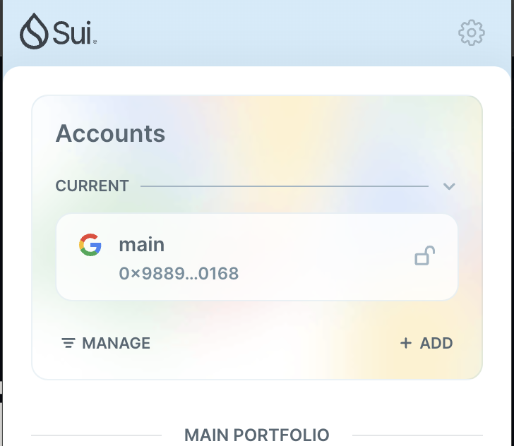
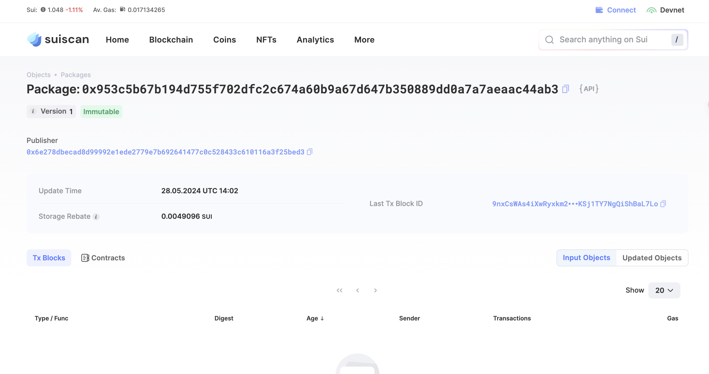
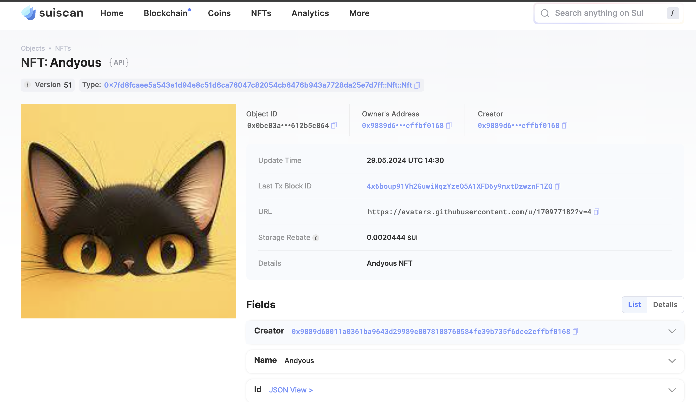

## 基本信息

- Sui钱包地址: `0x9889d68011a0361ba9643d29989e8078188760584fe39b735f6dce2cffbf0168`
  > 首次参与需要完成第一个任务注册好钱包地址才被合并，并且后续学习奖励会打入这个地址
- github: `andyous`

## 个人简介

- 工作经验: 7年
- 技术栈: `js` `ts` `golang` `rust`
  > 重要提示 请认真写自己的简介
- 多年web2开发经验，主要技术前端技术栈，已经学习了solidity，对Move特别感兴趣，想通过Move入门区块链
- 联系方式: tg: `@andyouss`

## 任务

## 01 hello move

- [] Sui cli version: sui-move 1.23.1
- [] Sui钱包截图: 
- [] package id: 0x953c5b67b194d755f702dfc2c674a60b9a67d647b350889dd0a7a7aeaac44ab3
- [] package id 在 scan上的查看截图:

## 02 move coin

- [] My Coin package id : 0x49dfecdbc866ef4703fa2652114e91840343280c17e2751805199a3b57142ca5
- [] Faucet package id : 0x4a4a5635541fed84a05810aea20b7b9b63a375ca9ca8505608a787230073c8ef
- [] 转账 `My Coin` hash: 6aKnmL9CjxGH1QoCCTbR8kH5mxjFcPZa4hPG8GM7ifFQ
- [] `Faucet Coin` address1 mint hash: Eym4gAMy1CTJjBwEBudwsYAbssySYKirG3PaeA1ydJ8P
- [] `Faucet Coin` address2 mint hash: 4wDmmSmQBm79UrDL4gV3ddC8ASDxm892muMj2K65RyYc

## 03 move NFT

- [] nft package id :0x7fd8fcaee5a543e1d94e8c51d6ca76047c82054cb6476b943a7728da25e7d7ff
- [] nft object id : 0x0bc03a6899b45cc3011cc05534faece6318800cde4c04e5dcc09fd5612b5c864
- [] 转账 nft hash: J15pdYvQ12y1MvPoU93bsF4Dw29pXdDEhdidv5m1orkP
- [] scan上的NFT截图:

## 04 Move Game

- [] game package id : 0xd5014cd2aa0fc701db0fe4311f49cd5a9b3f9921f483e28810e4b733d9aa7411
- [] deposit Coin hash:
- [] withdraw `Coin` hash:
- [] play game hash:

## 05 Move Swap

- [] swap package id : 0xa64e9799da1a2f8b78191c7b6e9b138200b51e191ef31f6671da13fd3321fc0f
- [] call swap CoinA-> CoinB hash : EGLNVgZT4nYXJ7oxyxBWfVBNYwduCDTyYev1xE9mWyRx
- [] call swap CoinB-> CoinA hash : gt8cV2grbd2cytxi2rqshZ6hgvgZVxWb62xgPD7TSjd

## 06 Dapp-kit SDK PTB

- [] save hash : 9QT3SpAHecdZLdvaPh8M6YFXVxJYDjBso9b3UtYb6tY5
