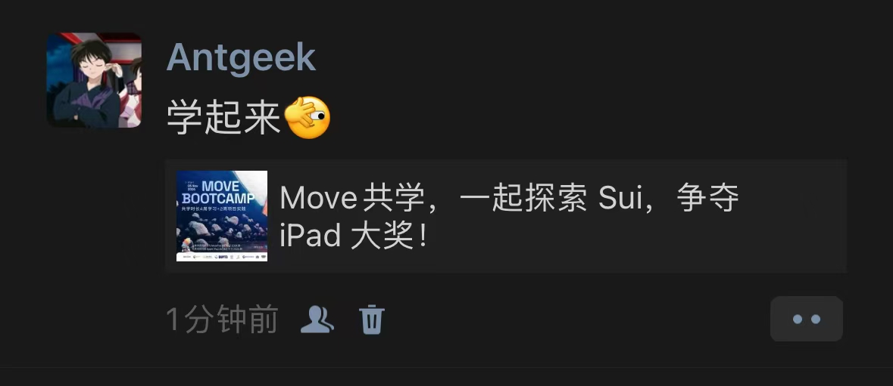
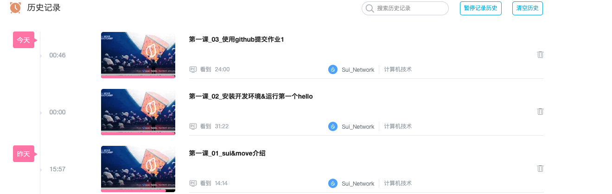
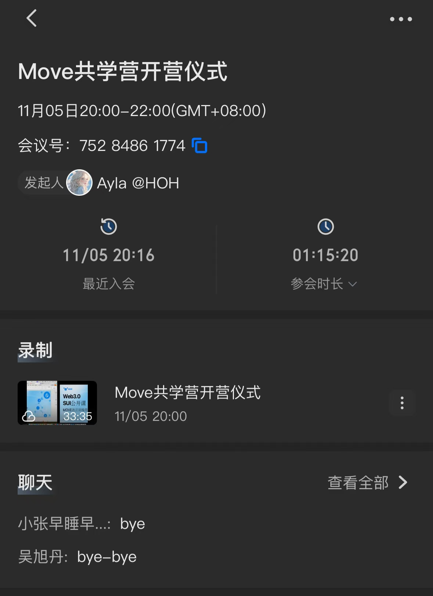

# 这个模板是2024年11月份的共学营才需要的

## b站，推特关注

- [x] b站，推特关注截图: 

## 为共学营宣传（在朋友圈或者群聊中转发海报/文章）

- [x] 宣传截图:

## 每周课程学习

- [x] 第一周:
- [] 第二周:
- [] 第三周:
- [] 第四周:

## 参加直播答疑

- [x] 第一周:
- [] 第二周:
- [] 第三周:
- [] 第四周:

## 群里分享学习笔记

- [x] 第一篇笔记
- [x] 第二篇笔记
- [x] 第三篇笔记
- [x] 第四篇笔记

## 对外输出学习笔记

- [x] 第一篇笔记【 https://blog.csdn.net/weixin_44745147/article/details/143627137 】
- [x] 第二篇笔记【 https://blog.csdn.net/weixin_44745147/article/details/143627442 】
- [x] 第三篇笔记【 https://blog.csdn.net/weixin_44745147/article/details/143627498 】
- [x] 第四篇笔记【 https://blog.csdn.net/weixin_44745147/article/details/143627551 】

## 在HOH社区公众号发布自己的技术文章

- [] 第一篇笔记【公众号文章链接】
- [] 第二篇笔记【公众号文章链接】
- [] 第三篇笔记【公众号文章链接】
- [] 第四篇笔记【公众号文章链接】

## 直播分享学习技巧/工具推荐

- [] 会议截图:

## 提交项目

- [] 项目提交

