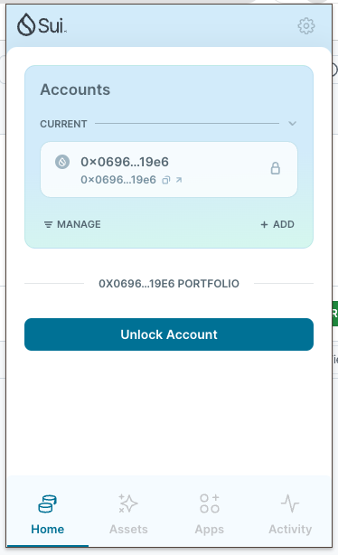
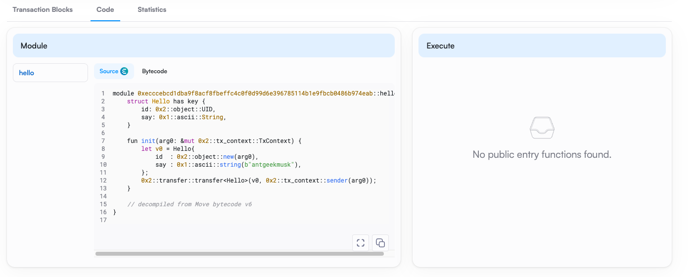

## 基本信息
- Sui钱包地址: `0x069646f0bade4ec91957f0e883b8f6afb0ea50cb7db86583467e3791940419e6`
> 首次参与需要完成第一个任务注册好钱包地址才被合并，并且后续学习奖励会打入这个地址
- github: `antgeekmusk`

## 个人简介
- 工作经验: 3年
- 技术栈: `Java`
> 重要提示 请认真写自己的简介
- 目前工作大数据开发
- 前端+后端+大数据 都懂一些
- 想学习区块链技术转型web3实现远程工作
- 联系方式: 邮箱: `antgeekmusk@gmail.com` 

## 任务

##   01 hello move  
- [x] Sui cli version: sui 1.37.1-homebrew
- [x] Sui钱包截图: 
- [x] package id: 0xecccebcd1dba9f8acf8fbeffc4c0f0d99d6e396785114b1e9fbcb0486b974eab
- [x] package id 在 scan上的查看截图:

##   02 move coin
- [] My Coin package id : 
- [] Faucet package id : 
- [] 转账 `My Coin` hash:
- [] `Faucet Coin` address1 mint hash:
- [] `Faucet Coin` address2 mint hash:

##   03 move NFT
- [] nft package id :
- [] nft object id : 
- [] 转账 nft  hash:
- [] scan上的NFT截图:

##   04 Move Game
- [] game package id :
- [] deposit Coin hash:
- [] withdraw `Coin` hash:
- [] play game hash:

##   05 Move Swap
- [] swap package id :
- [] call swap CoinA-> CoinB  hash :
- [] call swap CoinB-> CoinA  hash :

##   06 Dapp-kit SDK PTB
- [] save hash :

##   07 Move CTF Check In
- [] CLI call 截图 : 
- [] flag hash :

##   08 Move CTF Lets Move
- [] proof : 
- [] flag hash :
