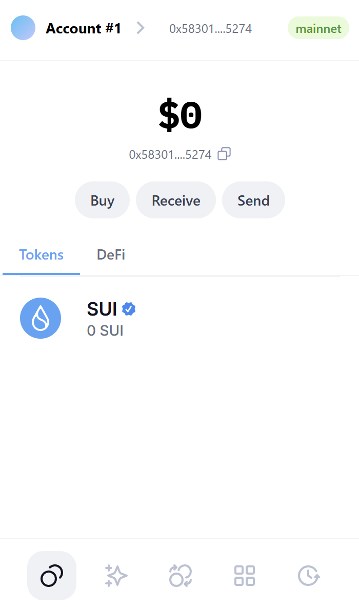
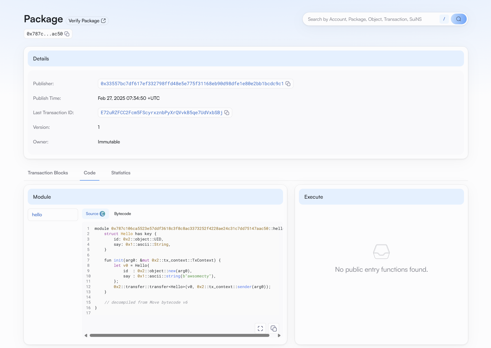
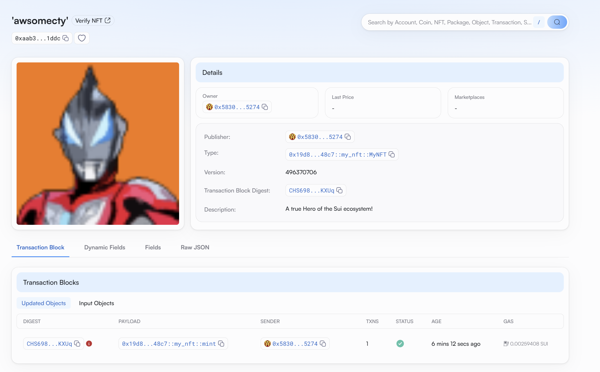

## 基本信息
- Sui钱包地址: `0x583011ba08823a39bb8e9cbe0645b089aa38aad84d8db58d30b1083f98735274`
> 首次参与需要完成第一个任务注册好钱包地址才被合并，并且后续学习奖励会打入这个地址
- github: `awsomecty`

## 个人简介
- 工作经验: 3年
- 技术栈: `python` `C++`
> 重要提示 请认真写自己的简介
- 几年web2开发经验，对Move特别感兴趣，想通过Move入门区块链
- 联系方式: tg: `无` 

## 任务

##   01 hello move  
- [x] Sui cli version: sui 1.43.1-2f52a7283e5f
- [x] Sui钱包截图: 
- [x] package id: 0x787c106ca5523e57ddf3618c3f8c8ac3373252f4228ae24c31c7dd75147aac50
- [x] package id 在 scan上的查看截图:

##   02 move coin
- [] My Coin package id : 
- [] Faucet package id : 
- [] 转账 `My Coin` hash:
- [] `Faucet Coin` address1 mint hash:
- [] `Faucet Coin` address2 mint hash:

##   03 move NFT
- [x] nft package id :0x19d84a1052129a56a6ad13485c6bd34e7593e85404f3d6b582f8b8adf1db48c7
- [x] nft object id :0xaab37897c488accb8204f97a173ae5b6e85a4aa86d93cbae86c14b4553781ddc
- [x] 转账 nft  hash: Acmcn1A7j9268L5rbG4qouLKu34kETVbxPipox35GEmU
- [x] scan上的NFT截图:

##   04 Move Game
- [] game package id :
- [] deposit Coin hash:
- [] withdraw `Coin` hash:
- [] play game hash:

##   05 Move Swap
- [] swap package id :
- [] call swap CoinA-> CoinB  hash :
- [] call swap CoinB-> CoinA  hash :

##   06 Dapp-kit SDK PTB
- [] save hash :

##   07 Move CTF Check In
- [] CLI call 截图 : 
- [] flag hash :

##   08 Move CTF Lets Move
- [] proof : 
- [] flag hash :

