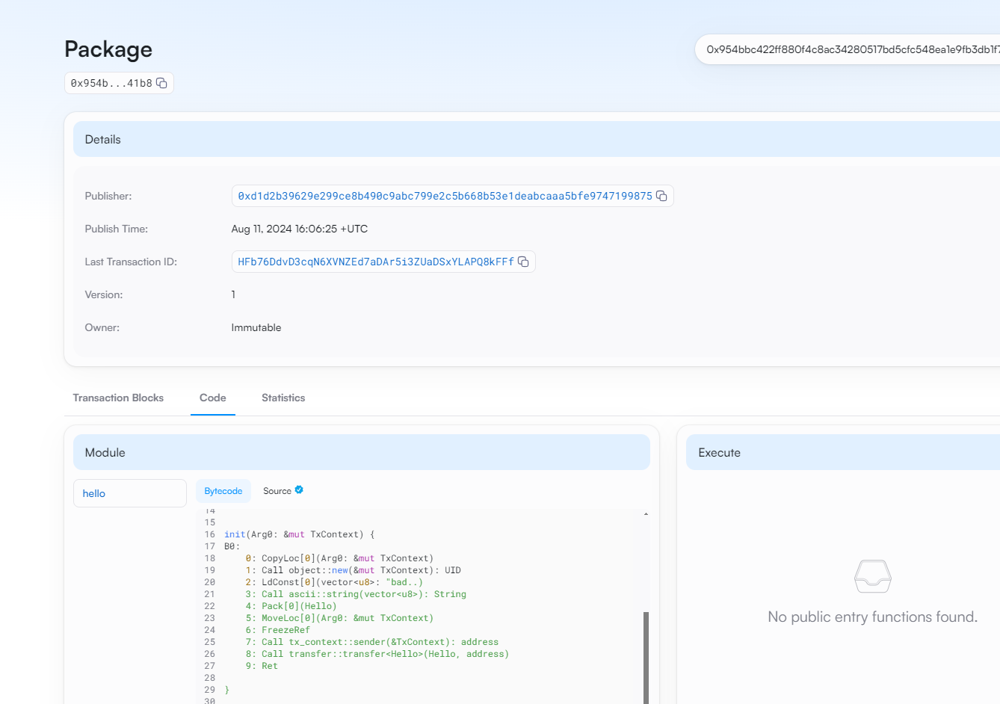

## 基本信息
- Sui钱包地址: `0xd1d2b39629e299ce8b490c9abc799e2c5b668b53e1deabcaaa5bfe9747199875 `
> 首次参与需要完成第一个任务注册好钱包地址才被合并，并且后续学习奖励会打入这个地址
- github: badmicroctrl

## 个人简介
- 工作经验: 6年
- 技术栈: `Python``Rust``Go`
> 重要提示 请认真写自己的简介
- 多年AI、quant经验，对Move特别感兴趣，想通过Move入门区块链
- 联系方式: wechat: `13910261670` 

## 任务

##   01 hello move  
- [] Sui cli version:sui 1.30.1-a4185da5659d
- [] Sui钱包截图: 
- [] package id: 0x954bbc422ff880f4c8ac34280517bd5cfc548ea1e9fb3db1f7a28f990a2d41b8
- [] package id 在 scan上的查看截图:

