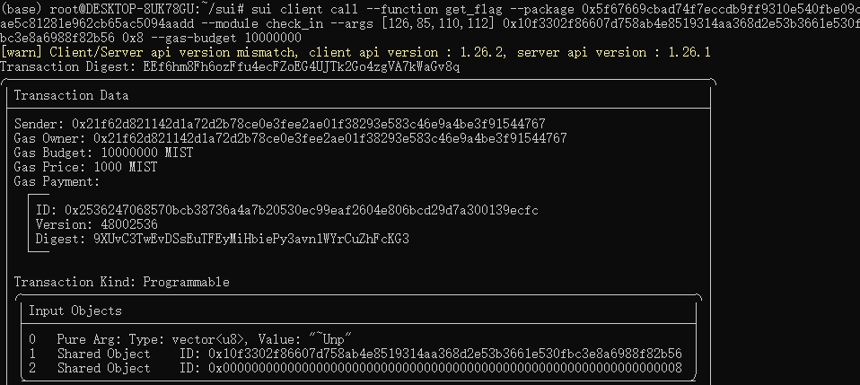

## 基本信息
- Sui钱包地址: `0x3c54103db151f05f698705b76427cc03f80f1b3a092353bc84c2fd88a6b56c85`
> 首次参与需要完成第一个任务注册好钱包地址才被合并，并且后续学习奖励会打入这个地址
- github: `baicaiyihao`

## 个人简介
- 工作经验: 5年
- 技术栈: `Java` `Python` `Html`
- 多年web2 安全测试经验，对Move特别感兴趣，想通过Move入门区块链
- 联系方式: tg: `stom698` 

## 任务

##   01 hello move  
- [x] package id: 0x11085fec8f8c6d1cac598b0848d7193fff7d950c698ede4eae28684f18c494fa

##   02 move coin
- [] My Coin package id : 
- [] Faucet package id : 
- [] 转账 `My Coin` hash:

##   03 move NFT
- [] nft package id :
- [] nft object id : 
- [] 转账 nft  hash:

##   04 Move Game
- [] game package id :
- [] call game hash:

##   05 Move Swap
- [] swap package id :
- [] call swap hash:

##   06 Dapp-kit SDK PTB
- [] save hash :

##   07 Move CTF Check In
- [x] CLI call 截图 : 
- [x] flag hash : EEf6hm8Fh6ozFfu4ecFZoEG4UJTk2Go4zgVA7kWaGv8q