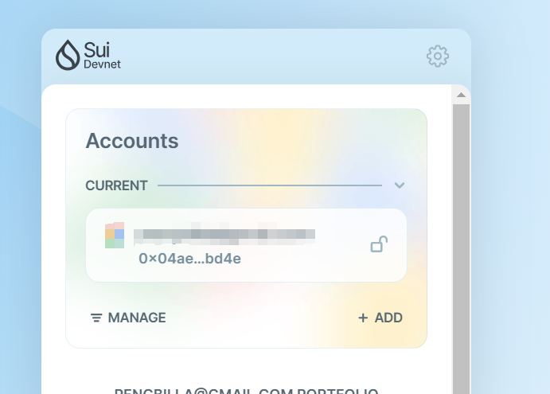

## 基本信息
- Sui钱包地址: `0x04aec9c55ac040784e333cf547a75455cceae4331c8199a785d7b39d6d6dbd4e`
> 首次参与需要完成第一个任务注册好钱包地址才被合并，并且后续学习奖励会打入这个地址
- github: `billaGitHub2016`

## 个人简介
- 工作经验: 10年
- 技术栈: `JS` `NodeJs`
- 多年前端开发，会写一点后端，Web3初学者
- 联系方式: 微信号: billa-

## 任务

##   01 hello move  
- [x] Sui cli version:sui 1.27.0-e5f080922d56-dirty
- [x] Sui钱包截图: 
- [x] package id: 0x4550ee8c10fb238f7b8a3e206ed94fa6d2995bee5a02d3f8ef0893dcf68a558b
- [x] package id 在 scan上的查看截图:

##   02 move coin
- [x] My Coin package id : 0xb09a7d960e811b57f91e1222eba51a206b16b93ca20750c9a0950e85292be0b2
- [x] Faucet package id : 0xb09a7d960e811b57f91e1222eba51a206b16b93ca20750c9a0950e85292be0b2
- [x] 转账 `My Coin` hash: 4QKDxAtQtbZ3VEZ1EtUV415w6dZzrZF8kNw1vM2Fjym6
- [x] `Faucet Coin` address1 mint hash: APQJNSPsCYfwFcwPtbfhBXh5hisac1z4LARZx61xW9WB
- [x] `Faucet Coin` address2 mint hash: 99oSjSrWH76mfLtySDa4gJV51NY6ZsuLaUd9nezP8CxU

##   03 move NFT
- [] nft package id : 
- [] nft object id : 
- [] 转账 nft hash: 

##   04 Move Game
- [] game package id :
- [] call game hash:

##   05 Move Swap
- [] swap package id :
- [] call swap hash:

##   06 SDK PTB
- [] save hash :