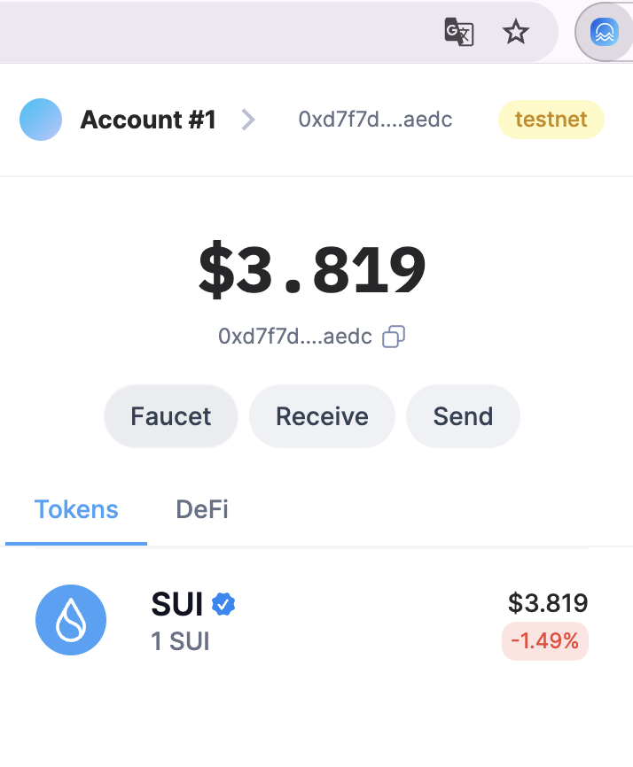
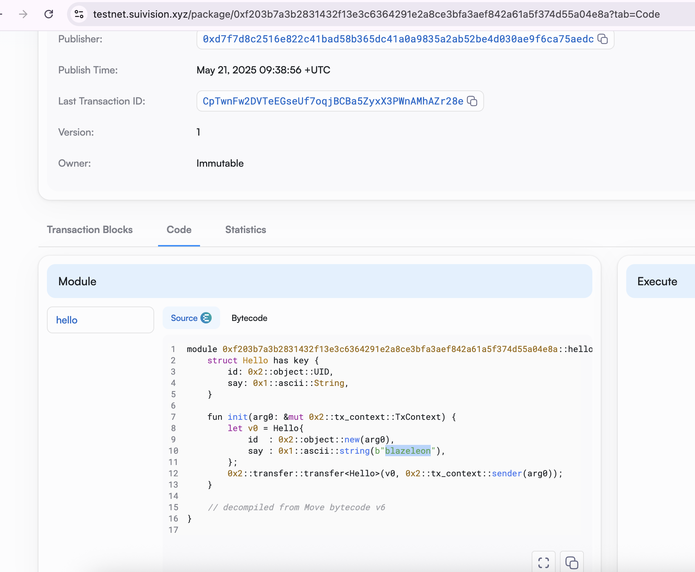
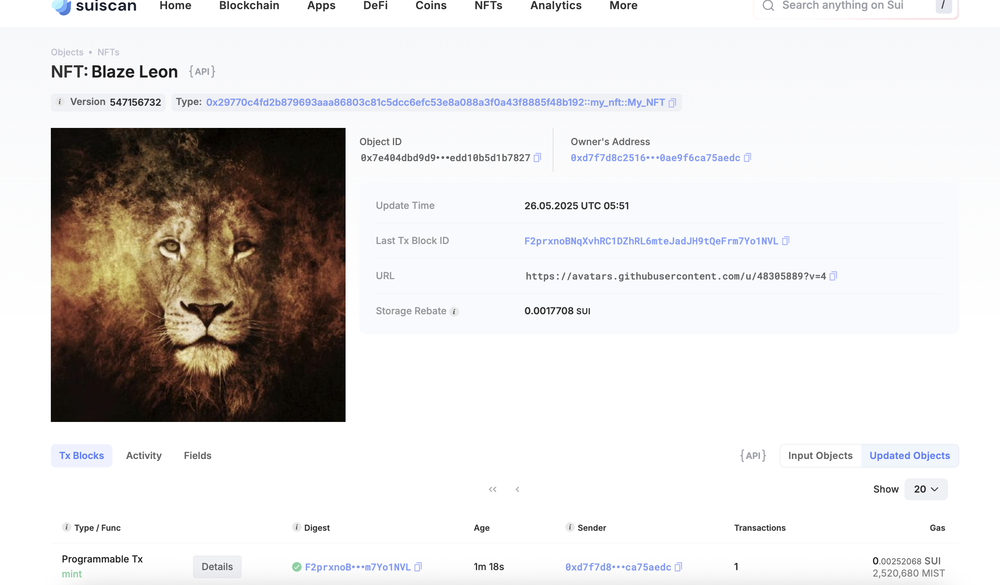

## 基本信息
- Sui钱包地址: `0xd7f7d8c2516e822c41bad58b365dc41a0a9835a2ab52be4d030ae9f6ca75aedc`
> 首次参与需要完成第一个任务注册好钱包地址才被合并，并且后续学习奖励会打入这个地址
- github: `blazeleon`

## 个人简介
- 工作经验: 7年
- 技术栈: `Java` `JavaScript/TypeScript` `React` `Rust`
> 重要提示 请认真写自己的简介
- 多年web2开发经验，有研究过区块链技术，但停留在理论的了解阶段；对Web3以及Move语言特别感兴趣，想通过学习Move智能合约语言进入Web3大门，希望通过实战学习让自身具备独立开发Web3 Dapp的能力。
- 联系方式: tg: `blazeleon` 

## 任务

##   01 hello move  
- [x] Sui cli version:`sui 1.48.1-homebrew`
- [x] Sui钱包截图: 
- [x] package id: `0xf203b7a3b2831432f13e3c6364291e2a8ce3bfa3aef842a61a5f374d55a04e8a`
- [x] package id 在 scan上的查看截图:

##   02 move coin
- [x] My Coin package id : `0xd4a2723c2a78a8f291e4809e76cef08c2a77edc0cd7a7ba4ebc37a74b7773136`
- [x] Faucet package id : `0x571a748747d0b3583a4ca885806a7d373f08f19deecebf568b3e68b2bb07c457`
- [x] 转账 `My Coin` hash: `CDhNZHyHENCDfoDHyWG8Tc2Lqs7tL6eJwFZtZmYxpKjf`
- [x] `Faucet Coin` address1 mint hash: `BtFLy9RMk8KstdeVJXpAKii8N7dDjhREF8PLBWAALecf`
- [x] `Faucet Coin` address2 mint hash: `Au6xkUGudQtRuPo6HN5yF7oVxxJHuUMC53C6LK8iwGCA`

##   03 move NFT
- [x] nft package id : `0x29770c4fd2b879693aaa86803c81c5dcc6efc53e8a088a3f0a43f8885f48b192`
- [x] nft object id : `0x7e404dbd9d9627e788f3616571ceb4f3e3ceed174efcbfb7f0edd10b5d1b7827`
- [x] 转账 nft  hash: `CLxDbLUMZUoGFt8KxKNeji6zyXZK6ZWzsBFmuZyY91h3`
- [x] scan上的NFT截图:

##   04 Move Game
- [x] game package id : `0x428e1bec314956ceef69274069d90632fd660eb1750f81621387df03be467326`
- [x] deposit Coin hash: `65TKJDGk89upzQvHv59MCvuXNhViUd3fvUq8CgPRjd2s`
- [x] withdraw `Coin` hash: `HB87VtgsSd6takFLnZrgtTzApXrPuo1uNZxS2bmiEEkz`
- [x] play game hash: `F5nK4rvZzKf9JmUy2wqoqqvHyvQ1e7upNxyU84UU7CHF`

##   05 Move Swap
- [] swap package id :
- [] call swap CoinA-> CoinB  hash :
- [] call swap CoinB-> CoinA  hash :

##   06 Dapp-kit SDK PTB
- [] save hash :

##   07 Move CTF Check In
- [] CLI call 截图 : 
- [] flag hash :

##   08 Move CTF Lets Move
- [] proof : 
- [] flag hash :

