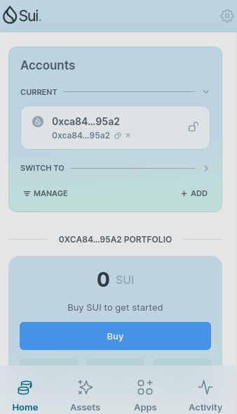
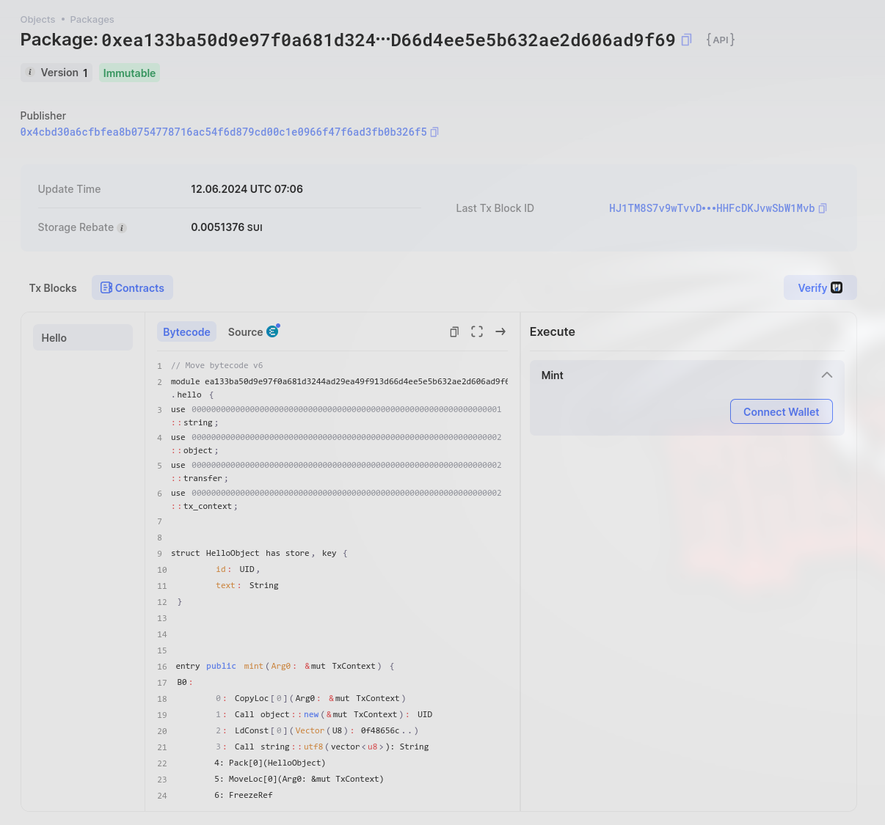
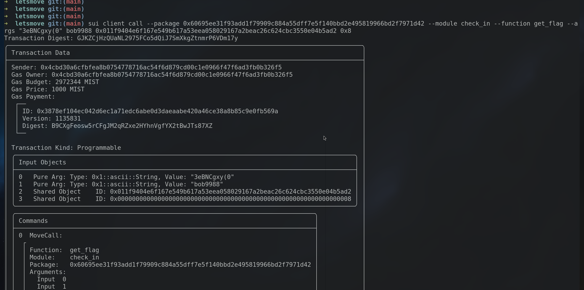

## 基本信息
- Sui钱包地址: `0xca84959f8ca55c4d763360ceb5b6afeae4062dfa6e4e927e7efaf48d1e0495a2`
- github: `bob9988`

## 个人简介
- 工作经验: 0年
- 技术栈: `Python`
- 对Move特别感兴趣，想通过Move入门区块链
- 联系方式: tg: `bob9988` 

## 任务

##   01 hello move  
- [x] Sui cli version: sui 1.27.0-homebrew
- [x] Sui钱包截图: 
- [x] package id: 0xea133ba50d9e97f0a681d3244ad29ea49f913d66d4ee5e5b632ae2d606ad9f69
- [x] package id 在 scan上的查看截图:

##   02 move coin
- [] My Coin package id : 
- [] Faucet package id : 
- [] 转账 `My Coin` hash:
- [] `Faucet Coin` address1 mint hash:
- [] `Faucet Coin` address2 mint hash:

##   03 move NFT
- [] nft package id :
- [] nft object id : 
- [] 转账 nft  hash:
- [] scan上的NFT截图:

##   04 Move Game
- [] game package id :
- [] deposit Coin hash:
- [] withdraw `Coin` hash:
- [] play game hash:

##   05 Move Swap
- [] swap package id :
- [] call swap CoinA-> CoinB  hash :
- [] call swap CoinB-> CoinA  hash :

##   06 Dapp-kit SDK PTB
- [] save hash :

##   07 Move CTF Check In
- [x] CLI call 截图 : 
- [x] flag hash : GJKZCjHzQUaNL2975FCo5dQiJ7SmXkgZtnmrP6VDm17y

##   08 Move CTF Lets Move
- [x] proof : 0x3a685c43
- [x] flag hash : 9FK5Wn1QiAGrMAzhhDMD76jbMFMGR2ftJHH5VLbnVdt8

##   justctf

```
$ cat tos.mv | nc tos.nc.jctf.pro 31337
[SERVER] Challenge modules published at: 542fe29e11d10314d3330e060c64f8fb9cd341981279432b03b2bd51cf5d489b[SERVER] Solution published at 8655bd078d73e2f0f010889dda6acb8e515c4db4554a161cdda02d3123b8e25c[SERVER] Congrats, flag: justCTF{Th4t_sp3ll_looks_d4ngerous...keep_y0ur_distance}

$ cat db.mv | nc db.nc.jctf.pro 31337
[SERVER] Challenge modules published at: 04db9c21c0199c3645b317bd7b12c7cecfcd2a48716a8e2a204fef460c0dd37e[SERVER] Solution published at e0f689404de0ad5622188a2a6c9754b47e6e5e3aa53d83bcd67b827aabd75eb9[SERVER] Congrats, flag: justCTF{I_us3d_to_b3_an_ott3r_until_i_t00k_th4t_arr0w}

$ cat woo.mv |nc woo.nc.jctf.pro 31337
[SERVER] Challenge modules published at: c4c8b6eefb675ba752fd89f6e63e40679126d0cfeca86e34df7fc864e8207e46[SERVER] Solution published at 2572cf7f8af849a797cac28c44b67bf0451d5c7564d1c68c018da28e58606443[SERVER] Congrats, flag: justCTF{Ott3r_uses_expl0it_its_sup3r_eff3ctiv3}
```
