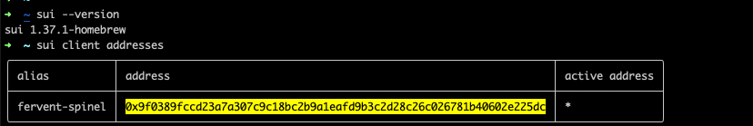

## 基本信息
- Sui钱包地址: `0x9f0389fccd23a7a307c9c18bc2b9a1eafd9b3c2d28c26c026781b40602e225dc`
> 首次参与需要完成第一个任务注册好钱包地址才被合并，并且后续学习奖励会打入这个地址
- github: `brainsk`

## 个人简介
- 工作经验: 10年
- 技术栈: `Rust` `go`
> 重要提示 请认真写自己的简介
- 多年web2开发经验，对Move特别感兴趣，想通过Move入门区块链
- 联系方式: tg: `brainsk` 

## 任务

##   01 hello move  
- [√] Sui cli version: sui 1.37.1-homebrew
- [√] Sui钱包截图: 
- [√] package id: 0x649f4acee5d47ea606010f23b0f094512c829124104abd9f0fe751cf3c57ddb4
- [√] package id 在 scan上的查看截图:

##   02 move coin
- [√] My Coin package id : 0x6873544ffc55c257a31c4fac905c730ed5f69c6340528314580b0c499a23c6fb
- [√] Faucet package id : 0xf55b7f267fbf88f6e195bdb979316293ec492882273e7deffc078a6615ec2bfd
- [√] 转账 `My Coin` hash: 9hxSYLtSrnnJdtti46r5S9zTrzQCySBewSSLjh2WqEvc
- [√] `Faucet Coin` address1 mint hash: 6D9fCzGZokCuAQoNP5Grki91Ba6oHsQ7i1nNk27gH38R
- [√] `Faucet Coin` address2 mint hash: GVGDJiH6Km8edU58uagitcrfA35cjhA4H1fxRMyxBp7y

##   03 move NFT
- [√] nft package id : 0x03defdabcae9c45534df08f5cdd4f119cd94fbbe80117a6179328ba45555b01d
- [√] nft object id :  0x95c4ad856bc9da78cc54d1183c5933f812e17ea913f01cda5be228bf08fcd8b4
- [√] 转账 nft  hash: 9TidEfi5awA7a8BwvkvhHguFkmR2ZBVCHT2FRLacVcrq
- [√] scan上的NFT截图:

##   04 Move Game
- [√] game package id : 0xd593563f21c3598ab5109488d634de8cbfe59b3463856b4dacf1cd90357a65b6
- [√] deposit Coin hash:  9LfqjZQg6Wh3FQeS9sRE9W9va7x6jRsdf1fdwoa4xEbj
- [√] withdraw `Coin` hash: HTrpXRECgm1qWjPLB7d6PK6fdhnpMFsZmSa6d9di54KN
- [√] play game hash: Hiybm73HN9n8UWMHNc6K63cTNtqdPz2jphpfckaZjNpW

##   05 Move Swap
- [√] swap package id : 0x8fce92f5a9044de1b3b19a622c2f2beb74c080321612ca546a8ddfbae089c264
- [√] call swap CoinA-> CoinB  hash : Fa4jYo1BY8msNRfWdScog3rwgh1Zybjh1vpD2tGjRwjJ
- [√] call swap CoinB-> CoinA  hash : GXDtyEBzEegurzVaqvtyPvqDYwC8szzg1ES26SU8PRGM

##   06 Dapp-kit SDK PTB
- [√] save hash : 8vxnNYwf4XPfGB1345gJponstKD7ZoUEonWZda7bBkGB

##   07 Move CTF Check In
- [√] CLI call 截图 : 
- [√] flag hash : HXm2wPKk8KoTiL2iFmpYAbgABRteTK8eX9Xjh3mxX9Vd

##   08 Move CTF Lets Move
- [] proof : 
- [] flag hash :
