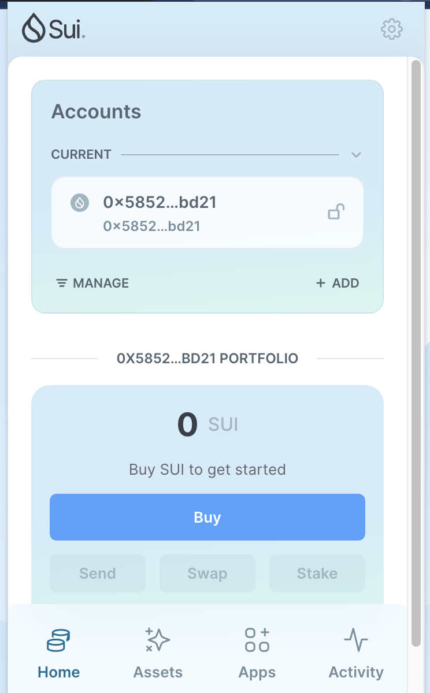
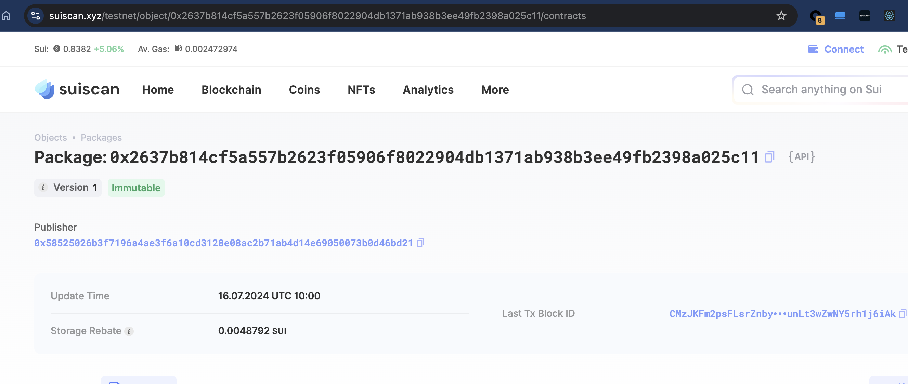
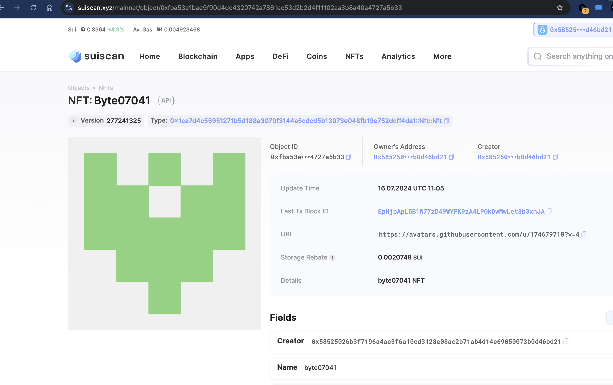

## 基本信息
- Sui钱包地址: `0x58525026b3f7196a4ae3f6a10cd3128e08ac2b71ab4d14e69050073b0d46bd21`
> 首次参与需要完成第一个任务注册好钱包地址才被合并，并且后续学习奖励会打入这个地址
- github: `byte07041`

## 个人简介
- 工作经验: 1年
- 技术栈: 前端
> 重要提示 请认真写自己的简介
- 前端开发, 目前在学习 web3 开发
- 联系方式: `byte07041@outlook.com`

## 任务

##   01 hello move  
- [x] Sui cli version: 1.27.0
- [x] Sui钱包截图: 
- [x] package id: 0x2637b814cf5a557b2623f05906f8022904db1371ab938b3ee49fb2398a025c11
- [x] package id 在 scan上的查看截图:

##   02 move coin
- [x] My Coin package id : 0xc8aebebb4e9790a3d43e1651d47d4bd02a90197668617a3fa63dadc96b132239
- [x] Faucet package id : 0xdd839a1e1d7ab1876ab354d2aaed0e896e1917efdf0bb032dccbabadc715b018
- [x] 转账 `My Coin` hash: HRS6bwmwQvJnAqUAYYk9aNbwRDjqCQB3JKxAc8sdpNk5
- [x] `Faucet Coin` address1 mint hash: HZhC3pqi6S6AnBTAe3T93mP5M27HhdvvfyBGpqiesXmn
- [x] `Faucet Coin` address2 mint hash: C3TW3qLfznuPybMtSAVLQyNnHJWzzUTqLoGzA9PMyxUZ

##   03 move NFT
- [x] nft package id : 0x1ca7d4c55951271b5d188a3079f3144a5cdcd5b13073e048fb19e752dcff4da1
- [x] nft object id : 0x7955a943be112b8829ae5c89208ce02eff211fdde5e095612253f16ee2b2079b
- [x] 转账 nft  hash: ARqzKkQfVxeCrWNJZKqdhojY8Sa7inewxMDcx5qqh7Lu
- [x] scan上的NFT截图: 

##   04 Move Game
- [] game package id :
- [] deposit Coin hash:
- [] withdraw `Coin` hash:
- [] play game hash:

##   05 Move Swap
- [] swap package id :
- [] call swap CoinA-> CoinB  hash :
- [] call swap CoinB-> CoinA  hash :

##   06 Dapp-kit SDK PTB
- [] save hash :

##   07 Move CTF Check In
- [] CLI call 截图 : 
- [] flag hash : 

##   08 Move CTF Lets Move
- [x] proof : 60244478
- [x] flag hash : 12HSrFDgCm6uVpNyhMKkMijRyCcpWUqz8XipXjoWL3LR
