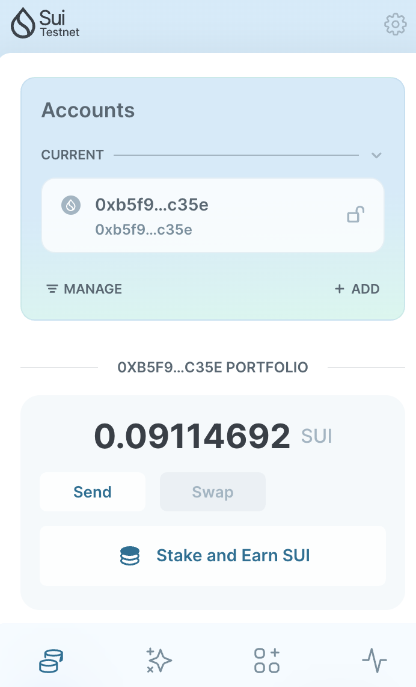
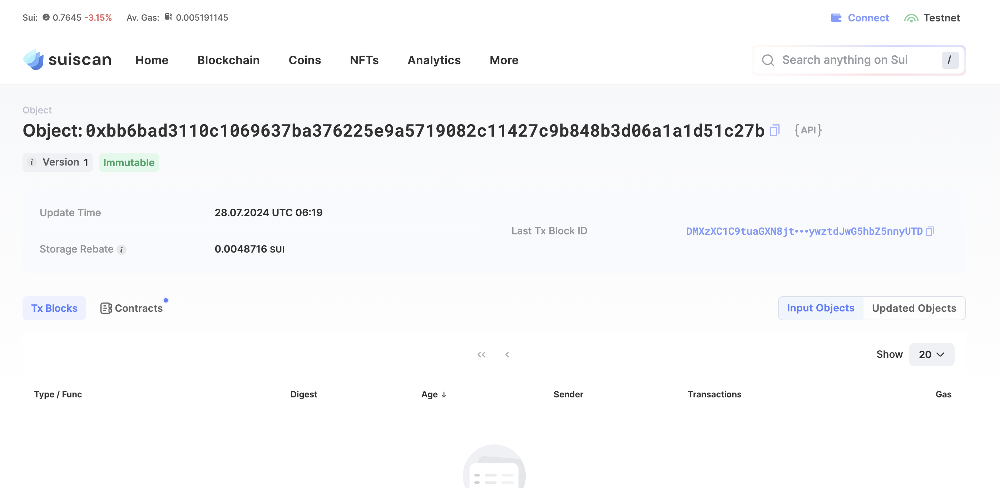
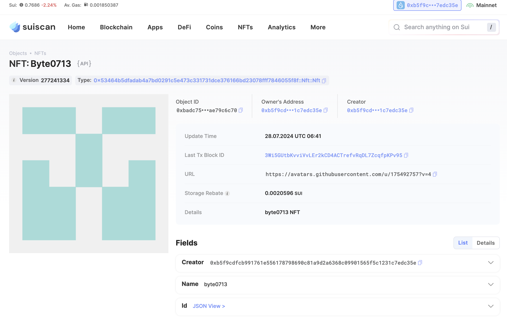

## 基本信息
- Sui钱包地址: `0xb5f9cdfcb991761e556178798690c81a9d2a6368c09901565f5c1231c7edc35e`
> 首次参与需要完成第一个任务注册好钱包地址才被合并，并且后续学习奖励会打入这个地址
- github: `byte0713`

## 个人简介
- 工作经验: 3年
- 技术栈: 客户端
> 重要提示 请认真写自己的简介
- 前端开发, 目前在学习 move 开发
- 联系方式: `byte0713@outlook.com`

## 任务

##   01 hello move  
- [x] Sui cli version: 1.27.0
- [x] Sui钱包截图: 
- [x] package id: 0xbb6bad3110c1069637ba376225e9a5719082c11427c9b848b3d06a1a1d51c27b
- [x] package id 在 scan上的查看截图:

##   02 move coin
- [x] My Coin package id : 0x284b813a1018218133922021f721717016f660d32a1285389803ac302fe74cef
- [x] Faucet package id : 0x98ac605b268d267fce113e916e7e11f0807908f79f85e709589466f993f3be2d
- [x] 转账 `My Coin` hash: C4MKxoi7oMLdUoNKHk3KfzUF7NH1xdVQsjuZVc6YzRC6
- [x] `Faucet Coin` address1 mint hash: 94ATWsJVzqGowSvUu3pcP1FzkNudHPQvY6nmE2kUs2qo
- [x] `Faucet Coin` address2 mint hash: Cxi8sKKt6ydCtCHSPvxwQRA8VNjStdvDEzCsb7iWh7ca

##   03 move NFT
- [x] nft package id : 0x53464b5dfadab4a7bd0291c5e473c331731dce376166bd23078fff7846055f8f
- [x] nft object id : 0x2185f003b119a8cf8bc7ef0f539b8d418e88eeda4408a4fe6ce43cbcf5efe318
- [x] 转账 nft  hash: 7zMG2uytB1WzFZ9dM4wxvHPE7HXR5XjawZFYUkE1Myzx
- [x] scan上的NFT截图: 

##   04 Move Game
- [] game package id :
- [] deposit Coin hash:
- [] withdraw `Coin` hash:
- [] play game hash:

##   05 Move Swap
- [] swap package id :
- [] call swap CoinA-> CoinB  hash :
- [] call swap CoinB-> CoinA  hash :

##   06 Dapp-kit SDK PTB
- [] save hash :

##   07 Move CTF Check In
- [] CLI call 截图 : 
- [] flag hash : 

##   08 Move CTF Lets Move
- [x] proof : 78328219
- [x] flag hash : EZBbcfA4avAfXyordFi4heAz59aoQ247XfJTXkJ1K7Qf
