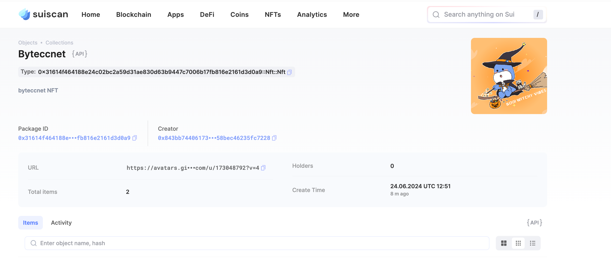

## 基本信息
- Sui钱包地址: `0x843bb744061732c64cb2b982697aa15e18386eebb0ee97eb58bec46235fc7228`
> 首次参与需要完成第一个任务注册好钱包地址才被合并，并且后续学习奖励会打入这个地址
- github: `byteccnet`

## 个人简介
- 工作经验: 1年
- 技术栈: `kotlin`
- Android 开发者，想学习 Web3 知识拓展自己技术能力，还有扩展视野。

## 任务

##   01 hello move  
- [x] Sui cli version: 1.27.0-homebrew
- [x] Sui钱包截图: 
- [x] package id: 0x51ab03c2a6fc6c68a8c7af3bacb002dc3f77a380cbf82eb82acd486c86519b12
- [x] package id 在 scan上的查看截图:

##   02 move coin
- [] My Coin package id : 0x5f20bae836f24d1d5250582adeb856d754dff30440faed48a873bcfabf732b0a
- [] Faucet package id : 0x0620181792f9d9dc1ae4ada2ac8cb48e05e6c1e3f8060950cdbc66a55a5d90ab
- [] 转账 `My Coin` hash: 3U4yWbxq7UiLMs74uneQwDHke14JN68q3pyvP96CQYRi
- [] `Faucet Coin` address1 mint hash: 9LsdYsc5DhT3aCx2cGVUoLXNWEDVbd4dgEspdiDj8Stp
- [] `Faucet Coin` address2 mint hash: AVahmELwDGwhu8jttVTYiKzdNvjhPWZFNfaL5Nntoz1m

##   03 move NFT
- [] nft package id : 0x31614f464188e24c02bc2a59d31ae830d63b9447c7006b17fb816e2161d3d0a9
- [] nft object id : 0xb8a76e3d511de7f0bf65ca270f0f478ce7b106dcc933e08c7920089ad07a5b3e
- [] 转账 nft  hash: 6sJrvvv6bD1xi5CWbuF62KJyKPU8a9gZfTKnc3HZysSJ
- [] mint 到自己地址的截图 hash：GoEeHBNF82DRt73XrUFKEi32UCt5W8Kr9U88cy1UVyxB 以及截图：

##   04 Move Game
- [] game package id :
- [] deposit Coin hash:
- [] withdraw `Coin` hash:
- [] play game hash:

##   05 Move Swap
- [] swap package id :
- [] call swap CoinA-> CoinB  hash :
- [] call swap CoinB-> CoinA  hash :

##   06 Dapp-kit SDK PTB
- [] save hash :

##   07 Move CTF Check In
- [x] CLI call 截图 : 
- [x] flag hash : FwwTTCa7aetzB1LdNTaRooQWCh8wJCp8GH6g9jcwBvWM

##   08 Move CTF Lets Move
- [] proof : 80241658
- [] flag hash : 2qxsB1CFiemTB7JZrw5JEz8hPJDKXbbi1KPAaZMyF8Xm
