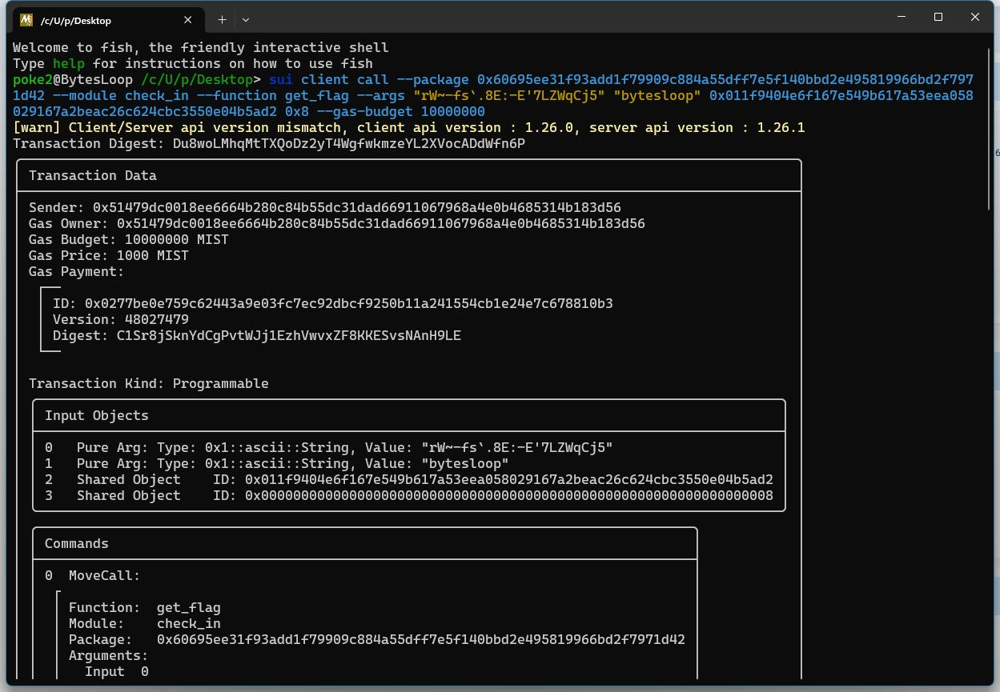

## 基本信息
- Sui钱包地址: `0x51479dc0018ee6664b280c84b55dc31dad66911067968a4e0b4685314b183d56`
> 首次参与需要完成第一个任务注册好钱包地址才被合并，并且后续学习奖励会打入这个地址
- github: `bytesloop`

## 个人简介
- 工作经验: 10年
- 技术栈: `Rust` `C#` `Python`
- 多年web2开发经验，对Move特别感兴趣，想通过Move入门区块链
- 联系方式: tg: `bytesloop` 

## 任务

##   01 hello move  
- [x] package id: `0x90f7990609a98035510af1a81f183f77c8d1c8bfd11148fc33b4a7d78d96c25d` (Testnet)

##   02 move coin
- [x] My Coin package id: `0x603c23f1529f80fe07aa0f0e63c42780de82f2d18089f6369519b4886efa22c6` (Testnet)
- [x] Faucet package id: `0x603c23f1529f80fe07aa0f0e63c42780de82f2d18089f6369519b4886efa22c6` (Testnet)
- [x] 转账 `My Coin` hash: `6ZfFqC5s2U2hFNNqnjkvfQ71TgBqiWTfpy9GxkS6Xa9T` (Testnet)

##   03 move NFT
- [x] nft package id: `0x193452b4288caed0e35a8a1470753d722e41ece22d8da082183179fd2896db83` (Testnet)
- [x] nft object id : `0x17449737cc5a2a94d611c521de7e8b69ae914fbfb277b585a87a01cce96fd364` (Testnet)
- [x] 转账 nft hash: `YAak4KPdP7bCtSUhhZxPAr6AG7djUPrGNwxuDkxmWqT` (Testnet)

##   04 Move Game
- [x] game package id: `0xc90108000890fe94cf334ffa7808c624c845a3408cd449c9910d8f32a7858481` (Testnet)
- [x] call game hash: `9wDmFHnQYe9FmtMhvWBx4mNQgSEbwb1tSTUidPxay1oa` (Testnet)

##   05 Move Swap
- [x] swap package id : `0x29cd0bf0b0cc54132acbf0cdae4bd21ce15e29a46d9acd2fcecdbca85d8c7258` (Testnet)
- [x] call swap hash: `https://suiscan.xyz/testnet/tx/C3znaEcZTqiqtaVCfwMxip7DvbkhCewYcDkYiaT1wgMF` (usd to rmb)
- [x] call swap hash: `https://suiscan.xyz/testnet/tx/9zr3rEQabQfyn94gFZtEDM6SUUqgd32ftgkKVzdWiU9o` (rmb to usd)

##   06 SDK PTB
- [x] save hash : `https://suivision.xyz/txblock/EfrEkzsnQjydVrnFdZwhSCWPDF3oiM1qnpMYHuzD6wb7`

##   07 Move CTF Check In
- [x] CLI call 截图 : 
- [x] flag hash : `Du8woLMhqMtTXQoDz2yT4WgfwkmzeYL2XVocADdWfn6P`

##   08 Move CTF Lets Move
- [x] proof : `6d2f21242436127de875`
- [x] flag hash : `2hchn6NgjancH8QwsHpxkrr3hSeQjouPKKXCTZzYK2PU`