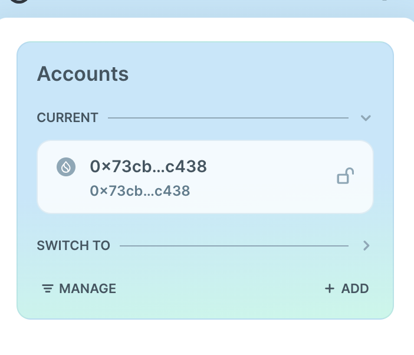
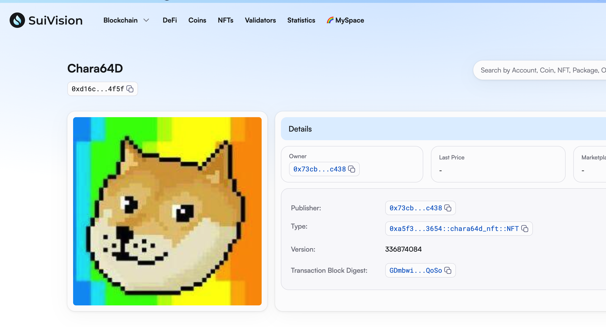
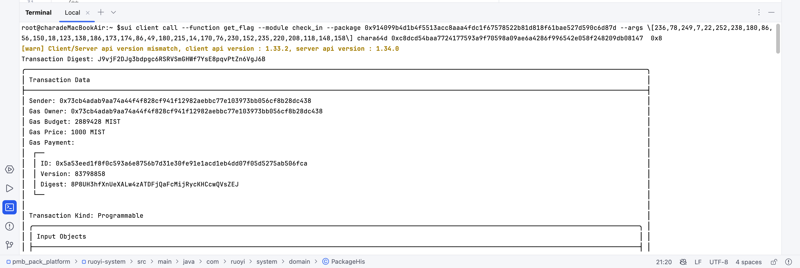

## 基本信息
- Sui钱包地址: `0x73cb4adab9aa74a44f4f828cf941f12982aebbc77e103973bb056cf8b28dc438` `修改钱包`
> 首次参与需要完成第一个任务注册好钱包地址才被合并，并且后续学习奖励会打入这个地址
- github: `chara64d`

## 个人简介
- 工作经验: 9年
- 技术栈: `C#` `C++` `Qt`
> 重要提示 请认真写自己的简介
- 多年web2开发经验，对Move特别感兴趣，想通过Move入门区块链
- 联系方式: tg: `dian64c` 

## 任务

##   01 hello move  
- [x] Sui cli version: 1.33.0
- [x] Sui钱包截图: 
- [x] package id: 0x2644b257ddd5f0c10e0663ac1dc81cc142c9da2f501629db2a7f9ea09b92ee91
- [x] package id 在 scan上的查看截图:

##   02 move coin
- [x] My Coin package id :  0x722335fed7ef240e3890ef4bd8d77c26c633855d93f0388a6fafa7eb9fd59615
- [x] Faucet package id :  0x722335fed7ef240e3890ef4bd8d77c26c633855d93f0388a6fafa7eb9fd59615
- [x] 转账 `My Coin` hash: Fqg14WEr6vZXzbREX8XnFc8XBGbUe91A5FBNdehKQKTi
- [x] `Faucet Coin` address1 mint hash: GWwSD48zoeXuq8zW4FcaB63GczWYgtQw1py2Xny1koTs
- [x] `Faucet Coin` address2 mint hash: 3L4QcKSMvhJcgocdpW8yWuQVgN8nbhtbab1664vXoiRt

##   03 move NFT
- [x] nft package id : 0xa5f3c32ad44bfdaec60c3b3737be1300da6a036fc05265cedd746b0844a83654
- [x] nft object id : 0xd16cd20bb3ee7c6ecb91752a1265422875b717f9580bfe9909acb4efb3e54f5f
- [x] 转账 nft  hash: 2dYLJaT35r2n9G5ktCRpXcvxHSeG1f1LPmCyTodeK4Vd
- [x] scan上的NFT截图:

##   04 Move Game
- [x] game package id : 0xfc1c8ab7223be0a1415745967ad2da8ca7dc337a33daab27ded73d7e13ea8c43
- [x] deposit Coin hash: Aah1B4pXmswaPzgF53LuUsJwToWpZzVq68ng1NXQ546v
- [x] withdraw `Coin` hash: 3EvpVsjzejyv4Rpna4HQH94DkAGxBWaC8SPKrt5te43M
- [x] play game hash: CEApGjydQACWoqzFK8Snc9ZKjR6LMA2ApUMVigdRZowP

##   05 Move Swap
- [x] swap package id : 5JGUzMDeswNCtmZtfEWLfWpQWCPKbjQMBMQJtSgbSQhk
- [x] call swap CoinA-> CoinB  hash : 8SG53vE1oAjpv1eb2AfX3VXiSD6fmucoWC7pXeiGGYoD
- [x] call swap CoinB-> CoinA  hash : 5JGUzMDeswNCtmZtfEWLfWpQWCPKbjQMBMQJtSgbSQhk

##   06 Dapp-kit SDK PTB
- [x] save hash : 8yMcU8r1cMBAwLATVTHAk8aiMSJGFBPnQFgnonqCkuQA

##   07 Move CTF Check In
- [x] CLI call 截图 : 
- [x] flag hash :  J9vjF2DJg3bdpgc6RSRVSmGHWf7YsE8pqvPtZn6VgJ6B

##   08 Move CTF Lets Move
- [x] proof :  a2c1c5cbb1313f6529e2
- [x] flag hash : 3zisduYfRyjXmYia93eAKQuH6z69FdijzCMUhLzj7Vyd
